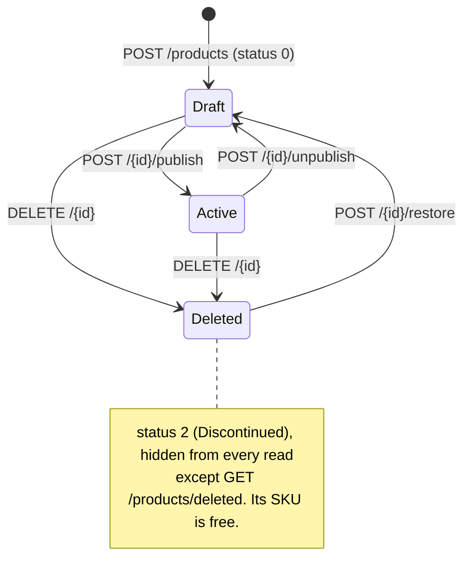

# Catalog API

Products and categories as the storefront reads them, plus product and category administration: images, attributes,
discounts, stock, publishing and the recycle bin. Bulk actions, CSV import and export, low-stock reporting, category
statistics and cache invalidation are also Catalog endpoints.

**Verified at:** `5c6c3b0` (`feature/admin-panel`, 2026-09-24). Catalog's code has not changed since `105d647`. Every
endpoint in this file was checked against the C# source and the service's OpenAPI document, and called through the
gateway on the compose `sandbox` stack. Shared rules (errors, paging, rate limits, CORS) are in
[conventions.md](conventions.md) and are not repeated here.

## Base paths through the gateway

| Path | Methods | Gateway policy | Audience |
|---|---|---|---|
| `/api/v1/products/**`, `/api/v1/categories/**` | GET, HEAD, OPTIONS | anonymous | Storefront (admins also see drafts) |
| `/api/v1/products/**`, `/api/v1/categories/**` | POST, PUT, PATCH, DELETE | `Admin` role | Admin panel |
| `/api/v1/products/deleted`, `/api/v1/products/export` | GET | `Admin` role | Admin panel |
| `/api/v1/admin/catalog/**` | all | `Admin` role | Admin panel |
| `/api/v1/admin/cache/**` | all | `Admin` role | Admin panel |

Not routed through the gateway: Catalog's own `GET /api/v1/admin/audit` (see [admin-platform.md](admin-platform.md)).

**Catalog differs from the other services in five ways.** Read these once before using any endpoint below:

- **Unknown body properties are rejected** with 400 `MalformedRequest`, and `detail` names the JSON path
  (`'$.bogus'`). So is `null` for a field that cannot be null (`{"discountPrice":null}`), with the same "unknown or
  invalid property" wording. Send exactly the documented fields (F-02).
- **`status` is an integer** (`0` Draft, `1` Active, `2` Discontinued), but the `status` and `sortBy` **query
  filters** take the exact-case name or the integer. `?status=active` is a 400 `MalformedRequest` whose `detail`
  wrongly blames the request body (F-01, F-25).
- **Validation errors come in two shapes, by endpoint.** Reads and creates (anything that returns a body) use
  shape (a), `Validation.Failed`, with every message in `detail`. Writes that answer 204 use shape (b),
  `ValidationError`, with an `errors` map keyed by PascalCase property name
  ([conventions.md §3.3](conventions.md#33-validation-errors-three-shapes)). Each error table names the shape.
- **A domain rule refusal is 400 `DomainError`**, with the rule in `detail` ("Discount price must be less than the
  product price."). Show `detail`; it is written for people.
- **`Location` on a 201 is a relative path** (`/api/v1/products/{id}`), unlike Identity's. A browser on another origin
  still cannot read it (F-04), so take the new id from the body.

## Contents

- [Storefront / customer](#storefront--customer)
  - [Who sees what](#who-sees-what)
  - [Products](#products): list, newest, detail
  - [Categories](#categories): tree, one category, a category's products
- [Admin panel](#admin-panel)
  - [Product lifecycle](#product-lifecycle)
  - [Products (admin)](#products-admin): recycle bin, create, update, delete, restore, stock, publish, discount
  - [Product images](#product-images)
  - [Product attributes](#product-attributes)
  - [Categories (admin)](#categories-admin): create, update, delete, move, restore, reorder
  - [Bulk actions, import and export, low stock, category statistics, cache](#bulk-actions-import-and-export-low-stock-category-statistics-cache)
  - [Audit trail](#audit-trail)
- [Not callable by clients](#not-callable-by-clients)
- [Types](#types)
- [Frontend notes](#frontend-notes)

---

## Storefront / customer

All six storefront reads are anonymous at both layers: gateway **anonymous** · service **anonymous**. A token is
optional. It changes what an admin sees, and nothing for anyone else. An invalid or expired token is ignored and the
request runs as anonymous ([conventions.md §4](conventions.md#4-authentication)).

### Who sees what

| Read | Anonymous or a customer | A caller with the `Admin` role |
|---|---|---|
| `GET /products`, `/products/newest`, `/categories/{id}/products` | Active products only | Active **and Draft** products |
| `GET /products/{id}` | Active products; a draft is **404** `Product.NotFound` | Drafts too |
| `GET /categories` | Live categories only | Live **and deleted** categories (`isActive: false`) |
| `GET /categories/{id}` | Live categories only | Live categories only: a deleted one is 404 for admins too |

- **Deleted products are hidden from every read above**, including an admin's detail read. Only the admin
  [recycle bin](#get-apiv1productsdeleted) lists them.
- **The decision comes from the token's role, never from a parameter.** `?includeUnpublished=true` (listed in the
  OpenAPI document) is overwritten on the server, so it changes nothing (observed, F-36).
- **Drafts are 404, not 403,** so the public API never confirms that an unpublished product exists.

### Products

#### `GET /api/v1/products`

The product list, paged by offset. Source: `GetProductsQuery` (filters on `ProductFilterQuery`).

**Rate limit:** `search`, **30 / 60 s per client IP**, on top of the global limit. The 31st call in a minute is a 429
with an empty body ([conventions.md §7](conventions.md#7-rate-limits)). Debounce search-as-you-type.

**Query** ([`ProductListQuery`](#productlistquery)); all optional:

| Parameter | Type | Default | Meaning |
|---|---|---|---|
| `pageNumber` | integer | `1` | ≥ 1 |
| `pageSize` | integer | `10` | 1–100 |
| `searchTerm` | string | — | 2–200 characters. A case-insensitive substring of the **name or the SKU**. Trimmed; `%` and `_` match literally |
| `categoryId` | GUID | — | Products **directly** in this category. Products in its subcategories are not included |
| `minPrice` | number | — | ≥ 0. Compared with the **effective price** (`discountPrice ?? price`) |
| `maxPrice` | number | — | Must be greater than `minPrice` when both are sent. Effective price, like `minPrice` |
| `sortBy` | `Name` \| `Price` \| `CreatedAt` | `Name` | Exact-case name, or `0`/`1`/`2`. `Price` sorts by the effective price. Ties are broken by id, so pages never repeat or skip a row |
| `isDescending` | boolean | `false` | |
| `status` | `Draft` \| `Active` \| `Discontinued` | — | Exact-case name, or `0`/`1`/`2`. It **narrows** the visibility rule and never widens it: anonymous `?status=Draft` gives an empty page. `Discontinued` always gives an empty page, because only deleted products carry it |
| `hasDiscount` | boolean | — | `true`: products with a `discountPrice`; `false`: without |
| `stockBelow` | integer | — | Strictly less than: `stockBelow=1` means "out of stock" |
| `createdFrom`, `createdTo` | date-time | — | Inclusive range on `createdAt`. A date without a zone is read as UTC |

**200** [`PagedResult<Product>`](conventions.md#61-pagedresultt-offset-pages-the-common-case). Captured anonymously
with `?pageSize=1`:

```json
{"items":[{"id":"9316561d-b960-46e2-862d-b7aceea4b77d","name":"Domain-Driven Design","description":null,
  "sku":"BOOK-DDD-001","price":42.00,"discountPrice":null,"stockQuantity":200,"status":1,
  "categoryId":"5747ee57-f779-4e0b-82b3-0171930cb2d1","mainImageUrl":null,"createdAt":"2026-09-16T10:55:12.139241Z"}],
 "pageNumber":1,"pageSize":1,"totalCount":5,"totalPages":5,"hasPreviousPage":false,"hasNextPage":true}
```

A list item carries the main image's URL only. The gallery and the attributes are on the
[detail read](#get-apiv1productsid).

| Status | `errorCode` | When |
|---|---|---|
| 400 | `Validation.Failed` | `pageNumber` < 1; `pageSize` outside 1–100; `searchTerm` shorter than 2 or longer than 200; `minPrice` < 0; `maxPrice` ≤ `minPrice`; any `cursor` value (see below). Several failures are joined in one `detail` |
| 400 | `MalformedRequest` | A value of the wrong type: `pageSize=abc`, `categoryId=nope`, `isDescending=maybe`, an unparseable date, or an enum name in the wrong case (`sortBy=price`, `status=draft`). `detail` says "The request body is not valid JSON…", although the problem is in the query (F-25) |
| 429 | — (empty body) | `search` or global bucket spent |

- **`cursor` is refused, not ignored.** `?cursor=…` answers 400 with "Cursor paging is served by GET
  /api/v1/products/newest". Use [`/newest`](#get-apiv1productsnewest) for cursor paging.
- **Cached for 5 minutes**, but every product write evicts the whole list family, so an admin's change shows on the
  next read (observed: a product appeared in the anonymous list straight after publish).

#### `GET /api/v1/products/newest`

Products newest first, paged by a forward-only cursor. Source: `GetNewestProductsQuery`.

**Rate limit:** `search`, 30 / 60 s per client IP, shared with `GET /products`.

**Query** ([`NewestProductsQuery`](#newestproductsquery)); all optional:

| Parameter | Type | Default | Meaning |
|---|---|---|---|
| `cursor` | string | — | The `nextCursor` of the previous page, **unchanged**. Omit it for the first page |
| `pageSize` | integer | `10` | 1–100 |
| `categoryId`, `searchTerm`, `minPrice`, `maxPrice` | | — | As on [`GET /products`](#get-apiv1products), with the same rules |

There is no `sortBy`, `status` or other filter here: those parameters are ignored if sent. The order is always
`createdAt` descending, then id descending.

**200** [`CursorPagedResult<Product>`](conventions.md#62-cursorpagedresultt-forward-cursor). Captured with
`?pageSize=2`:

```json
{"items":[{"id":"…","sku":"NB-PRO14-001","createdAt":"2026-09-16T10:55:12.139241Z", "…":"…"},
          {"id":"…","sku":"BOOK-DDD-001","createdAt":"2026-09-16T10:55:12.139241Z", "…":"…"}],
 "pageSize":2,"nextCursor":"NjM5MjUxNTI5MTIxMzkyNDEwOjkzMTY1NjFkYjk2MDQ2ZTI4NjJkYjdhY2VlYTRiNzdk",
 "previousCursor":null,"hasNextPage":true,"hasPreviousPage":false}
```

- **Forward only.** `previousCursor` is always `null` and `hasPreviousPage` always `false`. To go back, keep the
  cursors you have used.
- **No total.** There is no `totalCount`; stop when `nextCursor` is `null`.
- **Ties are safe.** Products created in the same instant (all the seeded ones above share one `createdAt`) are
  neither repeated nor skipped across pages (observed on a two-page walk).
- **The cursor is opaque.** Do not build or edit one.

| Status | `errorCode` | When |
|---|---|---|
| 400 | `Validation.Failed` | A cursor the server did not issue ("Cursor is not valid. Pass the nextCursor…"); `pageSize` outside 1–100; the `searchTerm` and price rules of `GET /products` |
| 400 | `MalformedRequest` | A value of the wrong type (F-25) |
| 429 | — (empty body) | `search` or global bucket spent |

#### `GET /api/v1/products/{id}`

One product with its gallery and attributes. **200** [`ProductDetails`](#productdetails). Captured anonymously
(placeholder seed data):

```json
{"id":"114176e0-23c3-418f-847c-440744ff2fdc","name":"Phantom X12","description":"Flagship smartphone with an OLED display",
 "sku":"PHN-X12-001","price":899.99,"discountPrice":799.99,"stockQuantity":50,"status":1,
 "categoryId":"86a032e8-5242-41f5-9afb-9c963cb4388b","mainImageUrl":"https://picsum.photos/seed/phn-x12-1/800/800",
 "createdAt":"2026-09-16T10:55:12.139241Z",
 "images":[{"id":"4693e7a5-fce2-4e72-9369-9e51d1af1101","url":"https://picsum.photos/seed/phn-x12-1/800/800",
            "altText":"Phantom X12 front","displayOrder":0,"isMain":true},
           {"id":"528e0548-1a8c-41dc-9b4b-9034ff70fc1e","url":"https://picsum.photos/seed/phn-x12-2/800/800",
            "altText":"Phantom X12 back","displayOrder":1,"isMain":false}],
 "attributes":[{"id":"1b75c00b-1943-4b56-9bb8-4a727759ed7b","name":"Color","value":"Midnight Black"},
               {"id":"58e89a33-dad4-4e98-8854-f32a57084a16","name":"Storage","value":"256GB"},
               {"id":"c4063fde-97e8-4c4a-8243-59f4ae12259f","name":"RAM","value":"12GB"}]}
```

- **Price to show:** `discountPrice ?? price`. Show `price` struck through when `discountPrice` is set. A discount is
  always strictly below the price.
- **`images`** are ordered by `displayOrder`, then by when they were added. Exactly one has `isMain: true` whenever
  the product has images, and `mainImageUrl` is that image's URL. The main image is **not necessarily first** in the
  array.
- **`attributes`** come in no guaranteed order. Sort them on the client if order matters.
- **Cached for 5 minutes**, separately for admins and everyone else; every write to the product evicts both.

| Status | `errorCode` | When |
|---|---|---|
| 400 | `Validation.Failed` | The all-zero id `00000000-0000-0000-0000-000000000000` |
| 404 | `Product.NotFound` | Unknown id; a draft, for a caller without the `Admin` role; a deleted product, for everyone |
| 404 | — (empty body) | The id is not a GUID (`/products/not-a-guid`): no route matches |

### Categories

#### `GET /api/v1/categories`

The category tree. **200**, a bare array of root [`Category`](#category) objects, each with its children nested in
`childCategories`. Captured anonymously:

```json
[{"id":"5747ee57-f779-4e0b-82b3-0171930cb2d1","name":"Books","description":null,"slug":"books",
  "parentCategoryId":null,"parentCategoryName":null,"displayOrder":0,"isActive":true,"childCategories":[]},
 {"id":"dbba55bf-f1ea-42b8-bafe-9e2a2bbc84b6","name":"Electronics","description":"Gadgets and devices",
  "slug":"electronics","parentCategoryId":null,"parentCategoryName":null,"displayOrder":0,"isActive":true,
  "childCategories":[{"id":"43bd0243-870a-481e-9968-7605ddacce69","name":"Laptops","description":null,
    "slug":"laptops","parentCategoryId":"dbba55bf-f1ea-42b8-bafe-9e2a2bbc84b6","parentCategoryName":"Electronics",
    "displayOrder":0,"isActive":true,"childCategories":[]}, "…"]}]
```

- **Sorted** by `displayOrder`, then `name`, at every level.
- **Admins also get deleted categories**, with `isActive: false`, at every level. Filter them out for the storefront
  view if an admin browses the shop.
- **No parameters.** An `includeInactive` query value is ignored; the role decides.
- **Cached for 10 minutes**, and every category write evicts it.

> ⚠ **The tree is three levels deep at most.** Roots, their children and their grandchildren are returned; a
> fourth-level category is **missing**, and its parent shows `childCategories: []` (observed with a four-level chain).
> Categories can be nested deeper than that through create and move. Do not read an empty `childCategories` as "leaf"
> below the second level; read the category itself with [`GET /categories/{id}`](#get-apiv1categoriesid). The server
> also returns **at most 100 roots** (from source, not observed). (F-37)

#### `GET /api/v1/categories/{id}`

One category, with its parent's name and **one level** of children. **200** [`Category`](#category):

```json
{"id":"bdde5a69-e200-48e1-8a6c-5afa5ac73d09","name":"fe-contracts S3 Grandchild","description":null,
 "slug":"fe-contracts-s3-grandchild","parentCategoryId":"2424c282-1be6-4e62-b239-c3c331c7232c",
 "parentCategoryName":"fe-contracts S3 Child","displayOrder":0,"isActive":true,
 "childCategories":[{"id":"0f8cb62e-0c43-4c52-a311-cdf913674c0a","name":"fe-contracts S3 Level4","description":null,
   "slug":"fe-contracts-s3-level4","parentCategoryId":"bdde5a69-e200-48e1-8a6c-5afa5ac73d09",
   "parentCategoryName":"fe-contracts S3 Grandchild","displayOrder":0,"isActive":true,"childCategories":[]}]}
```

The children's own `childCategories` are always `[]` here, whatever they contain. Deleted children are not listed.
Cached for 5 minutes; a write to the category, its parent or a child evicts it.

| Status | `errorCode` | When |
|---|---|---|
| 404 | `Category.NotFound` | Unknown id, or a deleted category (for admins too) |
| 404 | `Validation.Failed` | The all-zero id. **404 with a validation code**, unlike the product read's 400 (F-40) |
| 404 | — (empty body) | The id is not a GUID |

#### `GET /api/v1/categories/{id}/products`

The products **directly** in one category, paged. **200**
[`PagedResult<Product>`](conventions.md#61-pagedresultt-offset-pages-the-common-case), the same item shape as
`GET /products`.

**Query:** `pageNumber` (default `1`, ≥ 1) and `pageSize` (default `10`, 1–100). Nothing else: the order is always
`name` ascending. For filters, search or another sort, call `GET /products?categoryId=…` instead.

- **Admins also see drafts** here, the same rule as `GET /products` (observed: three products for the admin, two
  anonymously).
- **Subcategories are not included.** A parent category with products only in its children returns an empty page.
- **Only the global rate limit** applies, not `search`.
- **An unknown or deleted category is not an error**: it answers 200 with an empty page.

| Status | `errorCode` | When |
|---|---|---|
| 400 | `Validation.Failed` | `pageNumber` < 1, `pageSize` outside 1–100, or the all-zero category id |
| 400 | `MalformedRequest` | `pageSize=abc` or another value of the wrong type (F-25) |
| 404 | — (empty body) | The id is not a GUID. The problem+json 404 declared in the OpenAPI document never occurs (F-11) |

---

## Admin panel

**Auth, both layers:** every endpoint in this section needs gateway **`Admin` role** · service **`Admin` role**
(Catalog's `Admin` policy). Two endpoints break that pattern:

- `POST /api/v1/admin/cache/invalidate` needs the permission **`system.manage`** at the service, not the `Admin`
  policy (the gateway still asks the `Admin`-role question, as every `/api/v1/admin/**` route does).
- `GET /api/v1/categories/{id}/stats` has **no dedicated gateway route**. It falls under the anonymous
  `catalog-categories-read-route` (there is no `stats`-specific route the way there is for `/products/deleted` and
  `/products/export`), so the gateway proxies it to Catalog whoever calls it. Only Catalog's own
  `RequireAuthorization("Admin")` refuses it — which it does (401/403 observed, both through the gateway and
  directly on :7004), so there is no live gap, but it is the one admin-only Catalog read the gateway itself does not
  gate. (F-44)

Without a token the gateway answers 401; with a customer token it answers 403. Both have empty bodies. Catalog
checks again when called directly: every admin endpoint in this section, `/categories/{id}/stats` included, answered
401 anonymously and 403 to a customer on port 7004 too (observed).

**Common to every admin write:**

- **Success** is 204 with no body, apart from the creates (201 with `{ "id": "…" }`), the stock adjustment (200), and
  the [bulk actions, import and cache invalidation](#bulk-actions-import-and-export-low-stock-category-statistics-cache)
  (200 with a report — a 200 there does not by itself mean every item succeeded). Re-read the resource, or read the
  report, to show the result.
- **A deleted product is gone** as far as writes are concerned: every product write answers 404
  `Product.NotFound` for it, except `PUT /products/{id}`, which answers 400 with the same code. Only
  [restore](#post-apiv1productsidrestore) reaches it.
- **The all-zero id.** `{id:guid}` accepts `00000000-0000-0000-0000-000000000000`, and most writes reject it with
  400: `Validation.Failed` on the writes that return a body (image add, attribute add, stock), `ValidationError` on
  the 204 writes (key `ProductId`, `ImageId`, …). Product restore, category restore and attribute delete have no
  validator, so there it is simply not found (404).
- **A malformed id** (`/products/abc/publish`) gets a bare 404 with an empty body.
- **Concurrent writes** to the same product or category can answer **409 `ConcurrencyConflict`**. Reload and retry.
  From source, not observed: eight parallel `+1` stock adjustments all succeeded and all counted.
- **Caches.** Every write evicts what it changes, so the next read, the admin's or anyone's, shows the change.
- **Audit.** Every write, successful or rejected, is recorded in the [audit trail](#audit-trail).

### Product lifecycle

`status` is sent as an integer. Soft deletion is a separate flag (`isDeleted`, not sent), shown here as its own state:



- **A new product is a Draft**, invisible to the storefront until it is published.
- **Publish and unpublish are idempotent**: repeating either answers 204 and changes nothing.
- **Delete sets `status` to `2` (Discontinued)**, and nothing else ever does. So Discontinued means "deleted".
- **Restore always returns the product as a Draft**, whatever it was before deletion. Publish it again to show it.

### Products (admin)

#### `GET /api/v1/products/deleted`

The recycle bin: soft-deleted products only. **200**
[`PagedResult<Product>`](conventions.md#61-pagedresultt-offset-pages-the-common-case); every item has `status: 2`.

**Query:** `pageNumber` (default `1`, ≥ 1), `pageSize` (default `10`, 1–100), `categoryId`, `searchTerm` (name or SKU
substring, case-insensitive; **no length rule** here, so one character works).

| Status | `errorCode` | When |
|---|---|---|
| 400 | `Validation.Failed` | `pageNumber` < 1 ("must be greater than 0"), `pageSize` outside 1–100 |
| 400 | `MalformedRequest` | A value of the wrong type |

- **Not cached**: a restore disappears from the bin on the next read.
- **Several deleted products can share a SKU**, since deleting frees it. Only one of them can be restored while that
  SKU is free.

> ⚠ **The bin is ordered by creation time, not deletion time**, newest first, and the item has no `deletedAt`. The
> product deleted a moment ago can appear below older deletions (observed). (F-42)

#### `POST /api/v1/products`

Creates a product as a **Draft**. Source: `CreateProductCommand`.

**Body** ([`CreateProductRequest`](#createproductrequest)):

| Field | Type | Rules |
|---|---|---|
| `name` | string | Required, at most 200 characters. **Stored as sent, surrounding spaces included** (F-41) |
| `sku` | string | Required, at most 50 characters, only `A–Z a–z 0–9 - _`. **Case-sensitive**: `FE-1` and `fe-1` are two SKUs. Must not belong to another live product; a deleted product's SKU is free |
| `price` | number | Required, > 0. Stored with two decimals: `10.555` is stored as `10.56` |
| `stockQuantity` | integer | Required, ≥ 0 |
| `categoryId` | GUID | Required. A live category at any depth |
| `description` | string \| null | Optional, at most 1000 characters. Trimmed; blank is stored as `null` |
| `images` | array \| null | Optional, at most 10 [`CreateProductImage`](#createproductimage). URLs unique within the product, ignoring case and surrounding spaces. **The first image in the array becomes the main image**, whatever its `displayOrder` |
| `attributes` | array \| null | Optional, at most 50 [`AttributeInput`](#attributeinput). Names unique within the product, ignoring case and surrounding spaces |

**201** [`CreatedResourceResponse`](#createdresourceresponse): `{"id":"72c68f83-344c-4d85-8b21-8456d0f1a23a"}`, with
`Location: /api/v1/products/{id}`. The product is immediately readable by admins through `GET /products/{id}`.

| Status | `errorCode` | When |
|---|---|---|
| 400 | `Validation.Failed` | A rule above fails. Per-item messages name the item: `Images[1].Url: Image URL must be an absolute HTTP/HTTPS URL` |
| 400 | `Product.SkuConflict` | A live product already has this SKU (exact case) |
| 400 | `Category.NotFound` | Unknown or deleted `categoryId` |
| 400 | `MalformedRequest` | An unknown property, or malformed JSON |
| 409 | `Product.SkuConflict` | Another request took the SKU at the same moment. Retry with another SKU. From source, not observed |
| 500 | `InternalServerError` | `X-Correlation-ID` longer than 100 characters; nothing is saved (F-16) |

#### `PUT /api/v1/products/{id}`

Edits a product. Source: `UpdateProductCommand`.

**Body** ([`UpdateProductRequest`](#updateproductrequest)):

| Field | Type | Rules | Omitted |
|---|---|---|---|
| `productId` | GUID | **Required, and equal to `{id}`** | 400 `Validation.IdMismatch` |
| `price` | number | **Required**, > 0, and greater than an active `discountPrice` | treated as `0`, so 400 |
| `stockQuantity` | integer | **Required**, ≥ 0. Replaces the stock | treated as `0`: **the stock is set to 0** |
| `name` | string \| null | At most 200; blank is rejected. Trimmed | kept |
| `description` | string \| null | At most 1000 | kept. `""` or whitespace **clears** it; `null` keeps it |
| `sku` | string \| null | At most 50; blank is rejected; must not belong to another live product. **No character rule** (F-41) | kept |
| `categoryId` | GUID \| null | A live category; not the all-zero id | kept |

**204.** Re-sending the product's own SKU is fine.

| Status | `errorCode` | When |
|---|---|---|
| 400 | `Validation.IdMismatch` | `productId` missing or different from `{id}` |
| 400 | `ValidationError` | Shape (b): a rule above. Keys `Price`, `StockQuantity`, `Name`, `Sku`, `Description`, `CategoryId` |
| 400 | `Product.NotFound` | Unknown or deleted product. **400, not 404**, on this endpoint only |
| 400 | `Product.SkuConflict` | Another live product has the SKU |
| 400 | `Category.NotFound` | Unknown or deleted `categoryId` |
| 400 | `DomainError` | `price` at or below the active discount: "Price must be greater than the active discount price. Clear the discount first." |
| 400 | `MalformedRequest` | An unknown property, `null` for `price` or `stockQuantity`, or malformed JSON |
| 409 | `Product.SkuConflict` | SKU race with another write. From source, not observed |

- **Side effects.** A change to the effective price (`discountPrice ?? price`) is published to the Basket service,
  which reprices that product in every basket. A rename or a category change is not: baskets keep the old name.
- **Use [`PATCH /stock`](#patch-apiv1productsidstock) for stock movements.** This endpoint overwrites the stock with
  whatever the form held, so a stale form silently undoes a delivery another admin just recorded.

> ⚠ **`PUT` accepts SKUs that create rejects.** `"FE S3 A2!"` was stored (observed). Validate SKUs on the client with
> create's rule, `^[A-Za-z0-9_-]+$`. (F-41)

#### `DELETE /api/v1/products/{id}`

Soft-deletes a product. **204.**

- **It disappears from every read**, admin detail included, and appears in the
  [recycle bin](#get-apiv1productsdeleted) with `status: 2`.
- **Its SKU becomes free** for another product.
- **Not idempotent**: deleting it again answers 404.

| Status | `errorCode` | When |
|---|---|---|
| 400 | `ValidationError` | The all-zero id (key `ProductId`) |
| 404 | `Product.NotFound` | Unknown or already deleted |

#### `POST /api/v1/products/{id}/restore`

Brings a deleted product back, **as a Draft**. **204.** No body.

| Status | `errorCode` | When |
|---|---|---|
| 400 | `Product.NotDeleted` | The product is live |
| 404 | `Product.NotFound` | Unknown id (the all-zero id too) |
| 409 | `Product.SkuConflict` | A live product now has this SKU. `detail`: "SKU '…' is already used by another product. Change that product's SKU before restoring this one." Retrying unchanged cannot succeed |

> ⚠ **Restore the product's category first.** If the category was deleted after the product, restore still answers
> 204, but the product is then **unreachable**: it shows in the admin list, while its detail read and every write
> (publish, delete, …) answer 404 `Product.NotFound`, and it has left the recycle bin. Restoring the category makes
> it reachable again (observed). Check that `categoryId` is a live category before offering restore. (F-43)

#### `PATCH /api/v1/products/{id}/stock`

Moves the stock without touching anything else, and returns the new quantity. Source: `AdjustProductStockCommand`.

**Body** ([`AdjustStockRequest`](#adjuststockrequest)): **exactly one** of

- `delta` (integer, not 0): a movement. `+5` for a delivery, `-2` for a write-off. Concurrent deltas all apply.
- `absolute` (integer, ≥ 0): a stock-take. The counted value wins, whatever is stored.

plus an optional `reason` (at most 500 characters), which is kept in the audit trail. A `productId` in the body is
ignored; the route decides.

**200** [`ProductStockResponse`](#productstockresponse): `{"productId":"72c68f83-…","stockQuantity":12}`.

| Status | `errorCode` | When |
|---|---|---|
| 400 | `Validation.Failed` | Neither or both of `delta`/`absolute` (`detail` starts with `": "`, F-03); `delta` is 0; `absolute` < 0; `reason` over 500 characters |
| 400 | `DomainError` | The result would be negative ("Stock cannot go negative: 12 adjusted by -100.") or exceed 2 147 483 647 |
| 404 | `Product.NotFound` | Unknown or deleted product |

#### `POST /api/v1/products/{id}/publish`

Makes a Draft visible to the storefront (`status` 0 → 1). **204**, also when it is already Active. No body.

| Status | `errorCode` | When |
|---|---|---|
| 400 | `ValidationError` | The all-zero id |
| 404 | `Product.NotFound` | Unknown or deleted |

#### `POST /api/v1/products/{id}/unpublish`

Withdraws an Active product (`status` 1 → 0). **204**, also when it is already a Draft. Same errors as publish.

#### `PUT /api/v1/products/{id}/discount`

Sets a promotional price. **Body** ([`SetDiscountRequest`](#setdiscountrequest)): `{"discountPrice": 99.99}`,
required, > 0 and **strictly below** `price`.

**204.** The new effective price is published to the Basket service, which reprices the product in every basket.

| Status | `errorCode` | When |
|---|---|---|
| 400 | `ValidationError` | `discountPrice` ≤ 0 or omitted (key `DiscountPrice`) |
| 400 | `DomainError` | `discountPrice` ≥ `price`: "Discount price must be less than the product price." |
| 400 | `MalformedRequest` | `{"discountPrice": null}`: use `DELETE` to remove a discount |
| 404 | `Product.NotFound` | Unknown or deleted |

#### `DELETE /api/v1/products/{id}/discount`

Removes the discount. **204**, also when there is none.

| Status | `errorCode` | When |
|---|---|---|
| 400 | `ValidationError` | The all-zero id. Not declared in the OpenAPI document (F-11) |
| 404 | `Product.NotFound` | Unknown or deleted |

### Product images

A product has **at most 10 images**, and **exactly one main image** whenever it has any. The API stores URLs only; it
does not upload files, and it does not check that a URL points at an image.

- **The first image a product gets becomes main**, on create and on `POST /images`.
- **Deleting the main image promotes another one**: the lowest `displayOrder`, then the oldest.
- **Every image endpoint returns 404 `Product.NotFound`** for an unknown or deleted product. An all-zero id in the
  route is checked first, and answers 400.

#### `POST /api/v1/products/{id}/images`

Adds an image. **Body** ([`AddImageRequest`](#addimagerequest)):

| Field | Type | Rules |
|---|---|---|
| `url` | string | Required, an absolute `http`/`https` URL, at most 500 characters. Trimmed. Unique within the product, ignoring case |
| `altText` | string \| null | Optional, at most 200 characters. Blank is stored as `null` |
| `displayOrder` | integer | Optional, default `0`, ≥ 0. Duplicates are allowed; ties are shown oldest first |

**201** [`CreatedResourceResponse`](#createdresourceresponse): `{"id":"437e9c5f-…"}`, the **image** id. `Location`
points at the product, `/api/v1/products/{id}`, not at the image.

| Status | `errorCode` | When |
|---|---|---|
| 400 | `Validation.Failed` | A rule above |
| 400 | `DomainError` | The product already has 10 images, or already has this URL ("Product image URL already exists for this product.") |
| 404 | `Product.NotFound` | Unknown or deleted product |

#### `PUT /api/v1/products/{id}/images/reorder`

Sets the gallery order. **Body** ([`ReorderImagesRequest`](#reorderimagesrequest)): `imageIds`, **every image id of the
product exactly once**, in the new order. The images get `displayOrder` 0, 1, 2, … in that order. The main image does
not change. **204.**

| Status | `errorCode` | When |
|---|---|---|
| 400 | `ValidationError` | `imageIds` missing, empty, or containing the all-zero id |
| 400 | `DomainError` | Not every image is listed ("the product has 4 image(s) but 2 id(s) were supplied"), or an id is repeated |
| 404 | `ProductImage.NotFound` | An id that is not an image of this product |

#### `PUT /api/v1/products/{id}/images/{imageId}`

Replaces an image's URL and alt text. **Body** ([`UpdateImageRequest`](#updateimagerequest)): `url` (required, the
add rules) and `altText` (optional). **Both are replaced: an omitted `altText` clears it** (observed). `displayOrder`
and the main flag do not change. Re-sending the image's own URL is fine. **204.**

| Status | `errorCode` | When |
|---|---|---|
| 400 | `ValidationError` | `url` empty or over 500 characters, `altText` over 200, or the all-zero `imageId` |
| 400 | `DomainError` | `url` is not an absolute http(s) URL, or another image of the product has it |
| 404 | `ProductImage.NotFound` | Unknown `imageId` on this product |

#### `DELETE /api/v1/products/{id}/images/{imageId}`

Removes an image. **204.** If it was the main image, another is promoted (see above).

| Status | `errorCode` | When |
|---|---|---|
| 400 | `ValidationError` | The all-zero `imageId`. Not declared in the OpenAPI document (F-11) |
| 404 | `ProductImage.NotFound` | Unknown `imageId`, including one already deleted |

#### `PUT /api/v1/products/{id}/images/{imageId}/main`

Makes an image the main one. **204**, also when it already is. No body. Same errors as the delete, and the same
undeclared 400 (F-11).

### Product attributes

A product has **at most 50 attributes**. Names are **unique per product, ignoring case**, and names and values are
trimmed. Names are at most 100 characters and values at most 200; both are required.

Every attribute endpoint returns 404 `Product.NotFound` for an unknown or deleted product.

#### `POST /api/v1/products/{id}/attributes`

Adds one attribute. **Body** ([`AttributeInput`](#attributeinput)): `{"name":"Material","value":"Cotton"}`.

**201** [`CreatedResourceResponse`](#createdresourceresponse): the **attribute** id. `Location` points at the product.

| Status | `errorCode` | When |
|---|---|---|
| 400 | `Validation.Failed` | `name` or `value` missing or too long |
| 400 | `DomainError` | The name exists already, in any case ("Attribute 'colour' already exists for this product."), or the product has 50 attributes |
| 409 | `Product.AttributeConflict` | Another request added the same name at the same moment. Reload and retry. From source, not observed: ten parallel adds gave one 201 and nine 400 `DomainError`. Not declared in the OpenAPI document |

#### `PUT /api/v1/products/{id}/attributes`

Replaces the whole set. **Body** ([`ReplaceAttributesRequest`](#replaceattributesrequest)):
`{"attributes":[{"name":"Colour","value":"Blue"}, …]}`. `attributes` is required; send `[]` to remove every attribute.

**204.** The server reconciles by name rather than recreating everything:

- a name already on the product (in any case) **keeps its id** and takes the submitted casing and value;
- a name not in the list is removed;
- a new name is added with a new id.

| Status | `errorCode` | When |
|---|---|---|
| 400 | `ValidationError` | `attributes` missing or `null`, more than 50, duplicate names (ignoring case), or an item rule. Item keys look like `Attributes[0].Value` |
| 409 | `Product.AttributeConflict` | A concurrent write to the same product's attributes. From source, not observed |

#### `PUT /api/v1/products/{id}/attributes/{attributeId}`

Renames an attribute or changes its value. **Body** ([`AttributeInput`](#attributeinput)): `name` and `value`, both
required; both are replaced. **204.**

| Status | `errorCode` | When |
|---|---|---|
| 400 | `ValidationError` | `name` or `value` missing or too long, or the all-zero `attributeId` |
| 400 | `DomainError` | Another attribute of the product has this name ("Attribute 'weight' already exists for this product.") |
| 404 | `ProductAttribute.NotFound` | Unknown `attributeId` on this product |
| 409 | `Product.AttributeConflict` | Name race with another write. From source, not observed |

#### `DELETE /api/v1/products/{id}/attributes/{attributeId}`

Removes an attribute. **204.** An unknown `attributeId`, including the all-zero id and one already deleted, answers
404 `ProductAttribute.NotFound`.

### Categories (admin)

Categories form a tree of any depth (but see the tree-depth ⚠ in [`GET /categories`](#get-apiv1categories)). Each has
a **slug**, unique among its live siblings. Deleting a category is a soft delete: it disappears from every read except
an admin's tree, and its slug becomes free.

- **The slug is fixed at creation.** No endpoint changes it (F-39).
- **Category writes answer 404 `Category.NotFound`** for an unknown or deleted category, except `PUT /{id}`, which
  answers 400.

#### `POST /api/v1/categories`

Creates a category. Source: `CreateCategoryCommand`. **Body** ([`CreateCategoryRequest`](#createcategoryrequest)):

| Field | Type | Rules |
|---|---|---|
| `name` | string | Required, at most 200 characters. Trimmed |
| `slug` | string \| null | Optional, at most 200 characters. Omitted: generated from the name (below). **When given, it is only trimmed**, not checked or lower-cased: `"Mixed Case Slug!!"` was stored as is (F-39) |
| `parentCategoryId` | GUID \| null | Optional. A live category. Omitted or `null`: a root category |
| `description` | string \| null | Optional, at most 1000 characters. Trimmed; blank is stored as `null` |
| `displayOrder` | integer \| null | Optional, ≥ 0, default `0` |

**Generated slugs** keep only the ASCII letters, digits, spaces and hyphens of the name, lower-cased, with spaces
turned into hyphens: `"fe-contracts S3 Root"` → `fe-contracts-s3-root`. A name with no ASCII letters or digits
(`"Книги"`) gets `category-<first 8 hex digits of the id>` (observed: `category-5fed59e8`).

**201** [`CreatedResourceResponse`](#createdresourceresponse), with `Location: /api/v1/categories/{id}`.

| Status | `errorCode` | When |
|---|---|---|
| 400 | `Validation.Failed` | A rule above |
| 400 | `Category.ParentNotFound` | Unknown or deleted `parentCategoryId` |
| 400 | `Category.SlugConflict` | A live sibling has this slug, whether sent or generated |
| 409 | `Category.SlugConflict` | Slug race with another create. From source, not observed |

#### `PUT /api/v1/categories/{id}`

Edits the name, description and position value. **Body** ([`UpdateCategoryRequest`](#updatecategoryrequest)):

| Field | Type | Rules | Omitted |
|---|---|---|---|
| `id` | GUID | **Required, and equal to `{id}`** | 400 `Validation.IdMismatch` |
| `name` | string | **Required** on every call, at most 200 characters. Trimmed | 400 |
| `description` | string \| null | At most 1000 | kept. `""` or whitespace **clears** it; `null` keeps it |
| `displayOrder` | integer \| null | ≥ 0 | kept |

The slug and the parent cannot be changed here; a `slug` property is rejected as unknown. **204.**

| Status | `errorCode` | When |
|---|---|---|
| 400 | `Validation.IdMismatch` | `id` missing or different from `{id}` |
| 400 | `ValidationError` | Shape (b), keys `Name`, `Description`, `DisplayOrder` |
| 400 | `Category.NotFound` | Unknown or deleted. **400, not 404** |
| 400 | `MalformedRequest` | An unknown property such as `slug` |

#### `DELETE /api/v1/categories/{id}`

Soft-deletes an **empty** category: no live child categories and no live products (drafts count; deleted products do
not, observed). **204.** A deleted product left in a deleted category cannot usefully be restored until the category
is (F-43).

| Status | `errorCode` | When |
|---|---|---|
| 400 | `ValidationError` | The all-zero id (key `Id`) |
| **404** | `Category.HasChildren` | It still has live child categories |
| **404** | `Category.HasProducts` | It still has live products. Move or delete them first |
| 404 | `Category.NotFound` | Unknown or already deleted |

> ⚠ **A refused delete answers 404.** `Category.HasChildren` and `Category.HasProducts` come back as 404, so a client
> that treats any 404 on `DELETE` as "already gone" reports success for a delete that did not happen. Branch on
> `errorCode` and show `detail`. (F-40)

#### `PUT /api/v1/categories/{id}/parent`

Moves a category, with its whole subtree, under another parent or to the root. Source: `MoveCategoryRequest`.

**Body** ([`MoveCategoryRequest`](#movecategoryrequest)): `{"newParentCategoryId":"…"}` to move under that category,
or `{"newParentCategoryId":null}` to make it a root. **204.** Moving to the current parent is a no-op, also 204.

| Status | `errorCode` | When |
|---|---|---|
| 400 | `ValidationError` | The new parent is the category itself. Note the `errors` key is the **empty string**: `{"":["A category cannot be its own parent"]}` |
| 400 | `DomainError` | The new parent is one of its own descendants: "Cannot move a category beneath one of its own descendants." |
| 400 | `Category.ParentNotFound` | Unknown, deleted or all-zero `newParentCategoryId` |
| 400 | `MalformedRequest` | No body at all, or an unknown property |
| 404 | `Category.NotFound` | The category in the route is unknown or deleted |
| 409 | `Category.SlugConflict` | A category at the new level already has this slug. Not declared in the OpenAPI document (F-11) |

> ⚠ **`{}` moves the category to the root.** An empty body object, with `newParentCategoryId` omitted, answers 204 and
> makes the category a root (observed), although the OpenAPI document marks the property required. Always send the
> property. (F-38)
>
> ⚠ **The slug conflict cannot be resolved as `detail` suggests.** The 409 says "Another category with the same slug
> was created concurrently at this level. Retry with a different slug.", but nothing was concurrent and slugs cannot
> be changed. The only way out is to move or delete the other category. (F-39)

#### `POST /api/v1/categories/{id}/restore`

Brings a deleted category back, at its old place and `displayOrder`. **204.** No body.

| Status | `errorCode` | When |
|---|---|---|
| 400 | `Category.NotDeleted` | The category is live |
| 400 | `Category.ParentNotActive` | Its parent is deleted. Restore the parent first |
| 404 | `Category.NotFound` | Unknown id |
| 409 | `Category.SlugConflict` | A live sibling now has its slug. `detail` asks you to change that category's slug, which no endpoint can do (F-39) |

`Category.ParentNotActive`'s `detail` also suggests moving the category first; a deleted category cannot be moved (404).

#### `PUT /api/v1/categories/reorder`

Sets the order of one level of the tree. **Body** ([`ReorderCategoriesRequest`](#reordercategoriesrequest)):

| Field | Type | Rules |
|---|---|---|
| `parentCategoryId` | GUID \| null | The level to reorder: that category's children, or the roots when `null` or omitted |
| `categoryIds` | GUID[] | **Every live category of that level exactly once**, in the new order |

The categories get `displayOrder` 0, 1, 2, … in that order. **204.** Reordering the roots means sending every root,
the seeded ones included.

| Status | `errorCode` | When |
|---|---|---|
| 400 | `ValidationError` | `categoryIds` missing, empty or containing the all-zero id |
| 400 | `Validation.IncompleteReorder` | Not every sibling listed ("this level has 2 categor(ies) but 1 id(s) were supplied"), or an id repeated |
| 404 | `Category.NotFound` | Unknown `parentCategoryId`, or an id that is not a live child of that parent |

### Bulk actions, import and export, low stock, category statistics, cache

**Rate limit.** The five bulk actions, the import and the export **share one `bulk` bucket, 10 requests per 60 s per
client IP**, on top of the global limit ([conventions.md §7](conventions.md#7-rate-limits)). It is registered once, on
the whole `/api/v1/products` bulk group, so ten calls to any mix of these seven endpoints in a minute exhausts it for
all of them; the 11th is a 429 with an empty body. Observed: 10 calls across `bulk/publish`, `bulk/unpublish`,
`bulk/category`, `bulk/price` and `bulk/delete` in one minute, then a 429 on the 11th.

**Two size caps, both refused whole, never truncated:**

- The five bulk actions and the import take at most **1 000 ids or rows** per request
  (`ProductIds`/`Items`/`Products`). One over the cap is a 400 `Validation.Failed`; nothing is truncated to fit.
- The export answers at most **10 000 rows**. If more products match the filter, the request is refused with 400
  `Products.ExportTooLarge`, and `detail` gives the actual count. From source, not observed: creating ten thousand
  products was out of scope for this stage.

**A 200 from a bulk action or the import is not "every row succeeded"** — it is "the request was understood", and
the body is a **per-row report** whatever the rows' outcomes, success and failure mixed. A non-2xx means the whole
request was refused (over a cap, malformed, an id list with a duplicate or an empty entry, or — for the category
move — a target category that does not exist) and **nothing was changed**. The five bulk actions' report
(`BulkProductReport`) and the import's (`ProductImportReport`) share this shape, in **request order**, so a client
can zip the report against what it sent.

**Every bulk action and the import run as one transaction.** A row's own refusal (`Product.NotFound`, or a domain
rule the product's own methods enforce) is decided and reported without touching the database; a database failure —
a SKU another request took in the instant between the check and the save — fails the **whole** request and rolls
every row back, so the report is never a mix of real writes and fictitious ones.

**Auth, rate limit and body-cap routing all differ between endpoints in this group** — see each one below.

#### Bulk product actions

`POST /api/v1/products/bulk/{publish, unpublish, delete, category, price}`. Gateway **`Admin` role** (the ordinary
products write route) · service **`Admin` role**, rate limit **`bulk`**, gateway body cap the general **1 MiB**
(1 000 GUIDs is well under it; only the import gets the larger cap).

Every id in `productIds` (or `items[].productId` for the price action) is looked up once; each row's outcome is
independent of the others:

| Action | Body | Effect per id | Idempotent? |
|---|---|---|---|
| `bulk/publish` | `{"productIds":[...]}` | `Product.Publish()`, skipped if already Active | Yes, like the single endpoint |
| `bulk/unpublish` | `{"productIds":[...]}` | `Product.Unpublish()`, skipped if already Draft | Yes |
| `bulk/delete` | `{"productIds":[...]}` | Soft-deletes, like `DELETE /products/{id}` | No — a second call reports `Product.NotFound` for it |
| `bulk/category` | `{"productIds":[...],"categoryId":"…"}` | `Product.ChangeCategory(categoryId)` | Yes, moving to the current category is a no-op |
| `bulk/price` | `{"items":[{"productId":"…","price":…},…]}` | `Product.UpdatePrice(price)` — the same rule as `PUT /products/{id}`: refused if at or below an active discount | Yes, re-sending the same price is a no-op |

`bulk/category` alone can refuse the **whole** request before touching any row: an unknown or deleted `categoryId`
answers 400 `Category.NotFound` naming the category, not a per-row failure — one fact about the request is not worth
reporting a thousand times.

**200** [`BulkProductReport`](#bulkproductreport). Captured (`bulk/category`, two products moved to Electronics):

```json
{"requested":2,"succeeded":2,"failed":0,"items":[
  {"productId":"b32a6701-…","succeeded":true,"errorCode":null,"error":null},
  {"productId":"8c1ba325-…","succeeded":true,"errorCode":null,"error":null}]}
```

A mixed report (`bulk/publish`, one known id and one unknown):

```json
{"requested":2,"succeeded":1,"failed":1,"items":[
  {"productId":"b32a6701-…","succeeded":true,"errorCode":null,"error":null},
  {"productId":"00000000-…-99","succeeded":false,"errorCode":"Product.NotFound",
   "error":"Product with ID '00000000-…-99' was not found."}]}
```

A domain refusal, per row, `errorCode` **`DomainError`** — the same code a single `PUT /products/{id}` gets for the
same rule (`bulk/price`, a price at or below the product's own active discount):

```json
{"requested":1,"succeeded":0,"failed":1,"items":[{"productId":"1ccb94c5-…","succeeded":false,
  "errorCode":"DomainError","error":"Price must be greater than the active discount price. Clear the discount first."}]}
```

| Status | `errorCode` | When |
|---|---|---|
| 400 | `Validation.Failed` | The id (or item) list is missing, empty, over 1 000 entries, contains the all-zero id, or repeats an id. `bulk/category`: `categoryId` missing. `bulk/price`: an item's `price` is not > 0 |
| 400 | `Category.NotFound` | `bulk/category` only: the whole request, for an unknown or deleted target category |

- **A repeated id is refused, not de-duplicated**, on every action — a client bug is not silently corrected, and for
  `bulk/price` the two copies could disagree with no right answer for which wins (observed: `{"productIds":["A","A"]}`
  → 400 "Each product may appear only once in a bulk request").
- **Soft-deleted products are `Product.NotFound`**, the same as a genuinely unknown id, since the global filter hides
  them from the lookup.
- **Caches.** One family bump per request, not per row: `products:list` is bumped once however many products the
  batch touched, plus a detail-cache eviction for every named product (skipped entirely when the list is over the
  1 000 cap, since a refused request changed nothing — evicting tens of thousands of keys for it would be its own
  cost).
- **Audit.** One row per product, each with its own outcome; see [Audit trail](#audit-trail). `bulk/category`'s rows
  also carry the target `categoryId`, and `bulk/price`'s carry the price that product was sent.

#### Product import

`POST /api/v1/products/import`. Gateway **`Admin` role** (the ordinary products write route) · service **`Admin`
role**, rate limit **`bulk`**, gateway body cap **8 MiB** (the general 1 MiB cap does not apply here — large enough
for 1 000 rows).

**Create-only, never update.** Every row is checked exactly as `POST /api/v1/products` would check it — the same
validator, the same SKU and category rules — and a row whose SKU a live product already holds is refused, never
merged into it. New products are Drafts, publish them with [`bulk/publish`](#bulk-product-actions) afterwards.
**JSON rows, not a CSV file**: the API stays typed end to end, so a client that edits the CSV export turns it back
into rows first. The export's columns match an import row's fields, so round-tripping needs no remapping.

**Body:** `{"products": [ImportProductRow, …]}`, at most 1 000 rows.
[`ImportProductRow`](#importproductrow) is `POST /products`'s fields minus `images` and `attributes`: `name`, `sku`,
`price`, `stockQuantity`, `categoryId` required, `description` optional.

**A SKU on more than one row refuses every row that carries it**, including one that would otherwise pass, and names
every row number in the message — not just the first occurrence, since fixing the file and re-sending would then
collide with whichever row this import happened to create. Every other check runs per row: file → per-row
validation → in-file SKU duplicates → the database's taken SKUs → categories → construct — and only rows that pass
every step are created.

**200** [`ProductImportReport`](#productimportreport), one entry per row, **in the order sent**. Captured (two valid
rows):

```json
{"requested":2,"created":2,"failed":0,"rows":[
  {"index":0,"sku":"FE-S4-IMP-1","productId":"e5981df1-…","succeeded":true,"errorCode":null,"error":null},
  {"index":1,"sku":"FE-S4-IMP-2","productId":"549f1649-…","succeeded":true,"errorCode":null,"error":null}]}
```

Two rows sharing a SKU (both refused, "rows 0, 1" listed in each):

```json
{"requested":2,"created":0,"failed":2,"rows":[
  {"index":0,"sku":"FE-S4-IMP-DUP","productId":null,"succeeded":false,"errorCode":"Product.SkuConflict",
   "error":"SKU 'FE-S4-IMP-DUP' appears on more than one row of this import (rows 0, 1)."},
  {"index":1,"sku":"FE-S4-IMP-DUP","productId":null,"succeeded":false,"errorCode":"Product.SkuConflict",
   "error":"SKU 'FE-S4-IMP-DUP' appears on more than one row of this import (rows 0, 1)."}]}
```

| Status | `errorCode` (per row) | When |
|---|---|---|
| — | `Validation.Failed` | A row fails `POST /products`'s own validator (e.g. a blank `name`; observed: `"Product name is required"`) |
| — | `Product.SkuConflict` | The SKU appears on more than one row of this import, or a **live** product already holds it |
| — | `Category.NotFound` | Unknown or deleted `categoryId` |
| — | `DomainError` | The factory's own rules refuse it (from source, not observed for a create) |

| Status | `errorCode` (whole request) | When |
|---|---|---|
| 400 | `Validation.Failed` | `products` missing, empty, or over 1 000 rows |
| 409 | `Product.SkuConflict` | A SKU taken by a concurrent create between the check and the save. The whole import rolls back. From source, not observed |

- **Caches.** No detail key to evict (the products are new); the `products:list` family is bumped once for the whole
  import, whatever it created.
- **Audit.** One row per import row, keyed by the created product's id (or none, for a refused row), each carrying
  its row index and SKU as detail.

#### Product export

`GET /api/v1/products/export`. Gateway **`Admin` role** — its **own** gateway route, at a lower `Order` than the
anonymous products-read route, the same pattern as `GET /products/deleted` — · service **`Admin` role**, rate limit
**`bulk`**.

Every product matching the admin list's filters, **as a CSV file**, drafts included. The filter surface is exactly
[`GET /products`](#get-apiv1products)'s (`categoryId`, `searchTerm`, `minPrice`, `maxPrice`, `sortBy`,
`isDescending`, `status`, `hasDiscount`, `stockBelow`, `createdFrom`, `createdTo`) minus paging — there is no
`pageNumber`/`pageSize` here, the export is the whole matching set up to the cap. So "export what I am looking at"
in the admin product list is the same set of rows by construction, and the same query-binding rules apply: a bad
value (wrong-case `status`, `pageSize` — not a real parameter here — or any of the others) is 400 `MalformedRequest`
with the same misleading "request body" wording (F-25; observed: `?status=active` on `/export`).

**200**, `text/csv`, UTF-8 with BOM, `Content-Disposition: attachment; filename="products-<timestamp>.csv"` (see
[conventions.md §11](conventions.md#11-csv-downloads) for the shared CSV rules — quoting, the formula-injection
apostrophe, CRLF line endings). Columns, in order:

```
Id,Sku,Name,Description,CategoryId,Status,Price,DiscountPrice,StockQuantity,MainImageUrl,CreatedAt
```

Captured (two rows, one active with a discount, one draft):

```csv
Id,Sku,Name,Description,CategoryId,Status,Price,DiscountPrice,StockQuantity,MainImageUrl,CreatedAt
"1ccb94c5-…","FE-S4-BULK-A","fe-contracts S4 Bulk A",,"5747ee57-…","Active","15.50","10.00","5",,"2026-09-24T18:31:42.7526360Z"
"c2c64e41-…","FE-S4-BULK-B","fe-contracts S4 Bulk B",,"5747ee57-…","Draft","25.75",,"5",,"2026-09-24T18:31:42.9901400Z"
```

- **`Status` is the enum's NAME here** (`Active`, `Draft`, `Discontinued`), unlike the JSON API's integer — a
  spreadsheet has no client-side lookup table to turn `1` back into `Active`. This is the one Catalog response where
  the wire form of `ProductStatus` differs from the rest of this file.
  `Price`/`DiscountPrice` are decimal strings quoted like every field; empty fields (`Description`, `DiscountPrice`
  when absent, `MainImageUrl`) are simply empty between the commas.
- **Not cached.** Every call reads live, which is also why it has no ETag or conditional-GET support.
- **The columns match an import row's fields** (`Sku`, `Name`, `Description`, `Price`, `StockQuantity`,
  `CategoryId`), so a client that edits the export and turns each row back into JSON gets a valid
  [`ImportProductRow`](#importproductrow). `Id`, `Status`, `DiscountPrice`, `MainImageUrl` and `CreatedAt` are
  read-only context the import does not accept.

| Status | `errorCode` | When |
|---|---|---|
| 400 | `Validation.Failed` | The list's own filter rules (`searchTerm` length, `minPrice`/`maxPrice`) |
| 400 | `MalformedRequest` | A malformed query value (F-25) |
| 400 | `Products.ExportTooLarge` | More than 10 000 products match. `detail` gives the actual count and says to narrow the filters. From source, not observed |

#### Low stock

`GET /api/v1/admin/catalog/low-stock`. Gateway **`Admin` role** (`/api/v1/admin/catalog/**`) · service **`Admin`
role**. No named rate limit — only the global one.

The admin dashboard's "what is running out" widget: `?StockBelow=` with an opinionated default and a fixed sort,
through the **same** query service as `GET /products`, so it cannot drift from the list's projection or its
visibility rules.

**Query** ([`LowStockQuery`](#lowstockquery)); all optional:

| Parameter | Type | Default | Meaning |
|---|---|---|---|
| `threshold` | integer | `10` | Strictly less than. `threshold=1` means "out of stock". Must be > 0 |
| `pageNumber` | integer | `1` | ≥ 1 |
| `pageSize` | integer | `10` | 1–100 |
| `categoryId` | GUID | — | Direct members only, like the list |

**200** [`PagedResult<Product>`](conventions.md#61-pagedresultt-offset-pages-the-common-case), sorted by name
ascending — not by stock, so an admin scans by product, not by quantity. **Includes Drafts**: an unpublished
product that is out of stock is exactly what needs seeing before it is published.

| Status | `errorCode` | When |
|---|---|---|
| 400 | `Validation.Failed` | `threshold` ≤ 0, `pageNumber` < 1, `pageSize` outside 1–100 |
| 400 | `MalformedRequest` | A value of the wrong type |

- **Not cached**, like the recycle bin: one admin screen, and stale stock is worse than an extra query.

#### Category statistics

`GET /api/v1/categories/{id}/stats`. Gateway **anonymous** (see the ⚠ at the top of this section, F-44) · service
**`Admin` role**.

Per-category counts for the admin panel: **direct members only, not the whole subtree** — a recursive count would
need the descendant closure on every call, and an admin reading a parent's row expects the number shown to match
what clicking into it shows. Deleted products and categories are excluded throughout, matching every other read.

**200** [`CategoryStatsDto`](#categorystatsdto). Captured (Books, after this stage's product moves):

```json
{"categoryId":"5747ee57-…","categoryName":"Books","productCount":5,"publishedProductCount":2,
 "totalStock":213,"outOfStockCount":1,"childCategoryCount":0}
```

| Status | `errorCode` | When |
|---|---|---|
| 404 | `Category.NotFound` | Unknown, deleted, or the all-zero id (there is no validator here, unlike most category endpoints — the id goes straight to the same lookup as any other unknown id) |

- **Not cached**, deliberately: an admin re-reads this right after changing something, and a cache would mostly
  serve answers to questions the change just made obsolete.

#### Cache

`POST /api/v1/admin/cache/invalidate?family=<name>`. Gateway **`Admin` role** (`/api/v1/admin/cache/**`) · service
permission **`system.manage`** — the one endpoint in this file that needs a permission rather than the `Admin`
policy.

The manual lever: bump one of Catalog's versioned cache families, or all of them, after data changed behind the
application's back or when a list looks stale during an incident. It does not delete any key — `IDistributedCache`
has no SCAN — it bumps the family's version, so every previously cached entry in that family stops being addressed
and lapses on its own TTL; a bumped family is **not** observable as keys disappearing.

**Query:** `family` — `products:list`, `categories:list`, or omitted for both. **Case-sensitive** (F-39's sibling
problem for cache keys): `Products:List` is not a known family and is refused, rather than silently bumping an
entry nothing reads.

**200** [`CacheInvalidationReport`](#cacheinvalidationreport):

```json
{"service":"catalog","families":["products:list","categories:list"]}
```

| Status | `errorCode` | When |
|---|---|---|
| 400 | `Validation.Failed` | `family` is present and not one of the two known names (any case difference included) |
| 503 | `Cache.Unavailable` | Redis refused a bump. `detail` names which families succeeded before the failure and which one failed. From source, not observed |

- **This is the one command in this file that answers success or failure honestly for the bump itself.** Every
  other write's cache eviction is a side effect of something already committed — a failed bump there is logged and
  the write still answers 2xx. Here the bump **is** the whole request, so it reports `Cache.Unavailable` rather than
  claiming success while Redis refused it.
- **Exact keys (a product's or category's detail entry) are out of reach here.** They are not addressed by family and
  the endpoint has no way to name them without the id; they lapse on their own 5–10 minute TTL. Do not read this
  endpoint's success as "the whole cache is empty".
- **Audit.** One row per family actually bumped (successes only), read by `entityId` = the family name.

### Audit trail

Every admin write in this file records one audit row, successful or not, with the entity type `Product`, `Category`
or — for cache invalidation only — `CacheFamily`. Rejected writes carry their `errorCode`. A bulk action or the
import records **one row per item**, not one row for the whole request (see each endpoint above for what a row
carries). The admin panel reads the merged trail from the gateway's `GET /api/v1/admin/audit`, filtered with
`service=catalog`; see [admin-platform.md](admin-platform.md).

---

## Not callable by clients

| Endpoint | Why |
|---|---|
| `GET /api/v1/admin/audit` (on Catalog) | Catalog's own slice of the audit trail (`audit.read`). The gateway serves the merged trail at the same path ([admin-platform.md](admin-platform.md#get-apiv1adminaudit)), so this one is unreachable from outside. Called directly (at `0d87f3b`): admin 200, customer 403, anonymous 401 |

---

## Types

C# sources: `Products/*` and `Categories/*` in `EShop.Catalog.Application`, and `CreatedResourceResponse`,
`ProductStockResponse` and `MoveCategoryRequest` in `EShop.Catalog.API/Endpoints`. Every timestamp is UTC with `Z`.
Money is a JSON number with two decimals, in USD ([conventions.md §2](conventions.md#money)).

### Enums

#### ProductStatus

Sent as an **integer**. In a query filter, send the exact-case name or the integer.

| Integer | Name | Meaning |
|---|---|---|
| `0` | `Draft` | Not visible to the storefront. Every new and every restored product |
| `1` | `Active` | Published |
| `2` | `Discontinued` | Deleted. Seen only in the recycle bin |

#### ProductSortBy

A request-only enum: the `sortBy` value of `GET /products`. Send the exact-case name; `0`, `1`, `2` also work.

| Name | Integer | Sorts by |
|---|---|---|
| `Name` | 0 | Name (default) |
| `Price` | 1 | The effective price, `discountPrice ?? price` |
| `CreatedAt` | 2 | Creation time |

### Storefront types

#### ProductListQuery

The query of [`GET /products`](#get-apiv1products); every parameter is in its table.

#### NewestProductsQuery

The query of [`GET /products/newest`](#get-apiv1productsnewest): `cursor`, `pageSize`, `categoryId`, `searchTerm`,
`minPrice`, `maxPrice`.

#### Product

A list item. Source: `ProductDto`.

| Field | Type | Nullable | Notes |
|---|---|---|---|
| `id` | string (GUID) | no | |
| `name` | string | no | ≤ 200 |
| `description` | string | yes | ≤ 1000 |
| `sku` | string | no | ≤ 50, case-sensitive |
| `price` | number | no | The list price |
| `discountPrice` | number | yes | Below `price` when set. Charge and show `discountPrice ?? price` |
| `stockQuantity` | number | no | ≥ 0 |
| `status` | [`ProductStatus`](#productstatus) | no | Integer |
| `categoryId` | string (GUID) | no | |
| `mainImageUrl` | string | yes | `null` when the product has no image |
| `createdAt` | string (date-time) | no | |

#### ProductDetails

Source: `ProductDetailsDto`. Every field of [`Product`](#product), plus:

| Field | Type | Nullable | Notes |
|---|---|---|---|
| `images` | [`ProductImage`](#productimage)[] | no | `[]` when none. By `displayOrder`, then age |
| `attributes` | [`ProductAttribute`](#productattribute)[] | no | `[]` when none. No guaranteed order |

#### ProductImage

Source: `ProductImageDto`.

| Field | Type | Nullable | Notes |
|---|---|---|---|
| `id` | string (GUID) | no | |
| `url` | string | no | Absolute http(s), ≤ 500 |
| `altText` | string | yes | ≤ 200 |
| `displayOrder` | number | no | ≥ 0; may repeat |
| `isMain` | boolean | no | Exactly one `true` per product with images |

#### ProductAttribute

Source: `ProductAttributeDto`. `id` (string, GUID), `name` (string, ≤ 100) and `value` (string, ≤ 200).

#### Category

Source: `CategoryDto`.

| Field | Type | Nullable | Notes |
|---|---|---|---|
| `id` | string (GUID) | no | |
| `name` | string | no | ≤ 200 |
| `description` | string | yes | ≤ 1000 |
| `slug` | string | no | Unique among live siblings; fixed at creation |
| `parentCategoryId` | string (GUID) | yes | `null` for a root |
| `parentCategoryName` | string | yes | `null` for a root |
| `displayOrder` | number | no | ≥ 0 |
| `isActive` | boolean | no | `false` only in an admin's tree |
| `childCategories` | `Category[]` | no | Always an array in practice (typed nullable in the OpenAPI document). Not reliable beyond the tree's third level (F-37) |

### Admin types

#### CreatedResourceResponse

The body of every Catalog 201: `id` (string, GUID). For an image or attribute, the id of the new image or attribute.

#### ProductStockResponse

`productId` (string, GUID) and `stockQuantity` (number, the new quantity).

#### CreateProductRequest

`name`, `sku` (strings), `price` (number), `stockQuantity` (integer), `categoryId` (GUID): required. `description`
(string | null), `images` ([`CreateProductImage`](#createproductimage)[] | null), `attributes`
([`AttributeInput`](#attributeinput)[] | null): optional. Rules in [`POST /products`](#post-apiv1products).

#### CreateProductImage

`url` (string, required), `altText` (string | null, optional) and `displayOrder` (integer, optional, default `0`).

#### AttributeInput

`name` (string, ≤ 100) and `value` (string, ≤ 200), both required. The body of add and update, and one item of
create and replace.

#### UpdateProductRequest

`productId`, `price`, `stockQuantity`: required. `name`, `description`, `sku`, `categoryId`: optional. See
[`PUT /products/{id}`](#put-apiv1productsid).

#### AdjustStockRequest

Exactly one of `delta` (integer, ≠ 0) and `absolute` (integer, ≥ 0), plus `reason` (string | null, ≤ 500).

#### SetDiscountRequest

`discountPrice` (number, > 0, below `price`).

#### AddImageRequest

`url` (string, required), `altText` (string | null), `displayOrder` (integer, default `0`).

#### UpdateImageRequest

`url` (string, required) and `altText` (string | null). Both replace the stored values.

#### ReorderImagesRequest

`imageIds` (string[]): every image id of the product, once each.

#### ReplaceAttributesRequest

`attributes` ([`AttributeInput`](#attributeinput)[]): the complete new set; `[]` clears it.

#### DeletedProductsQuery

`pageNumber`, `pageSize`, `categoryId`, `searchTerm`. See [`GET /products/deleted`](#get-apiv1productsdeleted).

#### CreateCategoryRequest

`name` (string, required); `slug`, `description` (string | null), `parentCategoryId` (GUID | null) and `displayOrder`
(integer | null), optional.

#### UpdateCategoryRequest

`id` (GUID, equal to the route) and `name` (string), required; `description` (string | null) and `displayOrder`
(integer | null), optional.

#### MoveCategoryRequest

`newParentCategoryId` (GUID | null). Always send the property (F-38).

#### ReorderCategoriesRequest

`parentCategoryId` (GUID | null) and `categoryIds` (string[]).

### Bulk, import, export, low stock, statistics, cache types

#### BulkProductReport

The answer to every bulk product action. Source: `BulkProductReport`.

| Field | Type | Nullable | Notes |
|---|---|---|---|
| `requested` | number | no | How many ids the request named |
| `succeeded` | number | no | How many were changed, or already in the requested state |
| `failed` | number | no | `succeeded + failed === requested` |
| `items` | [`BulkProductItemResult`](#bulkproductitemresult)[] | no | One entry per requested id, in request order |

#### BulkProductItemResult

Source: `BulkProductItemResult`. `productId` (string, GUID), `succeeded` (boolean), `errorCode` (string | null —
`Product.NotFound`, or `DomainError` for a rule the product's own methods refused), `error` (string | null, the
message for a failed row).

#### BulkIdsRequest

The body of `bulk/publish`, `bulk/unpublish` and `bulk/delete`: `productIds` (string[], 1–1000, no duplicates, no
all-zero id).

#### BulkChangeProductCategoryRequest

`productIds` (string[], the `BulkIdsRequest` rules) and `categoryId` (string, GUID, required).

#### BulkUpdateProductPricesRequest

`items` (`BulkProductPriceItem`[], 1–1000 by id, no duplicate `productId`).

#### BulkProductPriceItem

`productId` (string, GUID) and `price` (number, > 0).

#### ImportProductRow

One row to create. The same fields as [`CreateProductRequest`](#createproductrequest) minus `images` and
`attributes`: `name`, `sku` (strings), `price` (number), `stockQuantity` (integer), `categoryId` (GUID) — all
required — and `description` (string | null, optional).

#### ProductImportReport

Source: `ProductImportReport`. `requested`, `created`, `failed` (numbers), `rows`
([`ProductImportRowResult`](#productimportrowresult)[], in the order sent).

#### ProductImportRowResult

Source: `ProductImportRowResult`.

| Field | Type | Nullable | Notes |
|---|---|---|---|
| `index` | number | no | The row's zero-based position in the request |
| `sku` | string | yes | The row's SKU, even when it failed |
| `productId` | string (GUID) | yes | `null` for a refused row |
| `succeeded` | boolean | no | |
| `errorCode` | string | yes | `Validation.Failed`, `Product.SkuConflict`, `Category.NotFound` or `DomainError` |
| `error` | string | yes | |

#### LowStockQuery

The query of [`GET /admin/catalog/low-stock`](#low-stock): `threshold`, `pageNumber`, `pageSize`, `categoryId`, all
optional.

#### CategoryStatsDto

The response of [`GET /categories/{id}/stats`](#category-statistics). Source: `CategoryStatsDto`. `categoryId`
(string, GUID), `categoryName` (string), `productCount`, `publishedProductCount`, `totalStock`, `outOfStockCount`,
`childCategoryCount` (all numbers, counting direct members only).

#### CacheInvalidationReport

The response of [`POST /admin/cache/invalidate`](#cache). Source: `CacheInvalidationReport`. `service` (string,
always `"catalog"`) and `families` (string[], the families actually bumped, in order).

### TypeScript

`PagedResult<T>`, `CursorPagedResult<T>` and `ProblemDetails` are in [conventions.md](conventions.md#6-paging).

```ts
// ---- Enums ----

/** Sent as an integer. Query filters take the exact-case name or the integer. */
export const ProductStatus = { Draft: 0, Active: 1, Discontinued: 2 } as const;
export type ProductStatus = (typeof ProductStatus)[keyof typeof ProductStatus];

/** Request-only: the sortBy value of GET /api/v1/products. Send the exact-case name. */
export type ProductSortBy = 'Name' | 'Price' | 'CreatedAt';

/** Query filter form of ProductStatus: the exact-case name. */
export type ProductStatusName = 'Draft' | 'Active' | 'Discontinued';

// ---- Storefront: queries ----

export interface ProductListQuery {
  pageNumber?: number;
  pageSize?: number;
  /** 2-200 characters; matches the name or the SKU, case-insensitive. */
  searchTerm?: string;
  /** Direct members of the category only, not its subcategories. */
  categoryId?: string;
  /** Compared with the effective price, discountPrice ?? price. */
  minPrice?: number;
  maxPrice?: number;
  sortBy?: ProductSortBy;
  isDescending?: boolean;
  /** Narrows the visibility rule; never widens it. */
  status?: ProductStatusName;
  hasDiscount?: boolean;
  /** Strictly less than. */
  stockBelow?: number;
  createdFrom?: string;
  createdTo?: string;
}

export interface NewestProductsQuery {
  /** The previous page's nextCursor, unchanged. */
  cursor?: string;
  pageSize?: number;
  categoryId?: string;
  searchTerm?: string;
  minPrice?: number;
  maxPrice?: number;
}

export interface CategoryProductsQuery {
  pageNumber?: number;
  pageSize?: number;
}

// ---- Storefront: responses ----

/** A list item (ProductDto). */
export interface Product {
  id: string;
  name: string;
  description: string | null;
  sku: string;
  price: number;
  /** Below price when set. Charge and show discountPrice ?? price. */
  discountPrice: number | null;
  stockQuantity: number;
  status: ProductStatus;
  categoryId: string;
  mainImageUrl: string | null;
  createdAt: string;
}

export interface ProductImage {
  id: string;
  url: string;
  altText: string | null;
  displayOrder: number;
  isMain: boolean;
}

export interface ProductAttribute {
  id: string;
  name: string;
  value: string;
}

/** GET /api/v1/products/{id} (ProductDetailsDto). */
export interface ProductDetails extends Product {
  /** By displayOrder, then age. The main image is not necessarily first. */
  images: ProductImage[];
  /** No guaranteed order. */
  attributes: ProductAttribute[];
}

export interface Category {
  id: string;
  name: string;
  description: string | null;
  slug: string;
  parentCategoryId: string | null;
  parentCategoryName: string | null;
  displayOrder: number;
  /** false only in an admin's tree. */
  isActive: boolean;
  /** The tree stops at the third level: [] there does not mean "no children" (F-37). */
  childCategories: Category[];
}
```

```ts
// ---- Admin: products ----

export interface CreatedResourceResponse {
  id: string;
}

export interface ProductStockResponse {
  productId: string;
  stockQuantity: number;
}

export interface CreateProductImage {
  /** Absolute http(s) URL, at most 500 characters. */
  url: string;
  altText?: string | null;
  displayOrder?: number;
}

/** One attribute: add, update, and an item of create and replace. */
export interface AttributeInput {
  name: string;
  value: string;
}

export interface CreateProductRequest {
  name: string;
  /** ^[A-Za-z0-9_-]+$, at most 50, case-sensitive. */
  sku: string;
  price: number;
  stockQuantity: number;
  categoryId: string;
  description?: string | null;
  /** At most 10. The first one becomes the main image. */
  images?: CreateProductImage[] | null;
  /** At most 50, names unique ignoring case. */
  attributes?: AttributeInput[] | null;
}

export interface UpdateProductRequest {
  /** Must equal the {id} in the route. */
  productId: string;
  price: number;
  /** Replaces the stock. Prefer PATCH /stock for movements. */
  stockQuantity: number;
  name?: string | null;
  /** Omitted or null keeps it; "" clears it. */
  description?: string | null;
  sku?: string | null;
  categoryId?: string | null;
}

/** Send exactly one of delta and absolute. */
export type AdjustStockRequest =
  | { delta: number; absolute?: never; reason?: string | null }
  | { absolute: number; delta?: never; reason?: string | null };

export interface SetDiscountRequest {
  /** Greater than 0 and below the product's price. */
  discountPrice: number;
}

export interface AddImageRequest {
  url: string;
  altText?: string | null;
  displayOrder?: number;
}

/** Both fields replace the stored values: an omitted altText clears it. */
export interface UpdateImageRequest {
  url: string;
  altText?: string | null;
}

export interface ReorderImagesRequest {
  /** Every image id of the product, once each, in the new order. */
  imageIds: string[];
}

export interface ReplaceAttributesRequest {
  /** The complete new set. [] removes every attribute. */
  attributes: AttributeInput[];
}

export interface DeletedProductsQuery {
  pageNumber?: number;
  pageSize?: number;
  categoryId?: string;
  searchTerm?: string;
}

// ---- Admin: categories ----

export interface CreateCategoryRequest {
  name: string;
  /** Omit to generate one from the name. Sent values are only trimmed (F-39). */
  slug?: string | null;
  parentCategoryId?: string | null;
  description?: string | null;
  displayOrder?: number | null;
}

export interface UpdateCategoryRequest {
  /** Must equal the {id} in the route. */
  id: string;
  name: string;
  /** Omitted or null keeps it; "" clears it. */
  description?: string | null;
  /** Omitted or null keeps it. */
  displayOrder?: number | null;
}

export interface MoveCategoryRequest {
  /** null makes the category a root. Always send the property: {} also makes it a root (F-38). */
  newParentCategoryId: string | null;
}

export interface ReorderCategoriesRequest {
  /** null or omitted: the root level. */
  parentCategoryId?: string | null;
  /** Every live category of that level, once each, in the new order. */
  categoryIds: string[];
}

// ---- Admin: bulk, import, export, low stock, statistics, cache ----

export interface BulkProductItemResult {
  productId: string;
  succeeded: boolean;
  /** Product.NotFound, or DomainError for a rule the product's own methods refused. */
  errorCode: string | null;
  error: string | null;
}

/** The answer to every bulk product action, and to the import (as ProductImportReport). Items are in request order. */
export interface BulkProductReport {
  requested: number;
  succeeded: number;
  failed: number;
  items: BulkProductItemResult[];
}

/** Body of bulk/publish, bulk/unpublish and bulk/delete. */
export interface BulkIdsRequest {
  /** 1-1000, no duplicates, no all-zero id. */
  productIds: string[];
}

export interface BulkChangeProductCategoryRequest {
  productIds: string[];
  categoryId: string;
}

export interface BulkProductPriceItem {
  productId: string;
  /** > 0. Subject to the same active-discount rule as PUT /products/{id}. */
  price: number;
}

export interface BulkUpdateProductPricesRequest {
  /** 1-1000 by id, no duplicate productId. */
  items: BulkProductPriceItem[];
}

/** One row to create: CreateProductRequest minus images and attributes. */
export interface ImportProductRow {
  name: string;
  sku: string;
  price: number;
  stockQuantity: number;
  categoryId: string;
  description?: string | null;
}

export interface ImportProductsRequest {
  /** 1-1000 rows. */
  products: ImportProductRow[];
}

export interface ProductImportRowResult {
  /** Zero-based position in the request. */
  index: number;
  sku: string | null;
  /** null for a refused row. */
  productId: string | null;
  succeeded: boolean;
  /** Validation.Failed, Product.SkuConflict, Category.NotFound or DomainError. */
  errorCode: string | null;
  error: string | null;
}

export interface ProductImportReport {
  requested: number;
  created: number;
  failed: number;
  /** In the order sent. */
  rows: ProductImportRowResult[];
}

/** GET /api/v1/products/export takes ProductListQuery's filters minus paging (no page params on this endpoint). */
export type ExportProductsQuery = Omit<ProductListQuery, 'pageNumber' | 'pageSize'>;

export interface LowStockQuery {
  /** Strictly less than. Defaults to 10; use 1 for "out of stock". Must be > 0. */
  threshold?: number;
  pageNumber?: number;
  pageSize?: number;
  categoryId?: string;
}

export interface CategoryStatsDto {
  categoryId: string;
  categoryName: string;
  /** Direct members only, not the whole subtree. */
  productCount: number;
  publishedProductCount: number;
  totalStock: number;
  outOfStockCount: number;
  childCategoryCount: number;
}

export interface CacheInvalidationReport {
  /** Always "catalog". */
  service: string;
  /** The families actually bumped, in order. */
  families: string[];
}
```

---

## Frontend notes

> ⚠ **The storefront and an admin see different catalogs through the same URLs.** With an admin token, the lists and
> the detail read include drafts, and the tree includes deleted categories. An admin previewing the shop needs its
> own filtering, or an anonymous request.

> ⚠ **The category tree stops at three levels**, and returns at most 100 roots. Read deeper categories with
> `GET /categories/{id}`. (F-37)

> ⚠ **A refused category delete answers 404** (`Category.HasChildren`, `Category.HasProducts`). Branch on `errorCode`,
> not on the status. (F-40)

> ⚠ **`PUT /categories/{id}/parent` with `{}` makes the category a root.** Always send `newParentCategoryId`. (F-38)

> ⚠ **Slugs are fixed at creation and are not validated when supplied.** Generate or check them on the client. A slug
> clash after a move or a restore cannot be fixed by the steps its `detail` suggests. (F-39)

> ⚠ **`PUT /products/{id}` is not a partial update for price and stock.** Omitting `stockQuantity` sets the stock to
> 0. Send the whole form, and record stock movements with `PATCH /stock`.

> ⚠ **Create and update disagree on normalisation.** Create keeps spaces around `name`; update trims them. Update
> accepts SKUs that create rejects. Apply create's rules on the client. (F-41)

> ⚠ **The recycle bin is ordered by creation time**, and has no deletion time. (F-42)

> ⚠ **Restoring a product whose category is deleted makes it unreachable.** Restore the category first. (F-43)

> ⚠ **The OpenAPI document lists members the server ignores or refuses.** Every command body schema shows
> `cacheKeysToInvalidate` and `cacheFamiliesToInvalidate` (ignored if sent), the sub-resource bodies show `productId`
> (the route wins), and `GET /products` lists `includeUnpublished` (overwritten) and `cursor` (always 400).
> `ProductStatus` and `ProductSortBy` are typed as plain integers, although the filters also take names. Do not
> generate a client from it without these corrections. (F-36)

> ⚠ **Several statuses are missing from the OpenAPI document**: the 400 for an all-zero id on the discount, image and
> main-image deletes, the 409 on a category move and on an attribute add, and the 404 on
> `GET /categories/{id}/products`, which never occurs. (F-11)

> ⚠ **A bad query value blames the request body.** `?status=active` or `?pageSize=abc` answers `MalformedRequest` with
> "The request body is not valid JSON…". (F-25)

> ⚠ **The five bulk actions, the import and the export share one rate-limit bucket**, 10 requests per 60 seconds per
> client — not 10 each. A screen that offers several of these needs one shared client-side budget, not one per
> button.

> ⚠ **A 200 from a bulk action or the import is not "it worked"** — it is a per-row report, success and failure
> mixed. Read `failed`/`items`/`rows` before telling the admin the action succeeded.

> ⚠ **`GET /categories/{id}/stats` is the one admin-only Catalog read the gateway does not gate**: it falls under the
> anonymous categories-read route, and only Catalog's own `Admin` check refuses an unauthorized caller. No live gap
> was found (401/403 both observed), but a future change to the gateway's route table that assumes every
> `/api/v1/categories/**` GET is safe to leave ungated would be wrong for this one path. (F-44)

---

## Related documents

- [conventions.md](conventions.md): errors, paging, rate limits, caching
- [admin-platform.md](admin-platform.md): the merged audit trail
- [flows.md](flows.md): browsing to checkout, and the admin product-edit flow

---

**Version**: 1.0  
**Last Updated**: 2026-09-24
