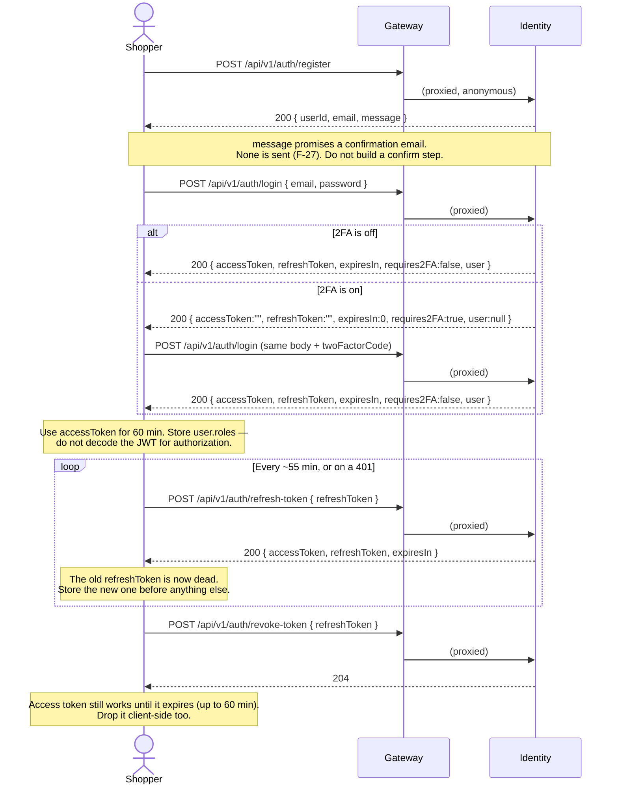
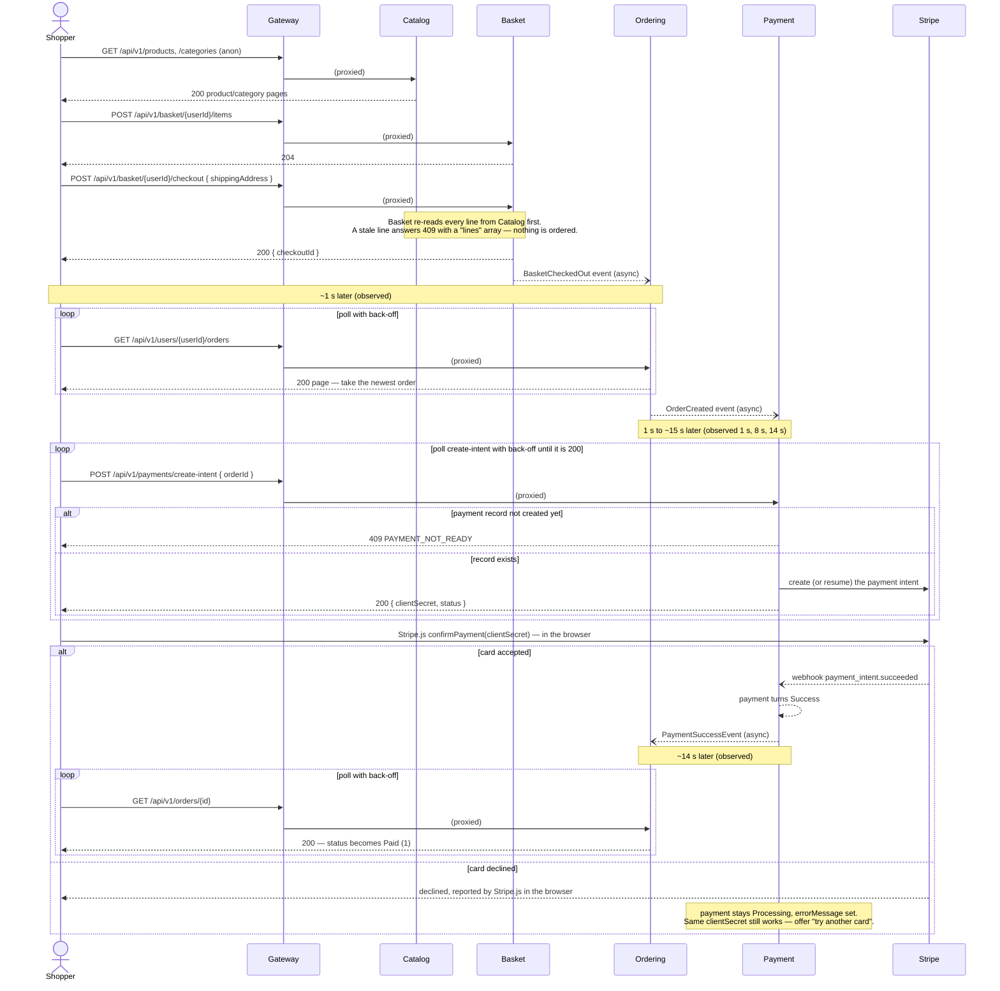
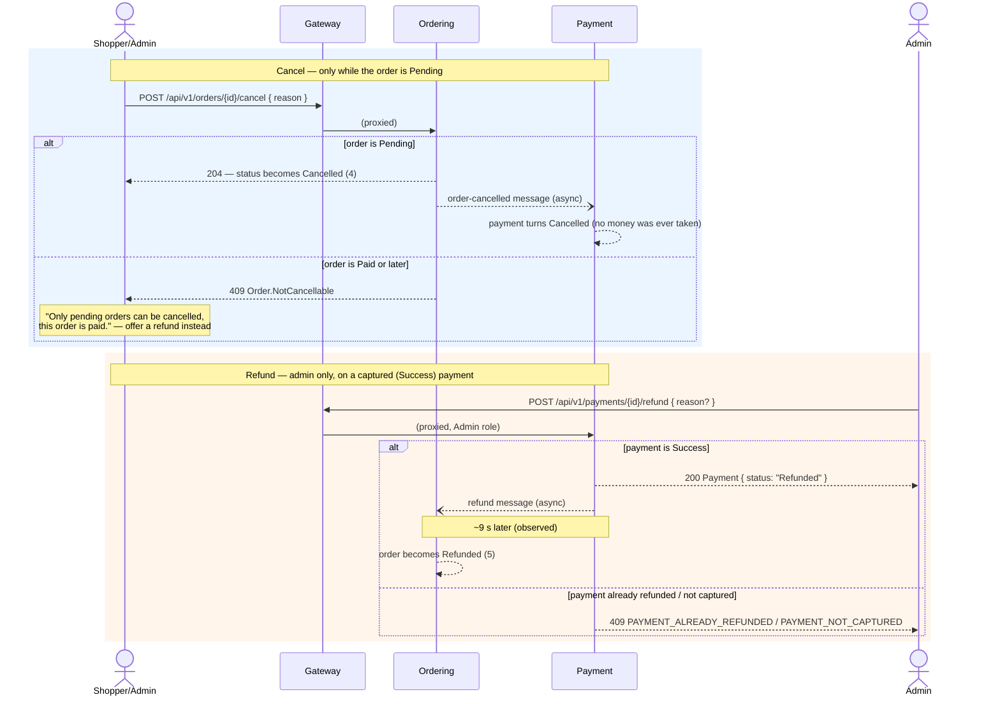
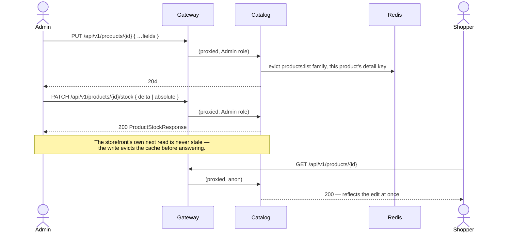
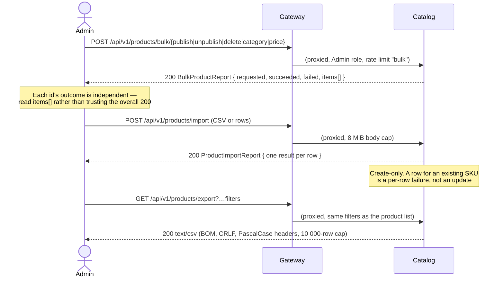
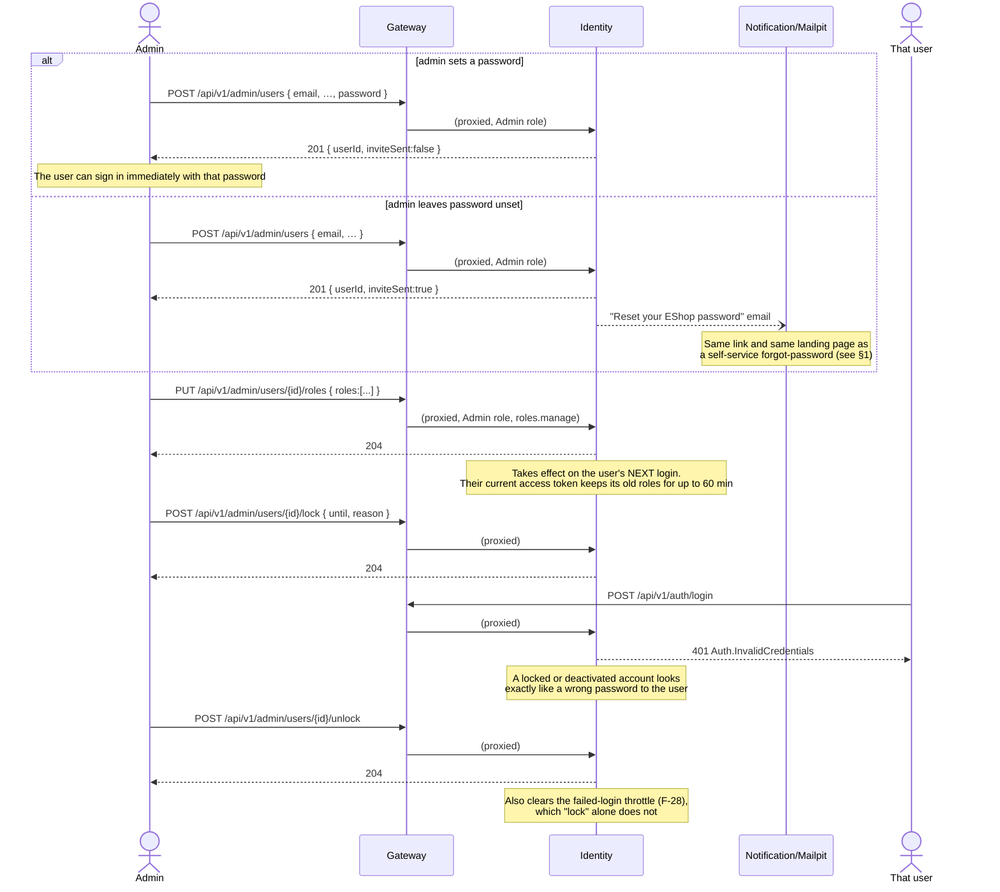

# Client flows

End-to-end sequences a client implements, assembled from the per-service contracts. Each diagram names the calls in
order; the prose below it says what to poll, how long to expect, and what quirk to design around. Nothing here was
re-probed for this file — every call, status and timing figure is already verified in the linked service file, and
this file is a synthesis of them.

**Verified at:** `85b69f5` on `feature/admin-panel` (2026-09-25) — the same commit as every service file it draws on.

---

## Contents

- [1. Sign-up and sign-in](#1-sign-up-and-sign-in)
- [2. Browse to a paid order](#2-browse-to-a-paid-order)
- [3. Cancel and refund](#3-cancel-and-refund)
- [4. Admin: product edit](#4-admin-product-edit)
- [5. Admin: bulk actions, import and export](#5-admin-bulk-actions-import-and-export)
- [6. Admin: user management](#6-admin-user-management)

---

## 1. Sign-up and sign-in

- **Registration signs nothing up for email confirmation in practice.** [`POST /auth/register`](identity.md#post-apiv1authregister)
  answers with a message that promises a confirmation email, but none is sent (F-27, deferred by the owner). The
  account can log in immediately. Do not add a "check your email" step, and do not build a UI for
  [`POST /auth/confirm-email`](identity.md#post-apiv1authconfirm-email) — no user can call it successfully, since
  registration gives them nothing to send.
- **Branch on `requires2FA`, never on the HTTP status.** Both the plain and the 2FA-pending answers are 200
  ([`POST /auth/login`](identity.md#post-apiv1authlogin)). Re-send the exact same login request with `twoFactorCode`
  added once the user enters a code from their authenticator app.
- **Recovery codes cannot be redeemed** (F-29): if a 2FA user loses their device, the only way back in is an admin
  running [`disable-2fa`](identity.md#post-apiv1adminusersiddisable-2fa) on their account. Do not tell users the
  codes shown at enrollment will let them sign in.
- **Refresh rotates the token, one at a time.** [`POST /refresh-token`](identity.md#post-apiv1authrefresh-token)
  invalidates the old refresh token as soon as it is used; run one refresh at a time (a parallel second refresh with
  the same token gets `Auth.InvalidToken` or, rarely, `Auth.TokenAlreadyUsed`) and store the new pair before any other
  request that might itself trigger a refresh.
- **A `password` field can also lock the account for 15 minutes** ([Failed logins and
  lockout](identity.md#failed-logins-and-lockout)): three wrong attempts throttle the account with an
  exponentially-growing delay (the reported wait itself is meaningful since the `bb8c148` fix), and a fifth locks it
  for 10 minutes. Any 401 `Auth.TooManyAttempts` should show the server's `detail`, not a generic "wrong password".
- **Forgot/reset password** is a separate, unauthenticated flow: `POST /auth/forgot-password` always answers the same
  200 regardless of whether the address exists (no user enumeration); the email's link
  (`<ResetUrlBase>?userId=…&token=…`, both URL-encoded) must be served by the frontend at the configured base path,
  and posts to [`POST /auth/reset-password`](identity.md#post-apiv1authreset-password), which revokes every session.
  The same reset page also completes an admin-created account that was invited with no password (see
  [§6](#6-admin-user-management)).
- **Logout is a revoke, not a token blacklist.** [`POST /revoke-token`](identity.md#post-apiv1authrevoke-token) is
  204 and idempotent even for an unknown token; the client must still discard its own access token, since the server
  cannot invalidate one early.

---

## 2. Browse to a paid order

- **There is no endpoint that returns an order id from a `checkoutId`.** Poll
  [`GET /users/{userId}/orders`](ordering.md#get-apiv1usersuseridorders) (newest first) and take the top row; do not
  try to correlate by amount or item list, since a second concurrent checkout would race it.
- **A repeated checkout call is safe.** [`POST /{userId}/checkout`](basket.md#post-apiv1basketuseridcheckout) returns
  the same `checkoutId` for a retry after a lost response, as long as the basket has not been re-created since. A
  revalidation 409 means the
  basket was updated to the catalog's current prices/stock in the same response — show the `lines` array, let the
  shopper review, and re-submit the identical request.
- **`create-intent` is both "create" and "resume".** Call it once to get the `clientSecret`; call it again — after a
  reload, in a second tab, or because the first response was lost — and it returns the **same** intent and secret
  while the payment is still payable (F-52, fixed). Do not cache the secret only in memory: store it (for example in
  `sessionStorage`) so a reload does not orphan the payment, but treat a fresh `create-intent` call as the source of
  truth.
- **The publishable key is not served by the API.** Stripe.js needs the publishable key from the frontend's own
  configuration, from the same Stripe account as the server's secret key ([payment.md](payment.md#how-a-customer-pays-the-card-flow)).
- **Poll with back-off, not a fixed delay**, for every asynchronous step above: 1 s, 2 s, 4 s, … up to about 30 s
  (the outbox processor's idle back-off). The observed figures (1 s / 8 s–15 s / 14 s) are typical, not guaranteed.
  See [conventions.md §9](conventions.md#9-consistency-and-caching) for the full table.
- **Changing the order's items while it is Pending is safe and reaches Payment.** Adding, updating or removing a
  line updates `Order.totalPrice`, and Payment revises its own `amount` — and an open Stripe intent's amount — within
  about 2 s ([ordering.md](ordering.md#post-apiv1ordersiditems), [payment.md](payment.md#payment-status-and-method)).
  The same `clientSecret` keeps working and now charges the new total; no new `create-intent` call is needed.

---

## 3. Cancel and refund

- **There is no customer "cancel after payment."** Once an order is Paid, [`POST /{id}/cancel`](ordering.md#post-apiv1ordersidcancel)
  answers 409 `Order.NotCancellable`; the only way back is an admin refund
  ([ordering.md](ordering.md#post-apiv1ordersidcancel)).
- **Refunds are always full**, never partial: `amount`, if sent at all, must equal the payment's own amount exactly
  ([`POST /{id}/refund`](payment.md#post-apiv1paymentsidrefund)).
- **A refund moves real money only for a card payment.** Stripe refunds in about 1 s. An offline or
  simulator-settled payment is only marked `Refunded` in the database — the money must be returned outside the
  system.
- **The order's status change is asynchronous either way**, by message, not by the cancel/refund call itself: expect
  the order to still read its old status for a few seconds after a 204/200. Poll
  [`GET /orders/{id}`](ordering.md#get-apiv1ordersid) with back-off.
- **A cancelled order is never refunded automatically.** If a payment already succeeded before the cancel request
  raced it, Payment does not undo it — that state is reconciled by an admin refund, not by the cancel flow.

---

## 4. Admin: product edit

- **A new product starts as a Draft**, invisible to the storefront, until
  [`POST /{id}/publish`](catalog.md#post-apiv1productsidpublish) — see the [product lifecycle
  diagram](catalog.md#product-lifecycle). Publish/unpublish are idempotent.
- **`PUT` and `POST` normalise differently** (F-41): create stores the name untrimmed, update trims it. Trim on the
  client before either call to avoid the difference being visible at all.
- **Stock has no built-in floor beyond zero-or-negative refusal**, and the endpoint is safe to call concurrently:
  concurrent `+1` deltas from multiple admin sessions are each applied in turn (observed 8 parallel `+1` calls all
  succeed and sum correctly) — [`PATCH /{id}/stock`](catalog.md#patch-apiv1productsidstock).
  **Ordering itself checks no stock** when an order is created directly with `POST /orders` rather than through
  Basket checkout ([ordering.md](ordering.md#post-apiv1orders)) — worth knowing before building an admin
  order-creation screen on that endpoint.
- **Deleting sets the product Discontinued**, freeing its SKU; restoring always comes back as a Draft, so the admin
  must publish it again to make it visible ([Product lifecycle](catalog.md#product-lifecycle)).
- **Moving or deleting the product's category has consequences the product edit screen should guard against**:
  restoring a product whose category was deleted makes it unreachable by id (F-43), and `PUT
  /categories/{id}/parent` with an empty body silently re-roots a category (F-38). Neither is fixed; both are
  documented with a ⚠ in [catalog.md](catalog.md).
- **Cache invalidation is automatic on every write** — an admin never needs to call
  [`POST /admin/cache/invalidate`](catalog.md#cache) after an ordinary edit. That endpoint exists for recovering
  from an inconsistency, not as a step in the normal edit flow.

---

## 5. Admin: bulk actions, import and export

- **A bulk report is per-item, not all-or-nothing.** [`POST /bulk/{action}`](catalog.md#bulk-product-actions)
  answers 200 even when some ids failed; the admin UI must read `report.items[]`, not just the overall status. Only
  `bulk/category` can refuse the whole request up front (an unknown target category), before touching any row.
- **A repeated id in the request is refused outright, not de-duplicated** — the batch is rejected with 400, forcing
  the client to fix its own list rather than silently picking a winner.
- **Import never updates.** [`POST /products/import`](catalog.md#product-import) checks every row exactly as
  `POST /products` would, so a row naming an existing SKU is a per-row failure in `ProductImportReport`, not a
  silent update — there is no bulk-edit-by-CSV path.
- **Export shares the product list's filters** ([`GET /products/export`](catalog.md#product-export)), so a
  filtered admin grid and its "export this view" button should send the same query string. The CSV writes the enum
  by name (`Active`), exactly as the JSON list does ([conventions.md, enum table](conventions.md#enums)).
- **The gateway's general 1 MiB body cap does not apply to import** — it gets its own 8 MiB cap, big enough for
  about 1 000 rows; bulk actions and everything else stay under the general cap.
- **A cache family is bumped once per request, not once per row** — a 1 000-item bulk publish costs one
  `products:list` eviction, not a thousand.

---

## 6. Admin: user management

- **An invited user completes their own account through the password-reset page**, not a separate "accept invite"
  endpoint: `inviteSent: true` sends the same email as
  [`forgot-password`](identity.md#post-apiv1authforgot-password), landing on the same
  `/reset-password` page ([`POST /admin/users`](identity.md#post-apiv1adminusers)). Build one reset-password page,
  not two.
- **A role change is not retroactive on an issued token.** `PUT /{id}/roles` changes what the *next* login's token
  contains; a session already open keeps its old `roles` claim for up to 60 minutes. Don't promise "permissions
  applied immediately" in the UI copy.
- **Deleting a role does not evict members' cached role claim either** (F-33): for up to 5 minutes after
  `DELETE /roles/{id}`, a member's freshly issued token can still carry the deleted role name, even though the same
  response's `user.roles` (from `/auth/login`) already omits it.
- **Locked, deactivated and deleted accounts are indistinguishable to the end user** — all three answer 401
  `Auth.InvalidCredentials` at login, deliberately, to avoid leaking account state. The admin screen is the only
  place that can tell them apart (`GET /admin/users/{id}`'s own status field).
- **Unlock does two things `lock`'s opposite doesn't**: it clears both the admin-set lock *and* the automatic
  failed-login throttle (F-28's fix). A support agent who only knows about "lock" may not realise a still-blocked
  login after unlocking is the throttle, not the lock, reasserting itself — advise re-running unlock, which is
  idempotent.
- **Deactivate/delete/revoke-tokens all revoke refresh tokens**, but not the access token already in the user's
  browser — it keeps working for up to 60 minutes ([identity.md, "When the account is no longer
  usable"](identity.md#when-the-account-is-no-longer-usable)). Where an admin needs an *immediate* cutoff (a
  compromised account), there is no faster mechanism than that window.

---

## Related documents

- [conventions.md §4](conventions.md#4-authentication) — the auth building blocks these flows compose
- [conventions.md §9](conventions.md#9-consistency-and-caching) — the full table of observed asynchronous delays
- [identity.md](identity.md), [basket.md](basket.md), [ordering.md](ordering.md), [payment.md](payment.md),
  [catalog.md](catalog.md) — the endpoint-level detail behind every step above

---

**Version**: 1.0  
**Last Updated**: 2026-09-25
