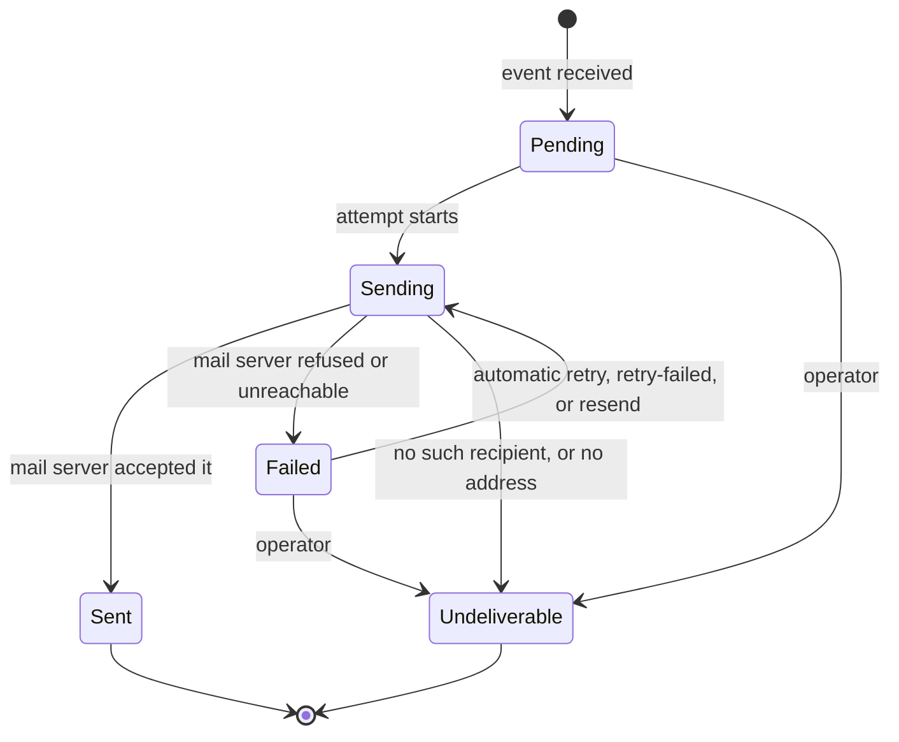

# Notification API

The admin panel's view of outgoing email: the delivery journal (list, statistics, one notification in full), the
email templates and a test send of each, and the operator actions retry, resend and mark-undeliverable.

**Verified at:** `0d87f3b` (`feature/admin-panel`, 2026-09-25). Notification's source has not changed since the
`105d647` baseline. Every endpoint in this file was checked against the C# source and the service's OpenAPI document,
and called through the gateway on the compose `sandbox` stack, with Mailpit as the mail server. The failure paths
were produced for real: Mailpit was stopped (deliveries fail) and paused (a delivery hangs mid-attempt). Shared rules
(errors, paging, rate limits, CORS) are in [conventions.md](conventions.md) and are not repeated here.

## Base paths through the gateway

| Path | Methods | Gateway policy | Service policy | Audience |
|---|---|---|---|---|
| `/api/v1/notifications`, `/stats`, `/{id}`, `/templates` | GET | `Admin` role | permission `notifications.read` | Admin panel |
| `/api/v1/notifications/templates/{name}/test`, `/retry-failed`, `/{id}/resend`, `/{id}/mark-undeliverable` | POST | `Admin` role | permission `notifications.manage` | Admin panel |

The gateway has one route for Notification, `/api/v1/notifications/**`, for every method, with the **`Admin` role**.
So there are two different checks, and a request must pass both: the gateway asks for the role, Notification asks for
the permission. A signed-in non-admin gets an empty 403 **from the gateway**; the request never reaches Notification
(verified: Notification logged no 403 for it). Called directly, Notification answers the same 401/403 itself.

Not routed through the gateway: Notification's own `GET /api/v1/admin/audit` (see
[Not callable by clients](#not-callable-by-clients)).

**Customers never call this service.** A customer's emails (order confirmation, payment, refund, password reset) are
sent by Notification when it receives the matching event from another service. There is no storefront endpoint, and
no customer-facing view of what was sent.

**Rate limit:** none of Notification's own. Only the global limiter applies: 100 requests per 60 seconds per client
IP, at the gateway and again in the service ([conventions.md §7](conventions.md#7-rate-limits)).

**Request bodies:** unknown properties are ignored. A body that is not valid JSON is 400 `MalformedRequest`. A query
value of the wrong type (`?pageSize=abc`, `?hasError=maybe`, `?from=yesterday`) is **also** 400 `MalformedRequest`,
with a `detail` that wrongly blames the request body (F-25).

## Contents

- [How a notification is delivered](#how-a-notification-is-delivered)
  - [Status](#status)
  - [Templates and the events that send them](#templates-and-the-events-that-send-them)
- [Admin panel](#admin-panel)
  - [Journal](#get-apiv1notifications)
  - [Statistics](#get-apiv1notificationsstats)
  - [One notification](#get-apiv1notificationsid)
  - [Templates](#get-apiv1notificationstemplates)
  - [Send a test email](#post-apiv1notificationstemplatesnametest)
  - [Retry failed notifications](#post-apiv1notificationsretry-failed)
  - [Resend one notification](#post-apiv1notificationsidresend)
  - [Mark undeliverable](#post-apiv1notificationsidmark-undeliverable)
  - [Not callable by clients](#not-callable-by-clients)
- [Types](#types)
- [Frontend notes](#frontend-notes)

---

## How a notification is delivered

Every notification is one email for one integration event, and the journal row is the record of its delivery.
Source: `NotificationLog` in `EShop.Notification.Domain/Entities/NotificationLog.cs`.

### Status

`status` is a **PascalCase string**:

| Value | Meaning | Final? |
|---|---|---|
| `Pending` | Recorded; no attempt has started. Rarely seen, because an attempt starts at once | no |
| `Sending` | An attempt holds the row: it is looking up the recipient or talking to the mail server | no |
| `Sent` | The mail server accepted the email; `providerMessageId` is its Message-ID | **yes** |
| `Failed` | The last attempt failed; `lastError` says why. It will be tried again | no |
| `Undeliverable` | No attempt can ever succeed: the recipient does not exist or has no address, or an operator [marked it](#post-apiv1notificationsidmark-undeliverable) | **yes** |



- **A final row is never attempted again**, by anyone. A resend or retry of a `Sent` or `Undeliverable` notification
  is refused, and a duplicate copy of its event that arrives later is skipped without sending (observed: "already
  Sent. Skipping."). No path sends the same notification twice.
- **An attempt holds its row for up to 5 minutes** (the attempt lease). While it does, resend and mark-undeliverable
  answer 409 `Notification.AttemptInProgress`. An attempt older than that is taken to have died, and the row can be
  retried or closed. Observed: with the mail server hanging, a row stayed `Sending` and both actions were refused.
- **`retryCount` counts failed attempts.** A failed delivery is retried automatically, several times a minute while
  the mail server is down (observed: 6 failed attempts in the first 90 s, 8 after about 2.5 minutes), and the row is
  sent as soon as the server is back. See the ⚠ on [automatic retries](#frontend-notes).
- **Rows are kept for 90 days** after their last change, then deleted.
- **Not in the journal:** template test sends, and the gateway's own operational notices to operators (the gateway
  sends those itself).

`lastError` is Notification's own wording, never the mail server's:

| When | `lastError` |
|---|---|
| An attempt failed | One of `"Email provider timeout."`, `"Email provider authentication failed."`, `"Email provider connectivity error."`, `"Email request validation failed."`, `"Email sending failed."` (observed for a refused SMTP connection) |
| The recipient cannot exist | For example `"Identity has no such user (404)."` (observed) |
| An operator marked it | `"Marked undeliverable by an operator: <reason>"` |

A `Sent` row has `lastError: null`: a later success clears the last failure.

### Templates and the events that send them

| `templateName` | `eventType` | Sent when | Resendable |
|---|---|---|---|
| `order-created` | `OrderCreatedEvent` | An order is created (checkout, or an admin creates one) | yes |
| `order-shipped` | `OrderShippedEvent` | An admin ships the order | yes |
| `payment-created` | `PaymentCreatedEvent` | A card payment **starts** (`create-intent`); nothing is charged yet | yes |
| `payment-completed` | `PaymentCompletedEvent` | The payment succeeds | yes |
| `payment-failed` | `PaymentFailedEvent` | The payment fails | yes |
| `payment-refunded` | `PaymentRefundedEvent` | An admin refunds the payment | yes |
| `password-reset` | `PasswordResetRequestedIntegrationEvent` | A customer asks for a reset, or an admin resets a password or invites a user | **no** |

A password reset is never resendable: its link carries a live reset token, so the event is not kept. Ask the customer
to request a new one.

---

## Admin panel

**Auth for every endpoint in this section:** gateway `Admin` role, then the service permission named per endpoint.
Anonymous → 401 from the gateway; a signed-in non-admin → empty 403 from the gateway (verified on all eight).

**Audit:** the four actions (test send, retry-failed, resend, mark-undeliverable) each write one row to the audit
trail, including refused and failed attempts. Read it through the gateway's merged
[`GET /api/v1/admin/audit`](admin-platform.md#get-apiv1adminaudit). The reads are not audited.

**Not cached:** every read goes to the database.

### `GET /api/v1/notifications`

The journal: every notification, filtered and paged, newest first (`createdAt` descending, then `id`). Source:
`GetNotificationsQuery`. **Service:** `notifications.read`.

**Query** [`NotificationListQuery`](#notificationlistquery); all optional:

| Parameter | Type | Default | Meaning |
|---|---|---|---|
| `pageNumber` | integer | `1` | ≥ 1 |
| `pageSize` | integer | `20` | 1–100 |
| `status` | string, repeatable | — | A status **name**, any case (`Failed`, `sent`). Repeat for a union: `?status=Failed&status=Undeliverable`. A number is refused |
| `eventType` | string | — | **Exact** match, any case (`OrderCreatedEvent`; `OrderCreated` matches nothing). At most 200 characters |
| `templateName` | string | — | **Exact** match, any case (`order-created`). At most 100 characters |
| `userId` | string | — | **Exact, case-sensitive** match on the recipient's user id. At most 100 characters |
| `email` | string | — | **Exact** match on the recipient address, any case. Not a search: `fe-contracts-customer` matches nothing. At most 320 characters |
| `from`, `to` | date-time | — | Inclusive bounds on `createdAt`. A value without a zone is read as UTC. `to` may equal `from` |
| `hasError` | boolean | — | `true`: only rows with a `lastError`. `false`: only rows without one |

There is no free-text search and no sort parameter; unknown parameters are ignored.

**200** [`PagedResult<NotificationSummary>`](conventions.md#61-pagedresultt-offset-pages-the-common-case). Captured
live (`?status=Undeliverable`):

```json
{"items":[{"id":"c0ffe6f9-64df-4644-9ecd-8f57361e0991","eventId":"8a439147-78e5-410f-9b19-275bfbf238a9",
   "eventType":"OrderCreatedEvent","templateName":"order-created",
   "subject":"Order confirmation #c95701e0-d1bb-47a1-92c8-3e209d62f3bb","status":"Undeliverable",
   "recipientEmail":null,"userId":"fe-contracts-no-such-user","retryCount":0,"hasError":true,
   "createdAt":"2026-09-25T10:38:49.722208Z","sentAt":null,"updatedAt":"2026-09-25T10:38:49.735599Z"}],
 "pageNumber":1,"pageSize":20,"totalCount":1,"totalPages":1,"hasPreviousPage":false,"hasNextPage":false}
```

(That order was created by an admin for a user id that does not exist, so there was nobody to email.)

| Status | `errorCode` | When |
|---|---|---|
| 400 | `Validation.Failed` | `pageNumber` < 1 (`"PageNumber: Page number must be at least 1."`); `pageSize` outside 1–100 (`"PageSize: Page size must not exceed 100."`); a `status` that is not a name (`"Status[0]: Status must each be one of: Pending, Sent, Failed, Sending, Undeliverable"`, also for `status=1`); a filter over its length (`"EventType: EventType must not exceed 200 characters."`); `to` before `from` (`"To: To must not be earlier than From"`) |
| 400 | `MalformedRequest` | A value of the wrong type (`pageSize=abc`, `hasError=maybe`, `from=yesterday`). `detail` says "The request body is not valid JSON…" although there is no body (F-25) |
| 401 / 403 | — | Anonymous / not an admin (both from the gateway) |

### `GET /api/v1/notifications/stats`

Dashboard counts over the same filters, without paging. Source: `GetNotificationStatsQuery`. **Service:**
`notifications.read`.

**Query:** every [journal](#get-apiv1notifications) filter (`status`, `eventType`, `templateName`, `userId`, `email`,
`from`, `to`, `hasError`), with the same rules and the same errors. `pageNumber`/`pageSize` are ignored.

**200** [`NotificationStats`](#notificationstats). Captured live (`?from=2026-09-25&to=2026-09-25T23:59:59`):

```json
{"from":"2026-09-25T00:00:00Z","to":"2026-09-25T23:59:59Z","total":52,"sent":51,"failed":0,"queued":0,
 "undeliverable":1,"byStatus":[{"status":"Pending","count":0},{"status":"Sent","count":51},
   {"status":"Failed","count":0},{"status":"Sending","count":0},{"status":"Undeliverable","count":1}]}
```

- `from`/`to` echo the window as applied, in UTC (`?from=2026-09-25T00:00:00+03:00` comes back as
  `"2026-09-24T21:00:00Z"`), or `null` when unbounded.
- `queued` is `Pending` + `Sending`: nothing delivered yet, and something still will be. Observed `queued: 1` while an
  attempt hung.
- `total` is the sum of `byStatus`. `byStatus` always has **five** entries, zeros included, in the order `Pending`,
  `Sent`, `Failed`, `Sending`, `Undeliverable`.
- A `status` filter narrows every figure (`?status=Undeliverable` → `total: 1`, every other count 0).

| Status | `errorCode` | When |
|---|---|---|
| 400 | `Validation.Failed` | As for the journal (`status`, lengths, `to` before `from`) |
| 400 | `MalformedRequest` | A value of the wrong type (`to=soon`) (F-25) |
| 401 / 403 | — | Anonymous / not an admin (gateway) |

### `GET /api/v1/notifications/{id}`

One notification in full, with the three fields the journal omits: `lastError`, `correlationId` and
`providerMessageId`, plus the attempt and resend state. Source: `GetNotificationByIdQuery`. **Service:**
`notifications.read`.

**200** [`NotificationDetail`](#notificationdetail). Captured live, a row that failed while the mail server was down:

```json
{"id":"f745b236-dc6b-49bb-8b16-c0b97ca7d213","eventId":"530b58f6-03a1-498a-b388-b0bb5f8df7f7",
 "eventType":"OrderCreatedEvent","templateName":"order-created",
 "subject":"Order confirmation #7c6a2e28-0a22-4a05-ac40-7a983aee478a","status":"Failed",
 "recipientEmail":"fe-contracts-customer2@example.com","userId":"a61222ca-c3e5-4886-bb16-0cc61fc2d909",
 "correlationId":"1aa217aaa39047ae8944a571bcfda607","retryCount":8,"lastError":"Email sending failed.",
 "providerMessageId":null,"createdAt":"2026-09-25T18:14:30.300958Z","sentAt":null,
 "updatedAt":"2026-09-25T18:16:14.274436Z","attemptStartedAt":"2026-09-25T18:16:14.230554Z",
 "isFinal":false,"isResendable":true}
```

- `correlationId` ties the row to the request that caused the event; search the logs (Seq) with it. For an event that
  did not start from a client request (a Stripe webhook), it can equal `eventId`.
- `isResendable` is `true` when the row is not final and its event was kept. It does **not** mean a resend will be
  accepted right now: while an attempt holds the row, the resend is still 409 (observed on a `Sending` row showing
  `isResendable: true`).
- `recipientEmail` is `null` until the recipient is known: during an attempt, and on a row whose user does not exist.

| Status | `errorCode` | When |
|---|---|---|
| 401 / 403 | — | Anonymous / not an admin (gateway) |
| 404 | `Notification.NotFound` | No such notification, including the all-zero id: `"Notification <id> was not found."` |
| 404 | — | The id is not a GUID (the route does not match; empty body) |

### `GET /api/v1/notifications/templates`

The email templates this service sends, for a template picker or the test-send screen. Source:
`GetNotificationTemplatesQuery`. **Service:** `notifications.read`.

**200** [`NotificationTemplate`](#notificationtemplate)[], a bare array, always the seven in the
[table above](#templates-and-the-events-that-send-them). Captured (shortened):

```json
[{"name":"order-created","eventType":"OrderCreatedEvent","resendable":true},
 {"name":"password-reset","eventType":"PasswordResetRequestedIntegrationEvent","resendable":false}]
```

401 / 403 as above. It has no other error.

### `POST /api/v1/notifications/templates/{name}/test`

Send one template, filled with sample data, to an address you choose, and wait for the mail server's answer. Source:
`SendTestNotificationCommand`. **Service:** `notifications.manage`.

- `{name}` is a template name, **any case** (`PAYMENT-FAILED` works; the response gives the canonical `payment-failed`).
- The email is exactly what a customer would receive: same template, same subject line (no "[TEST]" prefix), same
  mail server. The sample data marks it: order id `00000000-0000-0000-0000-000000000000`, a total of 123.45 USD, the
  date 2026-01-15, and a greeting to `name`. The password-reset sample links to the real reset page with a token no
  account holds.
- **Synchronous:** the response comes after the mail server has answered.
- It writes **no** journal row.

**Body** [`TestNotificationRequest`](#testnotificationrequest):

| Field | Type | Required | Notes |
|---|---|---|---|
| `email` | string | yes | A valid address, at most 320 characters |
| `name` | string | no | Whom the email greets, at most 100 characters. Omitted, `null` or blank: "there" (from source) |

**200** [`TestNotificationResult`](#testnotificationresult). Captured:

```json
{"templateName":"order-created","providerMessageId":"AA5EIDRLEUU4.QKN7UZVZZMD72@16580f371363"}
```

The email arrived in Mailpit with that Message-ID and the subject
`Order confirmation #00000000-0000-0000-0000-000000000000`.

| Status | `errorCode` | When |
|---|---|---|
| 400 | `Validation.Failed` | `email` missing, `null`, blank, or no body at all (`"Email: Email is required."`); not an address (`"Email: Email is not a valid address."`); over 320 characters; `name` over 100 characters |
| 400 | `MalformedRequest` | The body is not valid JSON |
| 401 / 403 | — | Anonymous / not an admin (gateway) |
| 404 | `Notification.TemplateNotFound` | `"There is no template named 'no-such-template'."` |
| 503 | `Notification.TestSendFailed` | The mail server refused the email or could not be reached (observed with Mailpit stopped): `"The test email could not be sent: the mail server refused it or could not be reached. The reason is in the service log."` |

- **Audit:** every attempt is recorded, the refused ones too, with the address masked (`"email":"****"`).

### `POST /api/v1/notifications/retry-failed`

Send the **`Failed`** notifications that match a filter again, oldest first, up to a limit. For clearing a backlog
after an outage. Source: `RetryFailedNotificationsCommand`. **Service:** `notifications.manage`.

**Body** [`RetryFailedNotificationsRequest`](#retryfailednotificationsrequest), optional. **No body, `{}` and every
field omitted** mean "the oldest failed ones, up to 100" (observed 202):

| Field | Type | Notes |
|---|---|---|
| `eventType` | string | As the journal filter: exact, any case, at most 200 characters |
| `templateName` | string | Exact, any case, at most 100 characters |
| `userId` | string | Exact, case-sensitive, at most 100 characters |
| `email` | string | Exact, any case, at most 320 characters |
| `from`, `to` | date-time | Inclusive bounds on `createdAt`; `to` not before `from` |
| `limit` | integer | How many to send, 1–100. Omitted: 100 |

There is **no `status` field**: only `Failed` rows are ever retried, and a `status` sent anyway is ignored. Rows whose
event was not kept (password resets) are skipped and not counted in `matching`.

**202** [`RetryFailedNotificationsResult`](#retryfailednotificationsresult). Captured (two failed rows matched,
`limit: 1`):

```json
{"matching":2,"limit":1,"dispatchedIds":["6b6ee3e1-dcae-45e1-b80b-6a08ecb78d10"],"failedIds":[]}
```

- **Dispatched is not delivered.** Each id was handed to the delivery queue; the journal shows the outcome a moment
  later. Poll the rows or the [statistics](#get-apiv1notificationsstats).
- `matching` counts every failed, resendable row that matched when the request ran. When it is larger than the two id
  lists together, the rest are waiting: call again.
- `failedIds` are rows the message bus refused outright. They stay `Failed` (from source; not observed).
- **Calling it twice is safe.** A row dispatched twice is delivered once, and the extra copy is skipped (observed: the
  retried row was sent once, and two later copies were skipped as "already Sent").
- There is no `Location` header.

| Status | `errorCode` | When |
|---|---|---|
| 400 | `Validation.Failed` | `limit` outside 1–100 (`"Limit: Limit must be between 1 and 100."`); a field over its length; `to` before `from` |
| 400 | `MalformedRequest` | The body is not valid JSON |
| 401 / 403 | — | Anonymous / not an admin (gateway) |
| 503 | `Notification.BusUnavailable` | This Notification host runs no message bus (test hosts only; from source) |
| 504 | — (empty body) | **The gateway gave up after 10 s.** Observed while deliveries were failing: the service could not reach the queue, nothing was dispatched, and the gateway answered 504 (F-56) |

### `POST /api/v1/notifications/{id}/resend`

Send one notification again. The stored event is put back on the delivery queue and delivered the normal way. Source:
`ResendNotificationCommand`. **Service:** `notifications.manage`. No body.

- Allowed for a `Pending` or `Failed` row, and for a `Sending` row whose attempt has passed its 5-minute lease.
- It writes nothing itself: the row is unchanged until the delivery claims it.

**202** [`NotificationDetail`](#notificationdetail): the row **as it stands before the resend** (still `Failed`), with
`Location: /api/v1/notifications/{id}` (a relative path). Captured:

```json
{"id":"6b6ee3e1-dcae-45e1-b80b-6a08ecb78d10","eventId":"9efaa80c-7f8a-484a-86cf-30d6cce64546",
 "eventType":"OrderCreatedEvent","templateName":"order-created",
 "subject":"Order confirmation #51d53577-a283-4b31-9c32-8a5b20531a3d","status":"Failed",
 "recipientEmail":"fe-contracts-customer2@example.com","userId":"a61222ca-c3e5-4886-bb16-0cc61fc2d909",
 "correlationId":"f436cf80affd4391b9470c3eb4040d80","retryCount":5,"lastError":"Email sending failed.",
 "providerMessageId":null,"createdAt":"2026-09-25T18:18:29.351432Z","sentAt":null,
 "updatedAt":"2026-09-25T18:18:44.505432Z","attemptStartedAt":"2026-09-25T18:18:44.461716Z",
 "isFinal":false,"isResendable":true}
```

Poll [`GET /api/v1/notifications/{id}`](#get-apiv1notificationsid) until `status` is final. Observed: the row was
`Sent` 12 s later, as soon as the mail server was back, and the one email went out once; the other copies of the event
(the resend's and a retry's) were skipped.

| Status | `errorCode` | When |
|---|---|---|
| 401 / 403 | — | Anonymous / not an admin (gateway) |
| 404 | `Notification.NotFound` | No such notification |
| 404 | — | The id is not a GUID (empty body) |
| 409 | `Notification.Final` | The row is `Sent` or `Undeliverable`: `"Notification <id> is Undeliverable; nothing is attempted again once a notification is final."` |
| 409 | `Notification.AttemptInProgress` | An attempt holds the row: `"An attempt to deliver notification <id> is in progress. Wait for it to end — at most the attempt lease — and look again."` Observed during an automatic retry and during a hung attempt |
| 409 | `Notification.NotResendable` | The event was not kept: `"Notification <id> kept no copy of its event, so there is nothing to send again. A password reset is never kept (its link carries a live token); ask the customer to request a new one."` Observed on a failed password reset. Also for an event type no consumer delivers any more (from source) |
| 503 | `Notification.BusUnavailable` | No message bus on this host (test hosts only; from source) |
| 503 | `Notification.DispatchFailed` | The message bus refused the resend: `"The message bus refused the resend. The reason is in the service log."` (from source) |
| 504 | — (empty body) | The gateway gave up after 10 s; nothing was resent (observed; F-56) |

### `POST /api/v1/notifications/{id}/mark-undeliverable`

Close a notification for good, with a reason: for example an address that bounces for a reason no retry will cure.
Source: `MarkNotificationUndeliverableCommand`. **Service:** `notifications.manage`.

**Body** [`MarkUndeliverableRequest`](#markundeliverablerequest):

| Field | Type | Required | Notes |
|---|---|---|---|
| `reason` | string | yes | Not blank, at most 500 characters. Stored trimmed, prefixed, as `lastError` |

**200** [`NotificationDetail`](#notificationdetail), now `Undeliverable`. Captured (the reason was sent with
surrounding spaces):

```json
{"id":"da0ec676-6963-40a8-aa0a-f34882784c53","eventId":"43000016-b8eb-49c1-a3f5-7626f2549207",
 "eventType":"OrderCreatedEvent","templateName":"order-created",
 "subject":"Order confirmation #7c0be6ca-e615-4029-ab01-4eec6d04d031","status":"Undeliverable",
 "recipientEmail":"fe-contracts-customer2@example.com","userId":"a61222ca-c3e5-4886-bb16-0cc61fc2d909",
 "correlationId":"86bf357b073143d5b34d366f7325e79d","retryCount":1,
 "lastError":"Marked undeliverable by an operator: fe-contracts S8: address bounces permanently",
 "providerMessageId":null,"createdAt":"2026-09-25T18:18:29.355817Z","sentAt":null,
 "updatedAt":"2026-09-25T18:18:36.2804473Z","attemptStartedAt":"2026-09-25T18:18:29.363432Z",
 "isFinal":true,"isResendable":false}
```

- Allowed from `Pending`, `Failed`, or a `Sending` row whose lease has expired. Not counted in `retryCount`.
- **Nothing is sent afterwards.** Observed: the pending automatic retry of this row arrived later and was skipped.

| Status | `errorCode` | When |
|---|---|---|
| 400 | `Validation.Failed` | `reason` missing, `null`, blank, or no body at all (`"Reason: A reason is required."`); over 500 characters (`"Reason: Reason must not exceed 500 characters."`) |
| 400 | `MalformedRequest` | The body is not valid JSON (from source) |
| 401 / 403 | — | Anonymous / not an admin (gateway) |
| 404 | `Notification.NotFound` | No such notification |
| 404 | — | The id is not a GUID (empty body) |
| 409 | `Notification.Final` | Already `Sent` or `Undeliverable` (observed on a second call) |
| 409 | `Notification.AttemptInProgress` | An attempt holds the row (observed during a hung attempt). Wait up to 5 minutes and try again |
| 409 | `ConcurrencyConflict` | A delivery claimed the row between this request's read and its save. Reload and decide again (from source) |

### Not callable by clients

| Endpoint | Why |
|---|---|
| `GET /api/v1/admin/audit` (on Notification) | Notification's own slice of the audit trail (`audit.read`). The gateway serves the merged trail at the same path ([admin-platform.md](admin-platform.md#get-apiv1adminaudit)). Called directly: admin 200, customer 403, anonymous 401 |

---

## Types

C# sources: `EShop.Notification.Application/Notifications/Common/NotificationDtos.cs` (`NotificationSummaryDto`,
`NotificationDetailDto`, `NotificationStatsDto`, `NotificationTemplateDto`, `TestNotificationResultDto`,
`RetryFailedNotificationsResultDto`), the queries in `Notifications/Queries/*`, the commands in
`Notifications/Commands/*`, and the request records in `EShop.Notification.API/Endpoints/NotificationEndpoints.cs`.
Every timestamp is UTC with `Z`.

### Enums

| Enum | Sent as | Values | In query filters |
|---|---|---|---|
| `NotificationStatus` | PascalCase string | `"Pending"` · `"Sending"` · `"Sent"` · `"Failed"` · `"Undeliverable"` | name, any case; repeatable |
| Template name | lower-case string | the seven in [the table above](#templates-and-the-events-that-send-them) | exact, any case |

### Requests

#### NotificationListQuery

`pageNumber` (default 1), `pageSize` (default 20, 1–100), `status` (repeatable), `eventType`, `templateName`,
`userId`, `email`, `from`, `to`, `hasError`; see [the journal](#get-apiv1notifications). The statistics take the same
filters without paging.

#### TestNotificationRequest

| Field | Type | Required | Notes |
|---|---|---|---|
| `email` | string | yes | A valid address, at most 320 characters |
| `name` | string \| null | no | At most 100 characters |

#### RetryFailedNotificationsRequest

Every field optional: `eventType`, `templateName`, `userId`, `email`, `from`, `to`, `limit` (1–100, default 100). The
whole body is optional.

#### MarkUndeliverableRequest

`{ "reason": string }`: required, not blank, at most 500 characters.

### Responses

#### NotificationSummary

Source: `NotificationSummaryDto`. An item of the journal.

| Field | Type | Nullable | Notes |
|---|---|---|---|
| `id` | string (GUID) | no | The notification id |
| `eventId` | string (GUID) | no | The integration event it was built from; one notification per event |
| `eventType` | string | no | For example `OrderCreatedEvent` |
| `templateName` | string | no | For example `order-created` |
| `subject` | string | no | The email's subject line |
| `status` | [`NotificationStatus`](#enums) | no | |
| `recipientEmail` | string | yes | `null` until the recipient is known |
| `userId` | string | yes | The recipient's Identity user id, as the event carried it |
| `retryCount` | number | no | Failed attempts |
| `hasError` | boolean | no | `lastError` is set; read it from the detail |
| `createdAt` | string (date-time) | no | When the event was received |
| `sentAt` | string (date-time) | yes | When the mail server accepted it |
| `updatedAt` | string (date-time) | yes | Last change. Set on creation too, so in practice never `null` |

#### NotificationDetail

Source: `NotificationDetailDto`. Every field of [`NotificationSummary`](#notificationsummary) except `hasError`,
plus:

| Field | Type | Nullable | Notes |
|---|---|---|---|
| `correlationId` | string | yes | The request that caused the event |
| `lastError` | string | yes | Why the last attempt failed, or why it is `Undeliverable`; see [status](#status) |
| `providerMessageId` | string | yes | The sent email's Message-ID |
| `attemptStartedAt` | string (date-time) | yes | When the latest attempt started |
| `isFinal` | boolean | no | `Sent` or `Undeliverable` |
| `isResendable` | boolean | no | Not final, and the event was kept. A resend can still be 409 while an attempt runs |

#### NotificationStats

Source: `NotificationStatsDto`.

| Field | Type | Nullable | Notes |
|---|---|---|---|
| `from` | string (date-time) | yes | The applied lower bound, in UTC; `null` when unbounded |
| `to` | string (date-time) | yes | The applied upper bound, in UTC; `null` when unbounded |
| `total` | number | no | Rows matching the filters |
| `sent` | number | no | `Sent` |
| `failed` | number | no | `Failed` |
| `queued` | number | no | `Pending` + `Sending` |
| `undeliverable` | number | no | `Undeliverable` |
| `byStatus` | `{ status, count }[]` | no | Always five entries |

#### NotificationTemplate

`name` (template name), `eventType` (string), `resendable` (boolean; `false` only for `password-reset`).

#### TestNotificationResult

`templateName` (the canonical name), `providerMessageId` (string).

#### RetryFailedNotificationsResult

| Field | Type | Nullable | Notes |
|---|---|---|---|
| `matching` | number | no | Failed, resendable rows that matched |
| `limit` | number | no | The limit applied |
| `dispatchedIds` | string (GUID)[] | no | Handed to the delivery queue, oldest first |
| `failedIds` | string (GUID)[] | no | Refused by the message bus |

### TypeScript

`PagedResult<T>` and `ProblemDetails` are in [conventions.md](conventions.md).

```ts
// ---- Enums (sent as strings) ----

export type NotificationStatus = 'Pending' | 'Sending' | 'Sent' | 'Failed' | 'Undeliverable';

export type NotificationTemplateName =
  | 'order-created'
  | 'order-shipped'
  | 'payment-created'
  | 'payment-completed'
  | 'payment-failed'
  | 'payment-refunded'
  | 'password-reset';

// ---- Requests ----

export interface NotificationFilterQuery {
  /** Repeat the parameter for a union: ?status=Failed&status=Undeliverable. */
  status?: NotificationStatus[];
  /** Exact match, any case, <= 200 chars (e.g. OrderCreatedEvent). */
  eventType?: string;
  /** Exact match, any case, <= 100 chars (e.g. order-created). */
  templateName?: string;
  /** Exact, case-sensitive match on the recipient's user id; <= 100 chars. */
  userId?: string;
  /** Exact match on the recipient address, any case; <= 320 chars. */
  email?: string;
  /** ISO instant; inclusive, on createdAt. */
  from?: string;
  /** ISO instant; inclusive, on createdAt. */
  to?: string;
  /** true: only rows with a lastError; false: only rows without one. */
  hasError?: boolean;
}

export interface NotificationListQuery extends NotificationFilterQuery {
  /** Default 1. */
  pageNumber?: number;
  /** Default 20, 1-100. */
  pageSize?: number;
}

/** The statistics take the journal's filters without paging. */
export type NotificationStatsQuery = NotificationFilterQuery;

export interface TestNotificationRequest {
  /** A valid address, <= 320 chars. */
  email: string;
  /** Whom the email greets, <= 100 chars. Omitted: "there". */
  name?: string | null;
}

export interface RetryFailedNotificationsRequest {
  eventType?: string | null;
  templateName?: string | null;
  userId?: string | null;
  email?: string | null;
  from?: string | null;
  to?: string | null;
  /** 1-100; omitted: 100. */
  limit?: number | null;
}

export interface MarkUndeliverableRequest {
  /** Not blank, <= 500 chars. */
  reason: string;
}

// ---- Responses ----

export interface NotificationSummary {
  id: string;
  /** One notification per integration event. */
  eventId: string;
  eventType: string;
  templateName: NotificationTemplateName;
  subject: string;
  status: NotificationStatus;
  /** null until the recipient is known. */
  recipientEmail: string | null;
  userId: string | null;
  /** Failed attempts. */
  retryCount: number;
  /** lastError is set; read it from the detail. */
  hasError: boolean;
  createdAt: string;
  sentAt: string | null;
  updatedAt: string | null;
}

export interface NotificationDetail extends Omit<NotificationSummary, 'hasError'> {
  correlationId: string | null;
  /** Our own wording: why the last attempt failed, or why it is Undeliverable. */
  lastError: string | null;
  /** The sent email's Message-ID. */
  providerMessageId: string | null;
  attemptStartedAt: string | null;
  /** Sent or Undeliverable: never attempted again. */
  isFinal: boolean;
  /** Not final and the event was kept. A resend can still be 409 while an attempt runs. */
  isResendable: boolean;
}

export interface NotificationStatusCount {
  status: NotificationStatus;
  count: number;
}

export interface NotificationStats {
  from: string | null;
  to: string | null;
  total: number;
  sent: number;
  failed: number;
  /** Pending + Sending. */
  queued: number;
  undeliverable: number;
  /** Always five entries: Pending, Sent, Failed, Sending, Undeliverable. */
  byStatus: NotificationStatusCount[];
}

export interface NotificationTemplate {
  name: NotificationTemplateName;
  eventType: string;
  /** false only for password-reset. */
  resendable: boolean;
}

export interface TestNotificationResult {
  templateName: NotificationTemplateName;
  providerMessageId: string;
}

export interface RetryFailedNotificationsResult {
  matching: number;
  limit: number;
  /** Handed to the delivery queue, not yet delivered. */
  dispatchedIds: string[];
  /** Refused by the message bus. */
  failedIds: string[];
}
```

---

## Frontend notes

> ⚠ **The gateway can answer 504 with an empty body** on retry-failed and resend. It gives Notification 10 s, and
> while deliveries are failing, Notification's link to its own queue can stall for longer (observed about 16 s).
> Nothing was dispatched in that case. Treat a 504 as "not done", read the rows again, and retry later. (F-56)

> ⚠ **Automatic retries do not stop** in the compose stack. A failed delivery is retried every few seconds for as long
> as the mail server is down (`retryCount` reached 8 in about 2.5 minutes), instead of backing off to minutes and
> stopping. Do not read a high `retryCount` as "gave up"; only `Undeliverable` means that. (F-56)

> ⚠ **202 is not delivered.** Resend and retry-failed only queue the email. Poll the row (or the statistics) until
> `status` is final, with back-off up to about 30 s. The resend's `Location` header is a relative path, and a browser
> on another origin cannot read it anyway (F-04); build the URL from the id.

> ⚠ **`isResendable: true` does not guarantee a resend is accepted.** While an attempt holds the row (up to 5
> minutes), resend and mark-undeliverable answer 409 `Notification.AttemptInProgress`. Show the button, and handle the
> 409 with "try again in a few minutes".

> ⚠ **Filters are exact matches, not searches.** `email`, `eventType` and `templateName` ignore case but must match
> the whole value; `userId` must match exactly, case included. A partial value returns an empty page, not an error.

> ⚠ **A query value of the wrong type is `MalformedRequest`**, with a `detail` about the request body on a GET that
> has none. Validate numbers, booleans and dates on the client. (F-25)

> ⚠ **A permission alone is not enough.** The gateway requires the `Admin` role on every Notification path, whatever
> permission the caller holds. (F-08)

> ⚠ **The OpenAPI document differs from the API in places.** It names query parameters in PascalCase (`PageNumber`),
> gives `status` no enum values, marks `name` in the test-send body as required although it is optional, and lists a
> get-only `effectiveLimit` in the retry-failed body. Write the client from this file. (F-36)

---

## Related documents

- [conventions.md](conventions.md): errors, paging, rate limits, auth
- [admin-platform.md](admin-platform.md): the merged audit trail, where every operator action here is recorded, and
  the health page, which shows the mail server's state
- [ordering.md](ordering.md) and [payment.md](payment.md): the actions that make a customer email go out
- [identity.md](identity.md): password resets and invitations, which send `password-reset`

---

**Version**: 1.0  
**Last Updated**: 2026-09-25
