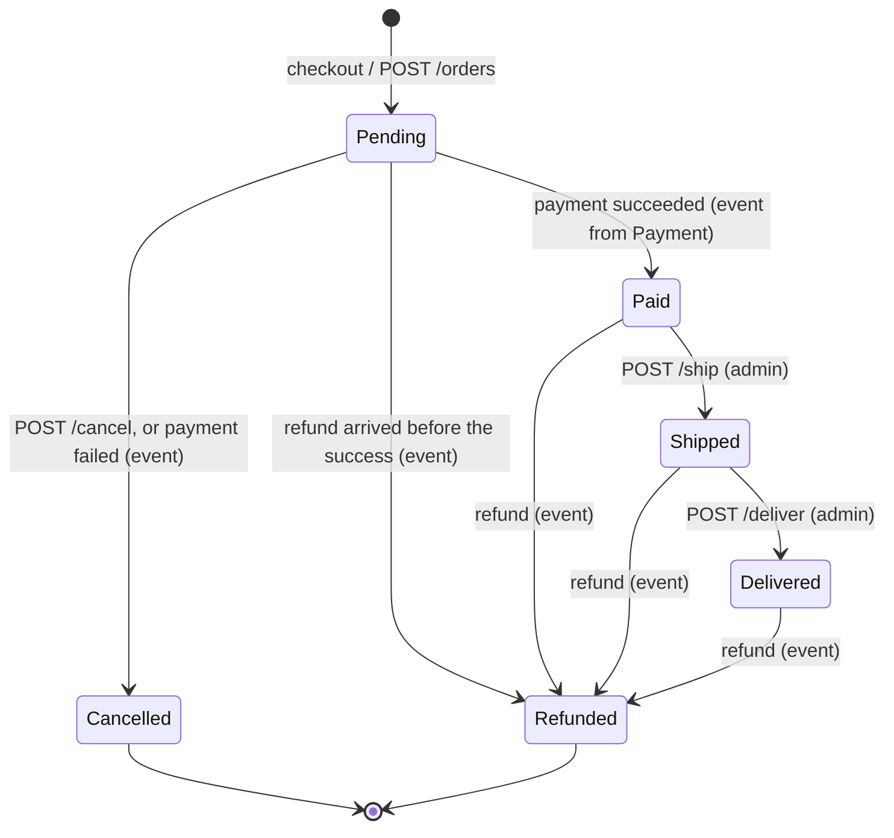

# Ordering API

A customer's orders: creating one directly, reading them, changing items and the shipping address before payment,
and cancelling. Plus the admin order list, statistics, internal notes, status history, shipping and delivery.

**Verified at:** `530fe5d` (`feature/admin-panel`, 2026-09-25). Ordering's code, `BuildingBlocks` and the gateway
have not changed since `105d647`. Every endpoint in this file was checked against the C# source and the service's
OpenAPI document, and called through the gateway on the compose `sandbox` stack. Shared rules (errors, paging, rate
limits, CORS) are in [conventions.md](conventions.md) and are not repeated here.

## Base paths through the gateway

| Path | Methods | Gateway policy | Service policy | Audience |
|---|---|---|---|---|
| `/api/v1/orders` | POST | `Authenticated` | any signed-in user | Storefront |
| `/api/v1/orders/{id}`, `/{id}/items/**`, `/{id}/shipping-address`, `/{id}/cancel` | GET, POST, PUT, DELETE | `Authenticated` | the order's owner **or** the `Admin` role | Storefront (and admin) |
| `/api/v1/users/{userId}/orders` | GET | `Authenticated` | the same user **or** the `Admin` role | Storefront |
| `/api/v1/orders` (GET), `/orders/stats`, `/{id}/notes`, `/{id}/history`, `/{id}/ship`, `/{id}/deliver` | as listed per endpoint | `Authenticated` | `Admin` role | Admin panel |

The gateway has two routes for Ordering: `/api/v1/orders/**` (every method) and `/api/v1/users/{userId}/orders/**`
(GET, HEAD and OPTIONS only; POST, PUT and DELETE answer **405** at the gateway, and HEAD answers 405 from Ordering).
**Both only check that a token is present.** Every admin decision is made by the service itself; unlike Identity, Basket, Notification and most of
Catalog, there is no gateway-level `Admin` gate in front of Ordering's admin endpoints (F-45). The practical result is
the same (a customer gets 403 on every admin endpoint, verified at both layers), but the 403 comes from Ordering.

Not routed through the gateway: Ordering's own `GET /api/v1/admin/settings` and `GET /api/v1/admin/audit` (see
[Not callable by clients](#not-callable-by-clients)).

**Ordering differs from the other services in six ways.** Read these once before using any endpoint below:

- **`status` is an integer** (`0` Pending … `5` Refunded), but the admin list's `status`/`statuses` filters take the
  **name** (any case) and refuse the integer. The stats endpoint's `groupBy` works the same way: a name in, an integer
  out (F-01).
- **Validation errors come in two shapes, by endpoint.** Endpoints that answer with a body (create, the reads, adding
  a note) use shape (a), `Validation.Failed`, with every message in `detail`. Writes that answer 204 (items, address,
  cancel, ship, deliver) use shape (b), `ValidationError`, with an `errors` map keyed by PascalCase property name
  ([conventions.md §3.3](conventions.md#33-validation-errors-three-shapes)). Each error table names the shape.
- **Someone else's order is a 403, not a 404.** For a non-admin, an order that belongs to another user **and an order
  that does not exist** both answer an empty 403: the ownership check runs before the order is looked up. Only an
  admin ever sees `404 Order.NotFound`.
- **Prices always come from Catalog, never from the request.** Every line is priced from Catalog's public product at
  the moment it is added: the effective price, `discountPrice ?? price`. A `productName`, `unitPrice` or `totalPrice`
  sent by the client is silently ignored. Once stored, a line's `unitPrice` never changes.
- **Unknown body properties are ignored**, unlike Catalog. A body that is not valid JSON, or `null` for a number, is
  400 `MalformedRequest`, and its `detail` misleadingly speaks of "an unknown or invalid property" (F-25).
- **`Location` on a 201 is a relative path** (`/api/v1/orders/{id}`). A browser on another origin cannot read it
  (F-04), so take the id from the body.

**Rate limit:** none of Ordering's own. Only the global limiter applies: 100 requests per 60 seconds per client IP, at
the gateway and again in the service ([conventions.md §7](conventions.md#7-rate-limits)).

## Contents

- [Storefront / customer](#storefront--customer)
  - [Order status and what each status allows](#order-status-and-what-each-status-allows)
  - [How an order normally appears: checkout](#how-an-order-normally-appears-checkout)
  - [Create an order](#post-apiv1orders)
  - [Get one order](#get-apiv1ordersid)
  - [A user's orders](#get-apiv1usersuseridorders)
  - [Add an item](#post-apiv1ordersiditems)
  - [Change an item's quantity](#put-apiv1ordersiditemsitemid)
  - [Remove an item](#delete-apiv1ordersiditemsitemid)
  - [Change the shipping address](#put-apiv1ordersidshipping-address)
  - [Cancel](#post-apiv1ordersidcancel)
- [Admin panel](#admin-panel)
  - [Order list](#get-apiv1orders)
  - [Statistics](#get-apiv1ordersstats)
  - [Notes](#post-apiv1ordersidnotes)
  - [Status history](#get-apiv1ordersidhistory)
  - [Ship](#post-apiv1ordersidship)
  - [Deliver](#post-apiv1ordersiddeliver)
  - [Not callable by clients](#not-callable-by-clients)
- [Types](#types)
- [Frontend notes](#frontend-notes)

---

## Storefront / customer

### Order status and what each status allows

`status` is sent as an **integer**. Source: `OrderStatus` in `EShop.Ordering.Domain/Entities/Order.cs`.

| Value | Name | Reached by | Items | Shipping address | Cancel |
|---|---|---|---|---|---|
| `0` | Pending | Creation (checkout or `POST /orders`) | add, change, remove | yes | yes |
| `1` | Paid | **Payment only**, asynchronously (see below) | no (409) | yes | no (409) |
| `2` | Shipped | Admin `POST /{id}/ship` | no | no (409) | no |
| `3` | Delivered | Admin `POST /{id}/deliver` | no | no | no |
| `4` | Cancelled | `POST /{id}/cancel`, or Payment reporting a failed payment | no | no | no |
| `5` | Refunded | **Payment only**, after a full refund | no | no | no |



- **There is no HTTP endpoint that makes an order Paid or Refunded.** Both happen only when Payment publishes an event,
  so the client sees them a few seconds after the payment side finished. Observed: an admin offline settle in Payment
  at 10:35:04, the order Paid at 10:35:13 (about 9 s). Poll `GET /orders/{id}` with back-off after a payment.
- Each timestamp (`paidAt`, `shippedAt`, `deliveredAt`, `cancelledAt`) is set by its transition and never cleared.
  There is no `refundedAt`; use [the status history](#get-apiv1ordersidhistory) for when a refund arrived.
- A cancelled order's pending payment is cancelled too, asynchronously (observed: the Payment row turned `CANCELLED`).
  Payment never refunds a cancelled order by itself.

### How an order normally appears: checkout

The storefront does **not** normally call `POST /orders`. Basket's
[checkout](basket.md#post-apiv1basketuseridcheckout) answers `{ checkoutId }`, and Ordering creates the order from a
message about **one second** later (observed in S1). There is no endpoint that maps a `checkoutId` to an order id, so
poll [`GET /users/{userId}/orders`](#get-apiv1usersuseridorders) and take the newest order. The order's payment record
then appears in Payment about 8 s later ([conventions.md §9](conventions.md#9-consistency-and-caching)). A checkout
order carries Basket's prices and names, and its first history row names `"system"` as the actor.

### `POST /api/v1/orders`

Create an order directly from product ids. Source: `CreateOrderCommand`.

**Body** [`CreateOrderRequest`](#createorderrequest). The address is **flat**, at the top level, unlike Basket's nested
`shippingAddress` (a nested object is ignored, and every address field then fails validation):

| Field | Type | Required | Notes |
|---|---|---|---|
| `items` | [`CreateOrderItem`](#createorderitem)[] | yes | At least one. Each product at most once ("combine the quantities instead") |
| `items[].productId` | string (GUID) | yes | Must be an **Active** product in the public catalog |
| `items[].quantity` | integer | yes | > 0. **No upper bound and no stock check** (⚠ below) |
| `street` | string | yes | 3–150 characters: letters, digits, spaces, `. , - / #` (no apostrophe) |
| `city` | string | yes | 2–100 characters: letters, spaces, `. ' -` |
| `state` | string | yes | Same rule as `city` |
| `zipCode` | string | yes | 3–12 characters; when `country` is `US`, `12345` or `12345-6789` |
| `country` | string | yes | 2 letters (ISO 3166-1 alpha-2), any case; stored upper-case |
| `userId` | string | admins only | See below |

Every address field is trimmed before it is checked and stored (`" us "` is stored as `US`).

**Who the order is for:**
- **A non-admin** may omit `userId`; the order is created for the caller. Sending the caller's own id (in any case) is
  accepted. Sending anyone else's id is **403 `Forbidden`** (with a problem body, unlike most 403s).
- **An admin** must send `userId` and creates the order on that user's behalf. Nothing checks that the user exists:
  an order for `"fe-contracts-no-such-user"` was accepted.

**201** [`CreateOrderResponse`](#createorderresponse): `{"id":"67435990-209a-41b6-8623-13cb86d3d5ad"}`, with
`Location: /api/v1/orders/{id}`.

| Status | `errorCode` | When |
|---|---|---|
| 400 | `Validation.Failed` | Shape (a). No items or `items: null` (`"Items: Order must have at least one item"`); a product twice; an all-zero `productId` (`"Items[0].ProductId: Product ID is required"`); `quantity` ≤ 0; any address field invalid. Every failing field is joined in one `detail` with `"; "` |
| 400 | `Validation.UserIdRequired` | The caller is an admin and sent no `userId` |
| 400 | `Order.ProductUnavailable` | A product does not exist or is not Active (draft, discontinued, deleted): `"Product '…' does not exist or is not available to order."`. Only the first such product is named |
| 400 | `DomainError` | The total would exceed 9 999 999 999 999 999.99 (from source, not observed) |
| 400 | `MalformedRequest` | The body is not valid JSON (F-25 wording) |
| 401 | — | No token (the gateway answers) |
| 403 | `Forbidden` | A non-admin sent another user's `userId`: `"You are not allowed to create orders on behalf of other users."` |
| 503 | `Catalog.Unavailable` | Catalog could not be reached to price the order (observed with Catalog stopped). Nothing was created; retry |

- **Side effects:** the order is Pending with one history row. Ordering publishes `OrderCreated`, from which Payment
  records a pending payment for **this total** about 8 s later, and Notification sends the order confirmation.
- Catalog is called once per line, anonymously, over the internal network. So an admin cannot order a draft product
  either.

### `GET /api/v1/orders/{id}`

One order. Source: `GetOrderByIdQuery`. **Service:** the `OrderOwnerOrAdmin` policy.

**200** [`Order`](#order). Captured live, a delivered order:

```json
{"id":"67435990-209a-41b6-8623-13cb86d3d5ad","userId":"0749b287-0897-408f-b248-5f133aab1796","totalPrice":84.00,
 "status":3,"paymentIntentId":"offline:fe-contracts-s6-paid-1","createdAt":"2026-09-25T10:32:37.272299Z",
 "paidAt":"2026-09-25T10:35:13.201357Z","shippedAt":"2026-09-25T10:36:21.942185Z",
 "deliveredAt":"2026-09-25T10:36:22.863316Z","cancelledAt":null,"cancellationReason":null,
 "shippingAddress":{"street":"1 Second Street","city":"Salem","state":"Oregon","zipCode":"97301","country":"US"},
 "items":[{"id":"31b5fff8-25d1-4939-8e6d-ee592487f9e1","productId":"9316561d-b960-46e2-862d-b7aceea4b77d",
   "productName":"Domain-Driven Design","unitPrice":42.00,"quantity":2,"subTotal":84.00}]}
```

| Status | `errorCode` | When |
|---|---|---|
| 400 | `Validation.Failed` | The all-zero id, for an admin (`"OrderId: Order ID is required"`). A non-admin gets 403 |
| 403 | — | A non-admin asked for another user's order, **or for an order that does not exist** |
| 404 | `Order.NotFound` | An admin asked for an unknown id |
| 404 | — | The id is not a GUID (the route does not match; empty body) |

- Cached for 5 minutes, but every write in this file and every payment event evicts it, so a read after a change is
  current (observed after item edits and after the payment event).
- `items` has **no defined order**: two lines came back in the reverse of the order they were created in. Sort on
  the client if the order matters.
- `paymentIntentId` is Stripe's intent id for a card payment, or `offline:<reference>` for a payment an admin recorded
  offline. It is `null` until the order is Paid.

### `GET /api/v1/users/{userId}/orders`

One user's orders, newest first. Source: `GetOrdersByUserQuery`. **Service:** the `SameUserOrAdmin` policy: `userId`
must be the caller's own id, or the caller must have the `Admin` role.

**Query:**

| Parameter | Type | Default | Limit |
|---|---|---|---|
| `pageNumber` | integer | `1` | ≥ 1 |
| `pageSize` | integer | `10` | 1–100 |

**200** [`PagedResult<Order>`](conventions.md#61-pagedresultt-offset-pages-the-common-case). Captured live (page 2 of
3-order pages; `items` shortened to one order):

```json
{"items":[{"id":"16329385-1eac-473a-83cb-00debea088c1","userId":"0749b287-0897-408f-b248-5f133aab1796",
   "totalPrice":42.00,"status":0,"paymentIntentId":null,"createdAt":"2026-09-25T10:32:38.430265Z","paidAt":null,
   "shippedAt":null,"deliveredAt":null,"cancelledAt":null,"cancellationReason":null,
   "shippingAddress":{"street":"12 Example Street","city":"Springfield","state":"Illinois","zipCode":"62701","country":"US"},
   "items":[{"id":"24e48657-b342-43d9-a967-0ce4dba0ac47","productId":"9316561d-b960-46e2-862d-b7aceea4b77d",
     "productName":"Domain-Driven Design","unitPrice":42.00,"quantity":1,"subTotal":42.00}]}],
 "pageNumber":2,"pageSize":3,"totalCount":11,"totalPages":4,"hasPreviousPage":true,"hasNextPage":true}
```

| Status | `errorCode` | When |
|---|---|---|
| 400 | `Validation.Failed` | `pageNumber` < 1, `pageSize` outside 1–100, or any `cursor` value (`"Cursor: Cursor paging is no longer supported on this endpoint; page with pageNumber and pageSize."`) |
| 400 | `MalformedRequest` | A non-integer `pageNumber`/`pageSize`, with a `detail` that wrongly blames the request body (F-25) |
| 403 | — | A non-admin asked for another user's orders |
| 405 | — | Any method other than GET. The gateway refuses POST, PUT and DELETE; it lets HEAD through, and Ordering then answers 405 |

- There is no filter here: status, date and search filters exist only on the [admin list](#get-apiv1orders).
- A page past the end is 200 with `items: []`. An admin asking for a user with no orders gets an empty page, not a 404.
- Cached for 3 minutes per page, and evicted by every write to one of the user's orders.

> ⚠ Send `userId` exactly as the login response gave it. The ownership check ignores case, but the query does not:
> `customer` asking for their own id in upper case got **200 with an empty page**, not their orders and not a 403
> (F-48).

### `POST /api/v1/orders/{id}/items`

Add a product to a Pending order. Source: `AddOrderItemCommand`. **Service:** `OrderOwnerOrAdmin`.

**Body** [`AddOrderItemRequest`](#addorderitemrequest): `productId` (GUID, required), `quantity` (integer > 0,
required), and optionally `orderId`, which must then equal the route's `{id}`.

**204** on success. The line is priced from Catalog now, and `totalPrice` is recalculated.

| Status | `errorCode` | When |
|---|---|---|
| 400 | `ValidationError` | Shape (b). `quantity` ≤ 0 (key `Quantity`); an all-zero `productId` (key `ProductId`); the all-zero order id, for an admin (key `OrderId`) |
| 400 | `Validation.IdMismatch` | The body's `orderId` is present and differs from the route |
| 400 | `Order.ProductUnavailable` | The product does not exist or is not Active |
| 400 | `DomainError` | The product is already on the order (`"Product 'Phantom X12' already exists in this order."`): change that line's quantity instead. Also a total over the maximum (from source) |
| 403 | — | Not the owner, or (for a non-admin) no such order |
| 404 | `Order.NotFound` | An admin named an unknown order |
| 409 | `Order.NotModifiable` | The order is not Pending: `"Items can only be changed while the order is pending; this order is paid."` |
| 503 | `Catalog.Unavailable` | Catalog could not be reached (observed) |

> ⚠ **Changing items after checkout breaks payment** (F-47): see [Frontend notes](#frontend-notes). The same applies
> to the two item endpoints below.

### `PUT /api/v1/orders/{id}/items/{itemId}`

Set one line's quantity. Source: `UpdateOrderItemQuantityCommand`. **Service:** `OrderOwnerOrAdmin`.

**Body** [`UpdateOrderItemQuantityRequest`](#updateorderitemquantityrequest): `{ "quantity": number }`, an integer
> 0. `itemId` is the line's `id` from [`Order.items`](#orderitem), not the product id.

**204** on success, including when the quantity is unchanged. The line keeps its original `unitPrice` (it is **not**
re-priced), and Catalog's stock is not checked.

| Status | `errorCode` | When |
|---|---|---|
| 400 | `ValidationError` | Shape (b). `quantity` ≤ 0 or omitted (key `Quantity`: `"Quantity must be greater than 0"`); the all-zero `itemId` (key `ItemId`). There is no "0 removes the line" rule, unlike Basket |
| 400 | `MalformedRequest` | `quantity: null` or not a number (F-25 wording) |
| 400 | `DomainError` | The total would exceed the maximum (from source) |
| 403 | — | Not the owner |
| 404 | `Order.NotFound` | An admin named an unknown order |
| 404 | `OrderItem.NotFound` | The order has no line with that id |
| 409 | `Order.NotModifiable` | The order is not Pending. This check runs before the item lookup |

### `DELETE /api/v1/orders/{id}/items/{itemId}`

Remove one line. Source: `RemoveOrderItemCommand`. **Service:** `OrderOwnerOrAdmin`.

**204** on success. Removing the same line again is **404** `OrderItem.NotFound`, not 204.

| Status | `errorCode` | When |
|---|---|---|
| 400 | `ValidationError` | The all-zero `itemId` (key `ItemId`) |
| 400 | `DomainError` | It is the order's **last** line: `"Order must have at least one item."`. Cancel the order instead |
| 403 | — | Not the owner |
| 404 | `Order.NotFound` | An admin named an unknown order |
| 404 | `OrderItem.NotFound` | No such line (or already removed) |
| 409 | `Order.NotModifiable` | The order is not Pending |

### `PUT /api/v1/orders/{id}/shipping-address`

Replace the whole shipping address. Source: `UpdateShippingAddressCommand`. **Service:** `OrderOwnerOrAdmin`.

**Body** [`ShippingAddress`](#shippingaddress): all five fields, required, with the same rules as on
[create](#post-apiv1orders). It is a full replacement, never a patch: an omitted field is invalid, not "unchanged".

**204** on success. Allowed while the order is **Pending or Paid**; it is the one change a Paid order still accepts.

| Status | `errorCode` | When |
|---|---|---|
| 400 | `ValidationError` | Shape (b), one key per failing field (`Street`, `City`, `State`, `ZipCode`, `Country`). Validation runs first, so an invalid address on a shipped order is 400, not 409 |
| 400 | `MalformedRequest` | The body is not valid JSON |
| 403 | — | Not the owner |
| 404 | `Order.NotFound` | An admin named an unknown order |
| 409 | `Order.AddressNotModifiable` | The order is Shipped, Delivered, Cancelled or Refunded: `"The shipping address can only be changed before the order ships; this order is shipped."` |

Captured, a two-field body `{"street":"99 New Avenue","city":"Portland"}`:

```json
{"type":"https://tools.ietf.org/html/rfc9110#section-15.5.1","title":"Bad Request","status":400,
 "detail":"One or more validation errors occurred.","errorCode":"ValidationError",
 "traceId":"00-2964f5b9214dcf833228b0e3289d2eeb-79df6bf2b6b0bb12-00",
 "errors":{"State":["State must be 2-100 characters and contain only letters and common separators."],
   "Country":["Country must be a 2-letter ISO code."],"ZipCode":["Zip code must be between 3 and 12 characters."]}}
```

### `POST /api/v1/orders/{id}/cancel`

Cancel a Pending order. Source: `CancelOrderCommand`. **Service:** `OrderOwnerOrAdmin`.

**Body** [`CancelOrderRequest`](#cancelorderrequest): `{ "reason": string }`, required, not blank, at most 500
characters. A body is required even though the reason is only stored: a request with **no body at all** is 400
`MalformedRequest`.

**204** on success. `status` becomes `4`, `cancelledAt` and `cancellationReason` are set, and the order's pending
payment is cancelled in Payment shortly afterwards.

| Status | `errorCode` | When |
|---|---|---|
| 400 | `ValidationError` | Shape (b). `reason` missing, empty or whitespace (`"Cancellation reason is required"`), or over 500 characters (key `Reason`) |
| 400 | `MalformedRequest` | No body, or not valid JSON |
| 403 | — | Not the owner |
| 404 | `Order.NotFound` | An admin named an unknown order |
| 409 | `Order.NotCancellable` | The order is not Pending (already cancelled, paid, or later): `"Only pending orders can be cancelled; this order is paid."` |

There is no customer "cancel after payment": a Paid order is refunded in Payment, and the order then becomes Refunded
by event ([payment.md](payment.md)).

---

## Admin panel

Every endpoint in this section needs the **`Admin` role** at the service (`RequireRole("Admin")`, not a permission, so
a permission bundle without the role does not help). The gateway only checks for a token (F-45). An anonymous call is
401 from the gateway; a signed-in non-admin is an empty 403 from Ordering. For a customer, this includes the notes and
history of **their own** order.

An admin can also call every storefront endpoint above for any order: the owner checks let the `Admin` role through.

**Audit:** item changes, address changes, cancel, ship, deliver and adding a note each write one row to the audit
trail, whoever sends them (a customer's own item change included), with the outcome `Succeeded`, `Rejected` or
`Failed`. A shape (b) validation error is recorded as `Failed`, not `Rejected`. `POST /orders` is not audited. Read the trail through the gateway's merged
[`GET /api/v1/admin/audit`](admin-platform.md).

### `GET /api/v1/orders`

Every order, filtered and paged. Source: `GetOrdersQuery`. Not cached: each call reads the database.

**Query** [`AdminOrderListQuery`](#adminorderlistquery); all optional:

| Parameter | Type | Default | Meaning |
|---|---|---|---|
| `pageNumber` | integer | `1` | ≥ 1 |
| `pageSize` | integer | `10` | 1–100 |
| `status` | string | — | One status **name**, any case (`Paid`, `cancelled`). A number is refused |
| `statuses` | string, repeatable | — | `?statuses=Paid&statuses=Shipped`. Combined with `status` as a union (`status=Delivered&statuses=Cancelled` returns both) |
| `search` | string | — | At most 200 characters. Case-insensitive substring of the **user id** or the **payment intent id**, or an **exact** order id. Part of an order id matches nothing. `%` and `_` are literal |
| `from`, `to` | date-time | — | Inclusive bounds on `createdAt`. A value without a zone is read as UTC, so `to=2026-09-25` means midnight at the **start** of that day |
| `minTotal`, `maxTotal` | number | — | Inclusive bounds on `totalPrice`. `minTotal` ≥ 0, `maxTotal` ≥ `minTotal` |
| `sortBy` | string | `CreatedAt` | `CreatedAt`, `TotalPrice` or `Status`, any case. Ties are broken by id |
| `isDescending` | boolean | `true` | Newest (or largest) first |

**200** [`PagedResult<Order>`](conventions.md#61-pagedresultt-offset-pages-the-common-case), the same shape as a
user's list.

| Status | `errorCode` | When |
|---|---|---|
| 400 | `Validation.Failed` | `pageNumber` < 1; `pageSize` outside 1–100; `status` not a name (`"Status: Status must be one of: Pending, Paid, Shipped, Delivered, Cancelled, Refunded"`, also for `status=0`); any bad `statuses` entry (`"Statuses[1]: …"`); an unknown `sortBy`; `search` over 200; `to` before `from`; `minTotal` < 0; `maxTotal` < `minTotal` |
| 400 | `MalformedRequest` | A value of the wrong type (`isDescending=maybe`, `from=yesterday`, `pageSize=abc`), with the misleading "request body" `detail` (F-25) |
| 401 / 403 | — | Anonymous (gateway) / not an admin (service) |

> ⚠ `sortBy=Status` sorts by the status **name**, alphabetically: ascending gives Cancelled, Delivered, Paid,
> Pending, Refunded, Shipped. That is neither the lifecycle order nor the order of the integers the API sends (F-50).

### `GET /api/v1/orders/stats`

Dashboard totals, a per-status breakdown and time buckets. Source: `GetOrderStatsQuery`. Not cached.

**Query** [`OrderStatsQuery`](#orderstatsquery): `from`, `to` (date-time, optional, inclusive bounds on `createdAt`,
UTC when no zone is given; omitted means unbounded), `groupBy` (`Day` default, `Month` or `Year`, any case; `Week`
does not exist, and a number is refused).

**200** [`OrderStats`](#orderstats). Captured live, one day's window:

```json
{"from":"2026-09-25T10:00:00Z","to":"2026-09-25T23:59:59Z","groupBy":0,"totalOrders":10,
 "grossValue":90194316443.98,"paidRevenue":84.00,"refundedValue":0,"cancelledValue":84.00,
 "byStatus":[{"status":0,"count":7,"value":90194316275.98},{"status":1,"count":0,"value":0},
   {"status":2,"count":0,"value":0},{"status":3,"count":1,"value":84.00},{"status":4,"count":2,"value":84.00},
   {"status":5,"count":0,"value":0}],
 "buckets":[{"periodStart":"2026-09-25T00:00:00Z","orderCount":10,"grossValue":90194316443.98,"paidRevenue":84.00}]}
```

(The large gross value comes from a test order for 2 147 483 647 units; see the stock ⚠ below.)

- `groupBy` comes back as an **integer**: `0` Day, `1` Month, `2` Year, although the query takes only names (F-01).
- `from`/`to` echo the window as applied (a date-only `from` comes back as `…T00:00:00Z`), or `null` when unbounded.
- `grossValue` counts every status. `paidRevenue` counts only Paid, Shipped and Delivered, and excludes Refunded,
  Cancelled and Pending, which are reported separately (`refundedValue`, `cancelledValue`, and `byStatus`).
- `byStatus` always has **six** entries, one per status, including zeros.
- `buckets` has one entry per **non-empty** period, oldest first. Empty days are absent, not zero-filled.
  `periodStart` is midnight UTC of the day, the first of the month, or 1 January.

| Status | `errorCode` | When |
|---|---|---|
| 400 | `Validation.Failed` | `groupBy` not `Day`/`Month`/`Year` (`"GroupBy: GroupBy must be one of: Day, Month, Year"`); `to` before `from` |
| 400 | `MalformedRequest` | A date that does not parse (`from=yesterday`, F-25 wording) |
| 401 / 403 | — | Anonymous (gateway) / not an admin (service) |

### `POST /api/v1/orders/{id}/notes`

Attach an internal note. Source: `AddOrderNoteCommand`. Notes are **never shown to the customer** and cannot be
edited or deleted; a correction is a new note. They can be added in any status, including Cancelled and Delivered.

**Body** [`AddOrderNoteRequest`](#addordernoterequest): `{ "body": string }`, required, not blank, at most 2000
characters **before trimming** (a 2000-character body with surrounding spaces is refused), stored trimmed. The author
is always the caller: `authorId`/`authorName` sent in the body are ignored.

**201** [`CreatedOrderNoteResponse`](#createdordernoteresponse): `{"id":"684dd267-a6bc-49aa-ba90-91d18dacc175"}`.
`Location` points at the **order** (`/api/v1/orders/{id}`), since there is no per-note endpoint.

| Status | `errorCode` | When |
|---|---|---|
| 400 | `Validation.Failed` | Shape (a). `body` missing, empty or whitespace (`"Body: Note body is required"`), over 2000 characters, or the all-zero order id |
| 400 | `Order.NoteLimitReached` | The order already has 500 notes (from source, not observed) |
| 400 | `MalformedRequest` | The body is not valid JSON |
| 401 / 403 | — | Anonymous / not an admin (the order's owner too) |
| 404 | `Order.NotFound` | Unknown order |

### `GET /api/v1/orders/{id}/notes`

The order's notes, **newest first**, unpaged (at most 500). Source: `GetOrderNotesQuery`.

**200** [`OrderNote`](#ordernote)[]; `[]` for an order with no notes. Captured, one entry:

```json
{"id":"9f17bf95-7074-409c-acc7-99280a69ec1d","orderId":"67435990-209a-41b6-8623-13cb86d3d5ad",
 "authorId":"16459cc5-f155-4ef2-a782-b611abab746e","authorName":"admin@eshop.com",
 "body":"fe-contracts S6 note two, padded","createdAt":"2026-09-25T10:36:44.291943Z"}
```

`authorName` is the author's name claim **as it was when the note was written**, which for current tokens is the
email address. It is not updated if the account changes later.

| Status | `errorCode` | When |
|---|---|---|
| 400 | `Validation.Failed` | The all-zero id |
| 401 / 403 | — | Anonymous / not an admin |
| 404 | `Order.NotFound` | Unknown order |

### `GET /api/v1/orders/{id}/history`

The order's status timeline, **oldest first**, unpaged. Source: `GetOrderStatusHistoryQuery`.

**200** [`OrderStatusHistoryEntry`](#orderstatushistoryentry)[]. Captured live, a delivered order (created by the
customer, paid by event, shipped and delivered by the admin):

```json
[{"id":"665b2b1d-9466-42fe-9814-37ccf830c63b","orderId":"67435990-209a-41b6-8623-13cb86d3d5ad","fromStatus":null,
  "toStatus":0,"reason":null,"actorId":"0749b287-0897-408f-b248-5f133aab1796","occurredAt":"2026-09-25T10:32:37.271516Z"},
 {"id":"8546b2ed-e78e-4686-b338-2836cf0544e2","orderId":"67435990-209a-41b6-8623-13cb86d3d5ad","fromStatus":0,
  "toStatus":1,"reason":null,"actorId":"system","occurredAt":"2026-09-25T10:35:13.201372Z"},
 {"id":"9a87c740-4c21-4bff-8336-59a0600acbd9","orderId":"67435990-209a-41b6-8623-13cb86d3d5ad","fromStatus":1,
  "toStatus":2,"reason":null,"actorId":"16459cc5-f155-4ef2-a782-b611abab746e","occurredAt":"2026-09-25T10:36:21.942254Z"},
 {"id":"99bc1862-5335-4005-8f25-2f871e684f71","orderId":"67435990-209a-41b6-8623-13cb86d3d5ad","fromStatus":2,
  "toStatus":3,"reason":null,"actorId":"16459cc5-f155-4ef2-a782-b611abab746e","occurredAt":"2026-09-25T10:36:22.863364Z"}]
```

- The first row always has `fromStatus: null` and `toStatus: 0`.
- `actorId` is the user id of whoever caused the transition: the customer or an admin for an HTTP call, `"system"`
  for a transition driven by a message (checkout creation, payment success, payment failure, refund). It can be
  `null` only on rows written before actors were recorded. It is an id, not a name; resolve names through Identity's
  admin users API.
- `reason` is set only on a cancellation (the customer's reason, or `"Payment failed: …"`).

| Status | `errorCode` | When |
|---|---|---|
| 400 | `Validation.Failed` | The all-zero id |
| 401 / 403 | — | Anonymous / not an admin (the order's owner too) |
| 404 | `Order.NotFound` | Unknown order |

### `POST /api/v1/orders/{id}/ship`

Mark a Paid order as Shipped. Source: `ShipOrderCommand`. No body (one sent is ignored).

**204** on success. `shippedAt` is set, and Ordering publishes `OrderShipped`, which Notification turns into a
"your order has shipped" email (from source).

| Status | `errorCode` | When |
|---|---|---|
| 400 | `ValidationError` | The all-zero id (key `OrderId`) |
| 401 / 403 | — | Anonymous / not an admin |
| 404 | `Order.NotFound` | Unknown order |
| 409 | `Order.NotPaidYet` | The order is not Paid: `"Order must be paid before shipping."`, **also** for an order that is already Shipped or Delivered (F-51) |

### `POST /api/v1/orders/{id}/deliver`

Mark a Shipped order as Delivered. Source: `DeliverOrderCommand`. No body.

**204** on success. `deliveredAt` is set. Nothing is published.

| Status | `errorCode` | When |
|---|---|---|
| 400 | `ValidationError` | The all-zero id (key `OrderId`) |
| 401 / 403 | — | Anonymous / not an admin |
| 404 | `Order.NotFound` | Unknown order |
| 409 | `Order.NotShippedYet` | The order is not Shipped: `"Only a shipped order can be delivered."`, **also** for one already Delivered (F-51) |

### Not callable by clients

| Endpoint | Why |
|---|---|
| `GET /api/v1/admin/settings` (on Ordering) | Ordering's slice of the System page: `{"currency":"USD","taxApplied":false,"shippingCharged":false}`, permission `system.manage`. The gateway serves the merged settings at the same path ([admin-platform.md](admin-platform.md)), so this one is unreachable from outside. Called directly: admin 200, customer 403, anonymous 401 |
| `GET /api/v1/admin/audit` (on Ordering) | Ordering's own slice of the audit trail (`audit.read`). The gateway serves the merged trail at the same path. Called directly: admin 200, customer 403 |

`taxApplied: false` and `shippingCharged: false` are the whole pricing model: an order's `totalPrice` is exactly the
sum of its lines' `subTotal`, in USD, with no tax or shipping line.

---

## Types

C# sources: `EShop.Ordering.Application/Orders/Queries/*` (`OrderDto`, `OrderNoteDto`, `OrderStatsDto`),
`Orders/Commands/*`, and the request records in `EShop.Ordering.API/Endpoints/OrderEndpoints.cs`. Every timestamp is
UTC with `Z`. Money is a JSON number with two decimals, always USD, with no `currency` field
([conventions.md §2](conventions.md#money)).

### Enums

| Enum | Sent as | Values | In query filters |
|---|---|---|---|
| `OrderStatus` | integer | `0` Pending · `1` Paid · `2` Shipped · `3` Delivered · `4` Cancelled · `5` Refunded | names only, any case |
| `OrderStatsGroupBy` | integer | `0` Day · `1` Month · `2` Year | names only, any case |
| `OrderSortBy` | never sent | `CreatedAt` · `TotalPrice` · `Status` | names only, any case |

### Storefront: requests

#### ShippingAddress

Also the body of [`PUT /{id}/shipping-address`](#put-apiv1ordersidshipping-address), and the `shippingAddress` of an
[`Order`](#order). Source: `UpdateShippingAddressRequest`, `AddressDto`.

| Field | Type | Required | Notes |
|---|---|---|---|
| `street` | string | yes | 3–150 characters: letters, digits, spaces, `. , - / #` |
| `city` | string | yes | 2–100 characters: letters, spaces, `. ' -` |
| `state` | string | yes | Same rule as `city` |
| `zipCode` | string | yes | 3–12 characters; `12345` or `12345-6789` when `country` is `US` |
| `country` | string | yes | 2 letters, any case; stored and returned upper-case |

All five are trimmed before they are checked and stored.

#### CreateOrderRequest

Source: `CreateOrderCommand`. Every [`ShippingAddress`](#shippingaddress) field at the **top level**, plus:

| Field | Type | Required | Notes |
|---|---|---|---|
| `items` | [`CreateOrderItem`](#createorderitem)[] | yes | At least one; each `productId` at most once |
| `userId` | string | admins only | A non-admin may omit it or send their own id; an admin must send it |

#### CreateOrderItem

| Field | Type | Required | Notes |
|---|---|---|---|
| `productId` | string (GUID) | yes | An Active product |
| `quantity` | integer | yes | > 0 |

#### AddOrderItemRequest

| Field | Type | Required | Notes |
|---|---|---|---|
| `productId` | string (GUID) | yes | An Active product not already on the order |
| `quantity` | integer | yes | > 0 |
| `orderId` | string (GUID) | no | If sent, must equal the route's `{id}` |

#### UpdateOrderItemQuantityRequest

`{ "quantity": number }`: an integer > 0.

#### CancelOrderRequest

`{ "reason": string }`: not blank, at most 500 characters.

#### UserOrdersQuery

`pageNumber` (integer, default 1, ≥ 1), `pageSize` (integer, default 10, 1–100).

### Storefront: responses

#### CreateOrderResponse

`{ "id": string (GUID) }`: the new order's id.

#### Order

Source: `OrderDto`.

| Field | Type | Nullable | Notes |
|---|---|---|---|
| `id` | string (GUID) | no | |
| `userId` | string | no | The owner's Identity user id |
| `totalPrice` | number | no | Sum of the lines' `subTotal`; no tax, no shipping |
| `status` | [`OrderStatus`](#enums) (integer) | no | |
| `paymentIntentId` | string | yes | `null` until Paid. Stripe's intent id, or `offline:<reference>` |
| `createdAt` | string (date-time) | no | |
| `paidAt` | string (date-time) | yes | |
| `shippedAt` | string (date-time) | yes | |
| `deliveredAt` | string (date-time) | yes | |
| `cancelledAt` | string (date-time) | yes | |
| `cancellationReason` | string | yes | Set with `cancelledAt` |
| `shippingAddress` | [`ShippingAddress`](#shippingaddress) | no | |
| `items` | [`OrderItem`](#orderitem)[] | no | At least one; in **no defined order** |

#### OrderItem

Source: `OrderItemDto`.

| Field | Type | Nullable | Notes |
|---|---|---|---|
| `id` | string (GUID) | no | The line id used by the item endpoints |
| `productId` | string (GUID) | no | |
| `productName` | string | no | Catalog's name when the line was added |
| `unitPrice` | number | no | Catalog's effective price when the line was added; never re-priced |
| `quantity` | number | no | |
| `subTotal` | number | no | `unitPrice * quantity` |

### Admin: requests

#### AdminOrderListQuery

`pageNumber`, `pageSize`, `status`, `statuses` (repeatable), `search`, `from`, `to`, `minTotal`, `maxTotal`, `sortBy`,
`isDescending`; see [the order list](#get-apiv1orders) for defaults and limits.

#### OrderStatsQuery

`from`, `to` (date-time), `groupBy` (`Day` | `Month` | `Year`, default `Day`).

#### AddOrderNoteRequest

`{ "body": string }`: not blank, at most 2000 characters before trimming.

### Admin: responses

#### OrderStats

Source: `OrderStatsDto`.

| Field | Type | Nullable | Notes |
|---|---|---|---|
| `from` | string (date-time) | yes | The applied lower bound; `null` when unbounded |
| `to` | string (date-time) | yes | The applied upper bound; `null` when unbounded |
| `groupBy` | [`OrderStatsGroupBy`](#enums) (integer) | no | The bucket size used |
| `totalOrders` | number | no | Orders created in the window, any status |
| `grossValue` | number | no | Sum of their totals, any status |
| `paidRevenue` | number | no | Paid + Shipped + Delivered only |
| `refundedValue` | number | no | Refunded only |
| `cancelledValue` | number | no | Cancelled only |
| `byStatus` | [`OrderStatusBreakdown`](#orderstatusbreakdown)[] | no | Always six entries |
| `buckets` | [`OrderStatsBucket`](#orderstatsbucket)[] | no | Non-empty periods only, oldest first |

#### OrderStatusBreakdown

`status` ([`OrderStatus`](#enums), integer), `count` (number), `value` (number).

#### OrderStatsBucket

`periodStart` (string (date-time), the period's first instant in UTC), `orderCount` (number), `grossValue` (number),
`paidRevenue` (number).

#### CreatedOrderNoteResponse

`{ "id": string (GUID) }`: the new note's id.

#### OrderNote

Source: `OrderNoteDto`.

| Field | Type | Nullable | Notes |
|---|---|---|---|
| `id` | string (GUID) | no | |
| `orderId` | string (GUID) | no | |
| `authorId` | string | no | The author's user id |
| `authorName` | string | no | The author's name claim when writing (currently the email); at most 200 characters |
| `body` | string | no | Trimmed |
| `createdAt` | string (date-time) | no | |

#### OrderStatusHistoryEntry

Source: `OrderStatusHistoryDto`.

| Field | Type | Nullable | Notes |
|---|---|---|---|
| `id` | string (GUID) | no | |
| `orderId` | string (GUID) | no | |
| `fromStatus` | [`OrderStatus`](#enums) (integer) | yes | `null` on the first row only |
| `toStatus` | [`OrderStatus`](#enums) (integer) | no | |
| `reason` | string | yes | Only on a cancellation |
| `actorId` | string | yes | A user id, or `"system"` for a message-driven transition |
| `occurredAt` | string (date-time) | no | |

#### PricingSettingsDto (not callable by clients)

`currency` (string, `"USD"`), `taxApplied` (boolean), `shippingCharged` (boolean). Shown for completeness; the
gateway's merged settings are documented in [admin-platform.md](admin-platform.md).

### TypeScript

`PagedResult<T>` and `ProblemDetails` are in [conventions.md](conventions.md).

```ts
// ---- Enums (sent as integers; filters take the names) ----

export const OrderStatus = {
  Pending: 0,
  Paid: 1,
  Shipped: 2,
  Delivered: 3,
  Cancelled: 4,
  Refunded: 5,
} as const;
export type OrderStatus = (typeof OrderStatus)[keyof typeof OrderStatus];
/** The form the admin list's status/statuses filters accept. */
export type OrderStatusName = keyof typeof OrderStatus;

export const OrderStatsGroupBy = { Day: 0, Month: 1, Year: 2 } as const;
export type OrderStatsGroupBy = (typeof OrderStatsGroupBy)[keyof typeof OrderStatsGroupBy];
export type OrderStatsGroupByName = keyof typeof OrderStatsGroupBy;

export type OrderSortBy = 'CreatedAt' | 'TotalPrice' | 'Status';

// ---- Storefront: requests ----

export interface ShippingAddress {
  /** 3-150 chars: letters, digits, spaces, . , - / # */
  street: string;
  /** 2-100 chars: letters, spaces, . ' - */
  city: string;
  /** Same rule as city. */
  state: string;
  /** 3-12 chars; 12345 or 12345-6789 when country is US. */
  zipCode: string;
  /** ISO 3166-1 alpha-2, any case; returned upper-case. */
  country: string;
}

export interface CreateOrderItem {
  productId: string;
  /** > 0. No upper bound, no stock check. */
  quantity: number;
}

/** The address is flat, at the top level. */
export interface CreateOrderRequest extends ShippingAddress {
  items: CreateOrderItem[];
  /** Admins must send it; a non-admin may omit it or send their own id. */
  userId?: string;
}

export interface AddOrderItemRequest {
  productId: string;
  /** > 0. */
  quantity: number;
  /** If sent, must equal the route id. */
  orderId?: string;
}

export interface UpdateOrderItemQuantityRequest {
  /** > 0. There is no "0 removes the line". */
  quantity: number;
}

export type UpdateShippingAddressRequest = ShippingAddress;

export interface CancelOrderRequest {
  /** Not blank, at most 500 characters. */
  reason: string;
}

export interface UserOrdersQuery {
  /** Default 1. */
  pageNumber?: number;
  /** Default 10, 1-100. */
  pageSize?: number;
}

// ---- Storefront: responses ----

export interface CreateOrderResponse {
  id: string;
}

export interface OrderItem {
  id: string;
  productId: string;
  productName: string;
  /** Catalog's effective price when the line was added; never re-priced. */
  unitPrice: number;
  quantity: number;
  subTotal: number;
}

export interface Order {
  id: string;
  userId: string;
  totalPrice: number;
  status: OrderStatus;
  /** Stripe intent id or "offline:<reference>"; null until Paid. */
  paymentIntentId: string | null;
  createdAt: string;
  paidAt: string | null;
  shippedAt: string | null;
  deliveredAt: string | null;
  cancelledAt: string | null;
  cancellationReason: string | null;
  shippingAddress: ShippingAddress;
  /** No defined order. */
  items: OrderItem[];
}

// ---- Admin: requests ----

export interface AdminOrderListQuery {
  pageNumber?: number;
  /** Default 10, 1-100. */
  pageSize?: number;
  status?: OrderStatusName;
  /** Repeat the parameter: ?statuses=Paid&statuses=Shipped. */
  statuses?: OrderStatusName[];
  /** <= 200 chars: substring of userId or paymentIntentId, or an exact order id. */
  search?: string;
  /** ISO instant; inclusive. */
  from?: string;
  /** ISO instant; inclusive. */
  to?: string;
  minTotal?: number;
  maxTotal?: number;
  /** Default CreatedAt. Status sorts alphabetically by name. */
  sortBy?: OrderSortBy;
  /** Default true. */
  isDescending?: boolean;
}

export interface OrderStatsQuery {
  from?: string;
  to?: string;
  /** Default Day. */
  groupBy?: OrderStatsGroupByName;
}

export interface AddOrderNoteRequest {
  /** Not blank, at most 2000 characters before trimming. */
  body: string;
}

// ---- Admin: responses ----

export interface OrderStatusBreakdown {
  status: OrderStatus;
  count: number;
  value: number;
}

export interface OrderStatsBucket {
  /** Midnight UTC of the day, the 1st of the month, or 1 January. */
  periodStart: string;
  orderCount: number;
  grossValue: number;
  paidRevenue: number;
}

export interface OrderStats {
  from: string | null;
  to: string | null;
  groupBy: OrderStatsGroupBy;
  totalOrders: number;
  grossValue: number;
  /** Paid + Shipped + Delivered. */
  paidRevenue: number;
  refundedValue: number;
  cancelledValue: number;
  /** Always six entries, one per status. */
  byStatus: OrderStatusBreakdown[];
  /** Non-empty periods only, oldest first. */
  buckets: OrderStatsBucket[];
}

export interface CreatedOrderNoteResponse {
  id: string;
}

export interface OrderNote {
  id: string;
  orderId: string;
  authorId: string;
  /** The author's name claim when writing (currently the email). */
  authorName: string;
  body: string;
  createdAt: string;
}

export interface OrderStatusHistoryEntry {
  id: string;
  orderId: string;
  /** null on the first row only. */
  fromStatus: OrderStatus | null;
  toStatus: OrderStatus;
  /** Only on a cancellation. */
  reason: string | null;
  /** A user id, or "system" for a message-driven transition. */
  actorId: string | null;
  occurredAt: string;
}
```

---

## Frontend notes

> ⚠ **Do not let a customer change items after checkout, until F-47 is fixed.** Payment records the amount to charge
> once, from the total at creation, and is never told about later item changes. Paying then charges the **old**
> total, and when the payment succeeds Ordering refuses it because the amounts differ: the order **stays Pending for
> good** while Payment reports `SUCCESS`. Observed: an order edited from 591.99 to 675.99 was settled in Payment at
> 591.99, and Ordering logged "Paid amount 591.99 does not match the order total 675.99" and kept retrying the
> message. The item endpoints themselves answer 204, so nothing tells the client. Until this is fixed, offer "cancel
> and order again" instead of editing items. (F-47)

> ⚠ **Ordering checks no stock and caps no quantity.** `POST /orders`, adding an item and changing a quantity all
> accept any positive quantity: 50 units of a product with 5 in stock, and 2 147 483 647 units of another, were both
> accepted. Basket checkout does check stock ([basket.md](basket.md)), so the checkout path is the safe one. Validate
> quantities against the product's `stockQuantity` on the client if you use these endpoints. (F-49)

> ⚠ **A 403 does not mean "exists but not yours".** For a non-admin, an unknown order id is also 403. Treat 403 on an
> order as "not available to you" and never as proof that the order exists.

> ⚠ **Send `userId` exactly as the login response gave it.** `/users/{userId}/orders` with the caller's own id in a
> different case answers 200 with an empty page. (F-48)

> ⚠ **Paid and Refunded arrive by message.** After a payment or refund, poll `GET /orders/{id}` with back-off; the
> order changed about 9 s after the payment in testing.

> ⚠ **`items` has no defined order.** Sort lines on the client (for example by `productName`) so they do not jump
> between reads.

> ⚠ **Status sorting in the admin list is alphabetical by name**, not by lifecycle. (F-50)

> ⚠ **Two 409 codes name the wrong state.** Shipping an order that is already Shipped or Delivered answers
> `Order.NotPaidYet` ("must be paid before shipping"), and delivering a Delivered order answers
> `Order.NotShippedYet`. Refresh the order and show its real status rather than the message. (F-51)

> ⚠ **`MalformedRequest` details are misleading.** A truncated JSON body is reported as "an unknown or invalid
> property: '$.items'", and a mistyped query value as an invalid request body on a GET. Treat `MalformedRequest` as
> "the request could not be read". (F-25)

---

## Related documents

- [conventions.md](conventions.md): errors, paging, rate limits, auth
- [basket.md](basket.md): checkout, which is how orders are normally created
- [payment.md](payment.md): paying for an order, refunds
- [flows.md](flows.md): browse → basket → checkout → order appears → payment
- [admin-platform.md](admin-platform.md): the merged audit trail and system settings

---

**Version**: 1.0  
**Last Updated**: 2026-09-25
