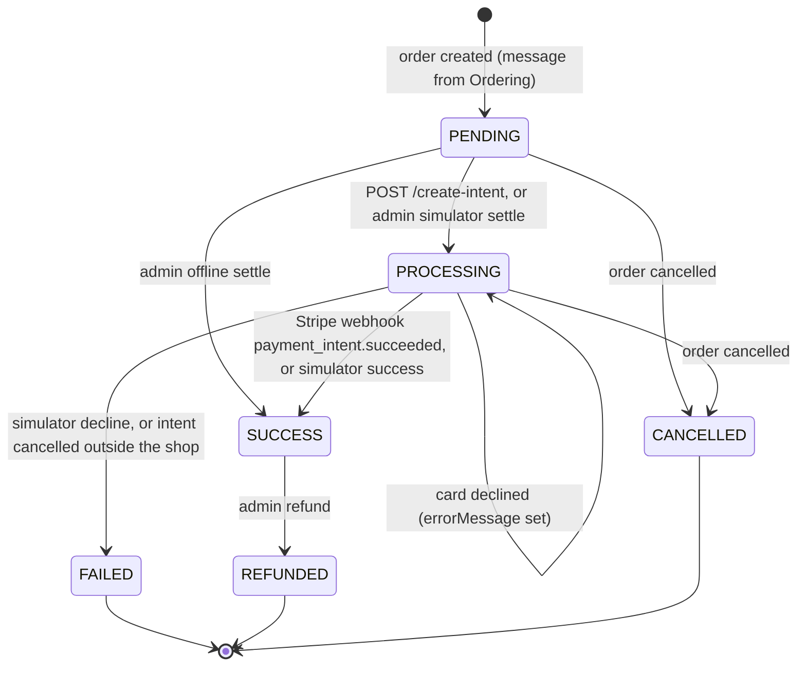

# Payment API

Card payments through Stripe (payment intents), a customer's payment history, and the admin payment screens: list,
statistics, CSV export, event timeline, offline settlement, simulator settlement, refunds, webhook replay and
simulator diagnostics.

**Verified at:** `0b7f826` (`feature/admin-panel`, 2026-09-25). The one Payment change since `105d647` is `d29a520`
(a payment's amount now follows its order's total), and it is covered below. Every endpoint in this file was checked
against the C# source and the service's OpenAPI document, and called on the compose `sandbox` stack: through the
gateway, or directly on the service where the gateway does not route it. The card flow was run against the real
Stripe test mode, with webhooks delivered by the Stripe CLI listener. `create-intent`'s resume and 409 wording were
re-verified at `f507f85`, which fixed F-52. Shared rules (errors, paging, rate limits, CORS) are in
[conventions.md](conventions.md) and are not repeated here.

## Base paths through the gateway

| Path | Methods | Gateway policy | Service policy | Audience |
|---|---|---|---|---|
| `/api/v1/payments/create-intent` | POST | `Authenticated` | any signed-in user; the order must be theirs (admins: any order) | Storefront |
| `/api/v1/payments/{id}` | GET | `Authenticated` | any signed-in user; someone else's payment is a 404 | Storefront (and admin) |
| `/api/v1/users/{userId}/payments` | GET | `Authenticated` | the same user **or** the `Admin` role | Storefront |
| `/api/v1/payments` (GET), `/stats`, `/export`, `/{id}/events` | GET | `Authenticated` | permission `payments.read` | Admin panel |
| `/api/v1/payments/offline`, `/webhooks/failed/replay` | POST | `Authenticated` | permission `payments.write` | Admin panel |
| `/api/v1/payments` (POST), `/{id}/refund`, `/simulation` | as listed per endpoint | `Authenticated` | `Admin` role | Admin panel |

The gateway has two routes for Payment, `/api/v1/payments/**` and `/api/v1/users/{userId}/payments`, both for every
method. **Both only check that a token is present.** Every admin decision is made by Payment itself; there is no
gateway-level `Admin` gate in front of the admin endpoints (F-45). A customer gets 403 on every admin endpoint all the
same (verified at both layers), but the 403 comes from Payment.

Not routed through the gateway (see [Not callable by clients](#not-callable-by-clients)):
- `POST /webhooks/stripe`, which Stripe calls server to server (the gateway answers 404);
- Payment's own `GET /api/v1/admin/settings`, `/api/v1/admin/feature-flags` and `/api/v1/admin/audit`. The gateway
  serves merged versions at the same paths; see [admin-platform.md](admin-platform.md).

**Payment differs from the other services in six ways.** Read these once before using any endpoint below:

- **`errorCode`s are `SCREAMING_SNAKE`** (`PAYMENT_NOT_FOUND`, `PAYMENT_NOT_READY`), not `Service.Reason` (F-24).
  The shared codes (`Validation.Failed`, `InternalServerError`) keep their usual form.
- **Enums are strings, and not all cased alike.** `status` is upper case (`"SUCCESS"`), `paymentMethod` is
  PascalCase (`"Stripe"`), the timeline's `kind` and the replay's `outcome` are PascalCase, and create-intent's
  `status` is **Stripe's own** lower-case value (`"requires_payment_method"`), not a payment status (F-01). Filters
  take the PascalCase **name** in any case.
- **Validation errors always use shape (a)**, `Validation.Failed`, with every message in `detail`
  ([conventions.md §3.3](conventions.md#33-validation-errors-three-shapes)). Every Payment endpoint answers with a
  body, so shape (b) never occurs here.
- **A body that is not valid JSON, and a query value of the wrong type, get a bare 400 with no body at all** (no
  problem+json, no `errorCode`), for example `?pageSize=abc`, `?from=yesterday`, `?orderId=nope` or a truncated body
  (F-20). Unknown body properties are ignored.
- **Someone else's payment is a 404, not a 403**, on every storefront endpoint that takes a payment or order id.
  Only the per-user list answers 403.
- **The gateway does not guard Payment's paths**: no 1 MiB body cap, and a bare 502 with no body instead of the usual
  503 `Gateway.UpstreamUnavailable` when Payment is down (F-13).

**Rate limit:** none of Payment's own. Only the global limiter applies: 100 requests per 60 seconds per client IP, at
the gateway and again in the service ([conventions.md §7](conventions.md#7-rate-limits)). `/webhooks/stripe` is exempt.

## Contents

- [Storefront / customer](#storefront--customer)
  - [Payment status and method](#payment-status-and-method)
  - [How a customer pays: the card flow](#how-a-customer-pays-the-card-flow)
  - [Start a card payment](#post-apiv1paymentscreate-intent)
  - [Get one payment](#get-apiv1paymentsid)
  - [A user's payments](#get-apiv1usersuseridpayments)
- [Admin panel](#admin-panel)
  - [Payment list](#get-apiv1payments)
  - [Statistics](#get-apiv1paymentsstats)
  - [CSV export](#get-apiv1paymentsexport)
  - [Event timeline](#get-apiv1paymentsidevents)
  - [Record an offline payment](#post-apiv1paymentsoffline)
  - [Settle through the simulator](#post-apiv1payments)
  - [Refund](#post-apiv1paymentsidrefund)
  - [Replay failed webhooks](#post-apiv1paymentswebhooksfailedreplay)
  - [Simulator diagnostics](#get-apiv1paymentssimulation)
  - [Not callable by clients](#not-callable-by-clients)
- [Types](#types)
- [Frontend notes](#frontend-notes)

---

## Storefront / customer

### Payment status and method

Every order gets exactly **one** payment record, created by Payment itself when it hears that the order was created.
No endpoint creates a payment. Source: `PaymentTransaction` in `EShop.Payment.Domain/Entities/PaymentTransaction.cs`.

`status` is an **upper-case string**:

| Value | Meaning | How it is reached |
|---|---|---|
| `PENDING` | Recorded; nothing started, nothing charged | When the order is created |
| `PROCESSING` | A Stripe payment intent exists and the customer may be paying; or the simulator is running | [`create-intent`](#post-apiv1paymentscreate-intent); an admin [simulator settle](#post-apiv1payments) |
| `SUCCESS` | The money was taken (or recorded as received) | Stripe's webhook; an offline or simulator settle |
| `FAILED` | The simulator declined it, or the Stripe intent was cancelled outside the shop (for example from Stripe's Dashboard). **A declined card is not `FAILED`** (see below) | Simulator; Stripe's webhook |
| `REFUNDED` | Refunded in full | Admin [refund](#post-apiv1paymentsidrefund) |
| `CANCELLED` | The order was cancelled before the money was taken; any Stripe intent was cancelled too | Order cancellation (by message) |



- **A declined card leaves the payment `PROCESSING`**, with Stripe's reason in `errorMessage` (observed: `"Your card
  was declined."`). The same intent stays payable, so the customer can try another card with the same client secret.
  A later success clears `errorMessage`.
- **`amount` can change while the payment is `PENDING` or `PROCESSING`.** When the customer changes the order's items,
  Payment updates the amount to the order's new total within about 2 s, and changes an open Stripe intent to match, so
  the client secret keeps working and charges the new total ([ordering.md](ordering.md#post-apiv1ordersiditems)).
- `SUCCESS` and `REFUNDED` reach the order **by message**: the order became Paid about **14 s** after Stripe's webhook,
  and Refunded about 9 s after the refund (observed). A simulator `FAILED` cancels the order (from source).

`paymentMethod` is a **PascalCase string**:

| Value | Meaning |
|---|---|
| `Stripe` | Paid (or to be paid) by card through Stripe. Every new payment starts as `Stripe` while Stripe is enabled |
| `Mock` | Settled by an admin: offline (`paymentIntentId` = `offline:<reference>`) or through the simulator (`paymentIntentId` = `pi_` + 32 hex characters, which is **not** a Stripe id) |
| `None` | A placeholder for an order cancelled before its payment was recorded; nothing was ever started. Hidden from the customer's list, shown in the admin list |

### How a customer pays: the card flow

1. **The order is created**, normally by Basket [checkout](basket.md#post-apiv1basketuseridcheckout). Payment records a
   `PENDING` `Stripe` payment for the order total **from about 1 s to about 15 s later** (observed 1 s, 8 s and 14 s;
   it depends on how long the message outbox has been idle).
2. **`POST /api/v1/payments/create-intent`** with the order id. While the record does not exist yet the answer is
   **409 `PAYMENT_NOT_READY`**: retry with back-off (1 s, 2 s, 4 s … up to about 30 s). The 200 answer carries the
   intent's `clientSecret`. **Calling it again returns the same intent and the same secret** while the payment is
   open, so after a reload or in a second tab, just call it again.
3. **Confirm the payment in the browser with Stripe.js** (Payment Element, or `stripe.confirmPayment`) using that
   `clientSecret` and the Stripe **publishable** key. The API does not serve the publishable key; the frontend needs it
   in its own configuration, from the same Stripe account as the server's secret key.
4. **Stripe calls Payment's webhook.** The payment turns `SUCCESS` at once; the order turns Paid about 14 s later.
   Poll `GET /api/v1/orders/{id}` with back-off. Observed: webhook at 16:54:05, order Paid at 16:54:19.
5. **A declined card** is reported by Stripe.js in the browser. The payment stays `PROCESSING`, and the customer can
   retry with the same client secret.

The amount charged is always Payment's recorded amount, in USD. The request cannot set an amount or currency.

### `POST /api/v1/payments/create-intent`

Create the Stripe payment intent for an order, or **resume** the one already created, and return its client secret.
Source: `CreatePaymentIntentCommand`. **Service:** any signed-in user; a non-admin may only pay their own order.

**Create or resume:**
- A `PENDING` payment: an intent is created at Stripe, and the payment turns `PROCESSING`.
- A `PROCESSING` card payment (an intent was created earlier, by this call): the **same intent** is read back from
  Stripe and its client secret returned. Nothing is created or written. Observed: calls made about 45 minutes after
  the intent was created, twice in a row, returned the original intent and secret; paying it then made the order
  Paid. Its `status` is Stripe's current one: after a declined card it is `requires_payment_method` again; if
  it reads `succeeded` or `processing`, do not confirm again, poll the order.
- Anything else is 409 `PAYMENT_ALREADY_EXISTS` (below).

**Body** [`CreatePaymentIntentRequest`](#createpaymentintentrequest):

| Field | Type | Required | Notes |
|---|---|---|---|
| `orderId` | string (GUID) | yes | The order to pay. Omitted or all-zero → 400 |
| `email` | string | no | For the Stripe customer record. At most 254 characters and a valid address. Omitted, `null`, `""` and whitespace all mean "none" (all observed 200) |

Anything else in the body (`amount`, `currency`, `userId`) is ignored: an order of 42.00 posted with
`"amount":1,"currency":"JPY"` was charged 42.00 USD.

**200** [`CreatePaymentIntentResponse`](#createpaymentintentresponse). Captured (secret shortened):

```json
{"paymentId":"3c8ce596-ba00-40df-bc52-236313576423","paymentIntentId":"pi_3UJcNVElFusFvdtI1QZUPMh7",
 "clientSecret":"pi_3UJcNVElFusFvdtI1QZUPMh7_secret_…","status":"requires_payment_method"}
```

`status` here is **Stripe's intent status**, not a [`PaymentStatus`](#payment-status-and-method). The payment itself
is now `PROCESSING`.

| Status | `errorCode` | When |
|---|---|---|
| 400 | `Validation.Failed` | `orderId` missing or all-zero (`"OrderId: OrderId is required."`); `email` invalid (`"Email: Email is not a valid e-mail address."`) or over 254 characters |
| 400 | — (empty body) | The body is not valid JSON, or there is no body (F-20) |
| 401 | — | No token (the gateway answers) |
| 404 | `PAYMENT_NOT_FOUND` | The order belongs to another user: `"Payment not found."` |
| 409 | `PAYMENT_NOT_READY` | Payment has no record for this order yet: `"The order's payment is not ready yet. Retry shortly."`. **Also for an order id that does not exist at all** |
| 409 | `PAYMENT_ALREADY_EXISTS` | The payment cannot be paid by card: it was paid, settled offline, refunded, cancelled or failed, or an admin is settling it through the simulator. `detail` names the status: `"This order's payment is SUCCESS and cannot be paid by card."` (observed for `SUCCESS`, `REFUNDED` and `CANCELLED`) |
| 500 | `InternalServerError` | Stripe refused the request for a reason a retry cannot fix. Observed for an order of 90 194 313 174.00 (Stripe: "Amount must be no more than $9,999,999,999.99"). Nothing was recorded; the payment stays `PENDING` (F-53) |
| 503 | `PAYMENT_PROVIDER_UNAVAILABLE` | Stripe could not be reached, timed out or was rate limited, when creating or when resuming: `"The payment provider is unavailable. Retry shortly."`. Nothing was recorded; retry (from source) |
| 503 | `STRIPE_NOT_ENABLED` | Stripe is switched off in this deployment; orders are then settled by the simulator (from source) |

- **Side effects** of a create: the payment turns `PROCESSING`, and its timeline gets a row naming the caller. Payment
  publishes `PaymentCreated`, which Notification turns into a "payment started" email. A resume has no side effects.
  Not audited.
- An **admin** may call it for any user's order (observed 200). The Stripe customer is always the order's owner.

### `GET /api/v1/payments/{id}`

One payment. Source: `GetPaymentByIdQuery`. **Service:** any signed-in user; a non-admin sees only their own.

**200** [`Payment`](#payment). Captured live, a card payment after a declined attempt:

```json
{"id":"e3bdb53e-bb0a-45ef-9db2-22f0a944b718","orderId":"0001a08c-eb11-40e4-a23d-fae2f1e14e95",
 "userId":"0749b287-0897-408f-b248-5f133aab1796","amount":42.00,"currency":"USD","paymentMethod":"Stripe",
 "status":"PROCESSING","paymentIntentId":"pi_3UJcNWElFusFvdtI1WfvFn1U","errorMessage":"Your card was declined.",
 "createdAt":"2026-09-25T16:52:44.545095Z","processedAt":null,"updatedAt":"2026-09-25T16:54:31.67038Z"}
```

| Status | `errorCode` | When |
|---|---|---|
| 401 | — | No token (the gateway answers) |
| 404 | `PAYMENT_NOT_FOUND` | No such payment, **the all-zero id**, or another user's payment (for a non-admin). The three cannot be told apart |
| 404 | — | The id is not a GUID (the route does not match; empty body) |

- There is no "payment for this order" endpoint for a customer. Find it in [the user's list](#get-apiv1usersuseridpayments)
  by `orderId`. Admins can filter the [admin list](#get-apiv1payments) by `orderId`.
- Not cached: every read is current.

### `GET /api/v1/users/{userId}/payments`

One user's payments, newest first (`createdAt`, then `id`). Source: `GetPaymentsByUserQuery`. **Service:** the
`SameUserOrAdmin` policy: `userId` must be the caller's own id, or the caller must have the `Admin` role.

**Query:**

| Parameter | Type | Default | Limit |
|---|---|---|---|
| `pageNumber` | integer | `1` | ≥ 1 |
| `pageSize` | integer | `10` | 1–100 |

**200** [`PagedResult<Payment>`](conventions.md#61-pagedresultt-offset-pages-the-common-case). Captured live (an admin
reading a customer's list, `pageSize=1`):

```json
{"items":[{"id":"fd3814fd-6679-4ff4-8d50-fb7a3cbb77ee","orderId":"214c3db9-80bf-45a5-8499-3eb1f4c58f77",
   "userId":"0749b287-0897-408f-b248-5f133aab1796","amount":126.00,"currency":"USD","paymentMethod":"Stripe",
   "status":"SUCCESS","paymentIntentId":"pi_3UJX7yElFusFvdtI154TBErS","errorMessage":null,
   "createdAt":"2026-09-25T11:17:09.918471Z","processedAt":"2026-09-25T11:17:52.288058Z",
   "updatedAt":"2026-09-25T11:17:52.296198Z"}],
 "pageNumber":1,"pageSize":1,"totalCount":14,"totalPages":14,"hasPreviousPage":false,"hasNextPage":true}
```

| Status | `errorCode` | When |
|---|---|---|
| 400 | `Validation.Failed` | `pageNumber` < 1 (`"PageNumber: Page number must be at least 1."`) or `pageSize` outside 1–100 (`"PageSize: Page size must not exceed 100."`) |
| 400 | — (empty body) | A non-integer `pageNumber`/`pageSize` (F-20) |
| 401 | — | No token (the gateway answers) |
| 403 | — | A non-admin asked for another user's payments (empty body) |
| 405 | — | Any method other than GET, including HEAD (Payment answers, `Allow: GET`) |

- Payments with method `None` (the placeholder for an order cancelled before its payment was recorded) are left out.
- A page past the end, and an admin asking for a user with no payments, are 200 with `items: []`.
- Not cached.

> ⚠ Send `userId` exactly as the login response gave it. The ownership check ignores case, but the query does not:
> `customer` asking for their own id in upper case got **200 with an empty page** (F-48).

---

## Admin panel

The admin endpoints use **two authorization styles** (F-09):

| Endpoints | Service requirement |
|---|---|
| list, stats, export, events | permission `payments.read` |
| offline settle, webhook replay | permission `payments.write` |
| simulator settle (`POST /payments`), refund, simulation | the **`Admin` role** (`payments.refund` exists but nothing uses it) |

Today only the `Admin` role holds these permissions, so in practice every endpoint needs an admin
([conventions.md §5](conventions.md#5-permissions-and-admin-access)). The gateway only checks for a token (F-45). An
anonymous call is 401 from the gateway; a signed-in non-admin is an empty 403 from Payment, on every endpoint in this
section (all verified at `0b7f826`). For a customer this includes the timeline of **their own** payment.

**Audit:** the simulator settle, offline settle, refund and webhook replay each write one row to the audit trail, with
the outcome `Succeeded`, `Rejected` (for example a validation failure) or `Failed`. Read the trail through the
gateway's merged [`GET /api/v1/admin/audit`](admin-platform.md). The reads and `create-intent` are not audited.

**Not cached:** every admin read goes to the database, so a change is visible on the next read.

### `GET /api/v1/payments`

Every payment, filtered and paged, newest first (`createdAt` descending, then `id`). Source: `GetPaymentsQuery`.

**Query** [`AdminPaymentListQuery`](#adminpaymentlistquery); all optional:

| Parameter | Type | Default | Meaning |
|---|---|---|---|
| `pageNumber` | integer | `1` | ≥ 1 |
| `pageSize` | integer | `10` | 1–100 |
| `status` | string, repeatable | — | A status **name**, any case (`Refunded`, `CANCELLED`). Repeat for a union: `?status=Refunded&status=Cancelled`. A number is refused |
| `userId` | string | — | **Exact** match on the owner's id, case-sensitive, at most 100 characters. Not a search |
| `orderId` | string (GUID) | — | Exact match; at most one payment per order |
| `paymentMethod` | string | — | `None`, `Mock` or `Stripe`, any case |
| `from`, `to` | date-time | — | Inclusive bounds on `createdAt`. A value without a zone is read as UTC |
| `minAmount`, `maxAmount` | number | — | Inclusive bounds on `amount`. `minAmount` ≥ 0, `maxAmount` ≥ `minAmount` |

There is no free-text search and no sort parameter. Unknown parameters (`search`, `sortBy`) are ignored.

**200** [`PagedResult<Payment>`](conventions.md#61-pagedresultt-offset-pages-the-common-case), the same shape as a
user's list. Unlike the user's list, it **includes** method-`None` placeholders.

| Status | `errorCode` | When |
|---|---|---|
| 400 | `Validation.Failed` | A `status` that is not a name (`"Status[0]: Status must each be one of: Pending, Processing, Success, Failed, Refunded, Cancelled"`, also for `status=2` and for `Paid`); an unknown `paymentMethod`; `userId` over 100; `to` before `from`; `minAmount` < 0; `maxAmount` < `minAmount`; `pageNumber` < 1; `pageSize` outside 1–100 |
| 400 | — (empty body) | A value of the wrong type (`orderId=nope`, `from=yesterday`, `pageSize=abc`) (F-20) |
| 401 / 403 | — | Anonymous (gateway) / not allowed (service) |

### `GET /api/v1/payments/stats`

Dashboard totals, a per-status breakdown and time buckets. Source: `GetPaymentStatsQuery`.

**Query** [`PaymentStatsQuery`](#paymentstatsquery); all optional:

| Parameter | Type | Default | Meaning |
|---|---|---|---|
| `from`, `to` | date-time | unbounded | Inclusive bounds on `createdAt`, UTC when no zone is given |
| `groupBy` | string | `Day` | `Day`, `Month` or `Year`, any case. `Week` does not exist; a number is refused |
| `currency` | string | `USD` | Three letters, any case. Only payments in this currency are counted. Every payment is USD today, so another code returns zeros |

**200** [`PaymentStats`](#paymentstats). Captured live, one day's window:

```json
{"from":"2026-09-25T00:00:00Z","to":"2026-09-25T23:59:59Z","currency":"USD","groupBy":"Day","totalPayments":21,
 "grossAmount":90194317957.97,"capturedRevenue":3311.98,"refundedAmount":126.00,"failedAmount":0,
 "byStatus":[{"status":"PENDING","count":6,"amount":90194314351.99},{"status":"PROCESSING","count":2,"amount":84.00},
   {"status":"SUCCESS","count":8,"amount":3311.98},{"status":"FAILED","count":0,"amount":0},
   {"status":"REFUNDED","count":3,"amount":126.00},{"status":"CANCELLED","count":2,"amount":84.00}],
 "buckets":[{"periodStart":"2026-09-25T00:00:00Z","paymentCount":21,"grossAmount":90194317957.97,
   "capturedRevenue":3311.98,"refundedAmount":126.00}]}
```

(The large gross amount comes from a test order for 2 147 483 647 units; see [ordering.md](ordering.md#frontend-notes).)

- `groupBy` comes back as the **name** (`"Day"`, `"Month"`, `"Year"`), unlike Ordering's stats, which send an integer.
- `currency` echoes the currency applied, upper-cased (`?currency=usd` → `"USD"`).
- `from`/`to` echo the window as applied (a date-only value comes back as `…T00:00:00Z`), or `null` when unbounded.
- `grossAmount` counts every status. `capturedRevenue` is `SUCCESS` only; refunded, failed, cancelled and in-flight
  money is never counted as revenue. `refundedAmount` and `failedAmount` are `REFUNDED` and `FAILED`. Cancelled and
  in-flight amounts appear only in `byStatus`.
- `byStatus` always has **six** entries, one per status, including zeros.
- `buckets` has one entry per **non-empty** period, oldest first. `periodStart` is midnight UTC of the day, the first
  of the month, or 1 January.

| Status | `errorCode` | When |
|---|---|---|
| 400 | `Validation.Failed` | `groupBy` not `Day`/`Month`/`Year` (`"GroupBy: GroupBy must be one of: Day, Month, Year"`); `currency` not three characters (`"Currency: Currency must be a three-letter code."`); `to` before `from` |
| 400 | — (empty body) | A date that does not parse (`from=yesterday`) (F-20) |
| 401 / 403 | — | Anonymous (gateway) / not allowed (service) |

### `GET /api/v1/payments/export`

The admin list as a CSV file, with the same filters and no paging. Source: `ExportPaymentsQuery`,
`PaymentCsvWriter`.

**Query:** every [list](#get-apiv1payments) filter except `pageNumber`/`pageSize` (which are ignored).

**200** `text/csv`, UTF-8 with a byte-order mark, CRLF line endings, and
`Content-Disposition: attachment; filename=payments-<yyyyMMdd-HHmmss>.csv; filename*=UTF-8''payments-<…>.csv`. The
general CSV rules are in [conventions.md §11](conventions.md#11-csv-downloads). Captured (`?status=Refunded`, first
row):

```text
Id,OrderId,UserId,Amount,Currency,PaymentMethod,Status,PaymentIntentId,ErrorMessage,CreatedAt,ProcessedAt
"021d215d-251e-441f-a3e5-e781f95b3c0d","2c3e2e97-361c-451e-a7e2-444c4f93365a","0749b287-0897-408f-b248-5f133aab1796","42.00","USD","Mock","REFUNDED","pi_a267801d171e4ca38872326a2060e8b9","'=1+1, ""fe-contracts"" S7 csv","2026-09-25T16:52:45.4332230Z","2026-09-25T16:57:24.8699190Z"
```

- The columns are the [`Payment`](#payment) fields without `updatedAt`, in the order shown. `Status` is upper case, as
  in JSON.
- Every value is quoted, and `"` is doubled. A `null` is an **empty unquoted** field (`…,"offline:ref",,"2026-…`).
- A value starting with `=`, `+`, `-`, `@`, tab or CR is prefixed with `'` (above: a refund reason `=1+1, …`).
- Timestamps have **seven** fractional digits, one more than the JSON.
- A filter that matches nothing returns the header row only.

| Status | `errorCode` | When |
|---|---|---|
| 400 | `EXPORT_TOO_LARGE` | More than 10 000 payments match: `"<n> payments match; an export is limited to 10000. Narrow the date range or the filters."`. The file is refused, never truncated (from source) |
| 400 | `Validation.Failed` | The same filter rules as the list |
| 400 | — (empty body) | A value of the wrong type (F-20) |
| 401 / 403 | — | Anonymous (gateway) / not allowed (service) |

> ⚠ A browser on another origin cannot read `Content-Disposition` (F-04). Name the downloaded file on the client.

### `GET /api/v1/payments/{id}/events`

One payment's timeline, **oldest first**, unpaged. Source: `GetPaymentEventsQuery`.

**200** [`PaymentEvent`](#paymentevent)[]. Captured live, a card payment whose first card was declined:

```json
[{"id":"321c0ae7-a54f-429e-963b-2f86b96a19ec","kind":"Transition","stripeEventId":null,"fromStatus":null,
  "toStatus":"PENDING","detail":"Payment of 42.00 USD recorded for the order, to be settled by Stripe.",
  "actorId":"system","occurredAt":"2026-09-25T16:52:44.462388Z"},
 {"id":"716d1b87-982c-4c84-95bf-4f12a94471dd","kind":"Transition","stripeEventId":null,"fromStatus":"PENDING",
  "toStatus":"PROCESSING","detail":"Stripe payment intent 'pi_3UJcNWElFusFvdtI1WfvFn1U' created; Stripe reports 'requires_payment_method'.",
  "actorId":"0749b287-0897-408f-b248-5f133aab1796","occurredAt":"2026-09-25T16:53:39.468746Z"},
 {"id":"8d8041cf-1dc3-4ffb-ba64-39a5d3c13e94","kind":"Webhook","stripeEventId":"evt_3UJcNWElFusFvdtI1JQjeDQl",
  "fromStatus":"PROCESSING","toStatus":"PROCESSING","detail":"Card declined, intent still payable: Your card was declined.",
  "actorId":null,"occurredAt":"2026-09-25T16:54:31.670009Z"}]
```

- The first row always has `fromStatus: null` and `toStatus: "PENDING"`, except for a method-`None` placeholder, whose
  only row goes straight to `"CANCELLED"`.
- **`toStatus` equals `fromStatus` when something other than the status changed**: a declined card, an amount revised
  after an item change (`"Amount revised from 84.00 to 126.00 USD because the order's items changed."`), a refund
  reason (`"Refund reason recorded: …"`), or a Stripe event that arrived after the payment had already moved
  (`"Stripe sent payment_intent.canceled ('canceled'); the payment is already Cancelled and was not changed."`).
- `kind` is `Webhook` for a row caused by a Stripe delivery (then `stripeEventId` is set), and `Transition` otherwise.
- `actorId` is **who** caused it: a user id for an HTTP call (the customer's own `create-intent`, an admin's settle or
  refund), `"system"` for a message (the payment's creation, an order cancellation, an amount revision), and **`null`
  for a Stripe webhook**, which arrives anonymously. A webhook replayed by an admin names that admin (from source). It
  is an id, not a name; resolve names through Identity's admin users API.
- `detail` is English text meant for people. Do not parse it.

| Status | `errorCode` | When |
|---|---|---|
| 401 / 403 | — | Anonymous (gateway) / not allowed (service), the payment's owner included |
| 404 | `PAYMENT_NOT_FOUND` | Unknown payment, including the all-zero id |
| 404 | — | The id is not a GUID |

### `POST /api/v1/payments/offline`

Record an order as paid outside the system (bank transfer, cash). Source: `SettleOfflinePaymentCommand`.
**Service:** permission `payments.write`.

**Body** [`SettleOfflinePaymentRequest`](#settleofflinepaymentrequest):

| Field | Type | Required | Notes |
|---|---|---|---|
| `orderId` | string (GUID) | yes | The order whose payment to settle |
| `reference` | string | yes | The operator's evidence (a transfer reference, a receipt number). Not blank, at most 100 characters, stored trimmed. **Unique**: one reference per payment |

There is **no amount**: the payment settles for its recorded amount, which is the order's current total.

**200** [`Payment`](#payment): `status: "SUCCESS"`, `paymentMethod: "Mock"`,
`paymentIntentId: "offline:<reference>"`. Captured:

```json
{"id":"bb082b33-6fda-4d64-927b-61d6130c934b","orderId":"a4bfa1bb-aa0b-43d0-9586-3ccd08a5033f",
 "userId":"0749b287-0897-408f-b248-5f133aab1796","amount":42.00,"currency":"USD","paymentMethod":"Mock",
 "status":"SUCCESS","paymentIntentId":"offline:fe-contracts-s7-offline-1","errorMessage":null,
 "createdAt":"2026-09-25T16:52:45.420438Z","processedAt":"2026-09-25T16:55:38.9123316Z",
 "updatedAt":"2026-09-25T16:55:38.9131861Z"}
```

| Status | `errorCode` | When |
|---|---|---|
| 400 | `Validation.Failed` | `orderId` missing or all-zero; `reference` omitted, `null`, empty or whitespace (`"Reference: Reference is required."`) or over 100 characters |
| 400 | — (empty body) | The body is not valid JSON (F-20) |
| 401 / 403 | — | Anonymous (gateway) / not allowed (service) |
| 404 | `PAYMENT_NOT_FOUND` | No payment recorded for this order (also for an unknown order): `"No payment has been recorded for this order."` |
| 409 | `PAYMENT_NOT_PENDING` | The payment is not `PENDING`: already `PROCESSING` (the customer opened a card payment), settled, refunded or cancelled. `"Only a pending payment can be settled."` |
| 409 | `PAYMENT_REFERENCE_IN_USE` | The reference (after trimming) is already recorded: `"Reference 'fe-contracts-s7-offline-1' is already recorded against order a4bfa1bb-…."` |

- **Side effects:** the order becomes Paid by message (about 9 s in S6). Notification sends the "payment received"
  email. No "payment started" email is sent.
- A customer's own payment list will show this payment as method `"Mock"`. Label it in the UI from the `offline:`
  prefix (for example "Bank transfer"); there is no separate method value.

### `POST /api/v1/payments`

Settle an order's `PENDING` payment through the **payment simulator**. An admin testing tool; it does not create a
payment. Source: `CreatePaymentCommand`. **Service:** the `Admin` role.

**Body** [`SettlePaymentRequest`](#settlepaymentrequest): `{ "orderId": string }`. Any other field (`amount`,
`currency`, `paymentMethod`) is ignored.

**200** [`Payment`](#payment), **synchronously after the simulator's delay** (1–3 s in the sandbox; observed 1.2 s to
2.4 s). Its `status` is the simulator's outcome:
- `SUCCESS` (observed four times out of four), with `paymentMethod: "Mock"` and a fake `pi_<32 hex>` intent id;
- or `FAILED` (from source), with the simulator's reason in `errorMessage`. **A `FAILED` settle cancels the order.** In
  the sandbox 20 % of settles fail (`successRatePercent: 80`; see [simulator diagnostics](#get-apiv1paymentssimulation)).

A 200 therefore does not mean the payment succeeded: read `status`.

| Status | `errorCode` | When |
|---|---|---|
| 400 | `Validation.Failed` | `orderId` missing or all-zero (`"OrderId: OrderId is required."`) |
| 400 | — (empty body) | The body is not valid JSON (F-20) |
| 401 / 403 | — | Anonymous (gateway) / not an admin (service) |
| 404 | `PAYMENT_NOT_FOUND` | No payment recorded for this order |
| 409 | `PAYMENT_NOT_PENDING` | The payment is not `PENDING`: `"Only a pending payment can be settled."` |

### `POST /api/v1/payments/{id}/refund`

Refund a captured payment **in full**. `{id}` is the **payment** id, not the order id. Source: `RefundPaymentCommand`.
**Service:** the `Admin` role.

**Body** [`RefundPaymentRequest`](#refundpaymentrequest); a body is required, but `{}` is enough:

| Field | Type | Required | Notes |
|---|---|---|---|
| `amount` | number | no | If sent, must equal the payment's `amount` exactly (`42.000` equals `42.00`); at most two decimals. Omitted or `null` means the full amount |
| `reason` | string | no | At most 500 characters. Stored trimmed as the payment's **`errorMessage`** and on the timeline |

**200** [`Payment`](#payment) with `status: "REFUNDED"` and, when a reason was given, `errorMessage` set to it.

- **Card payments** are refunded at Stripe (observed: 200 in about 1 s). **Offline and simulator payments** are only
  recorded as refunded after the simulator's refund delay (2 s in the sandbox): **no money moves**, so an offline
  payment must be paid back outside the system too.
- **Side effects:** the order becomes Refunded by message (observed about 9 s later), and Notification sends a refund
  email. The timeline gets a `Refunded … in full.` row and, with a reason, a second `Refund reason recorded: …` row.

| Status | `errorCode` | When |
|---|---|---|
| 400 | `Validation.Failed` | `amount` ≤ 0 (`"Amount: Refund amount must be greater than 0."`) or with more than two decimals; `reason` over 500 characters; the all-zero id (`"PaymentId: PaymentId is required."`) |
| 400 | `PARTIAL_REFUND_NOT_SUPPORTED` | `amount` differs from the payment's: `"Only a full refund of 42.00 USD is supported."` |
| 400 | `REFUND_FAILED` | Stripe or the simulator refused (`detail` is the provider's reason, for example `"Stripe refund failed with status 'failed'."`), or the provider call failed (`"An error occurred while processing the refund. Please try again later."`). From source, not observed. The payment is unchanged |
| 400 | — (empty body) | No body, or not valid JSON (F-20) |
| 401 / 403 | — | Anonymous (gateway) / not an admin (service) |
| 404 | `PAYMENT_NOT_FOUND` | Unknown payment |
| 409 | `PAYMENT_ALREADY_REFUNDED` | `"The payment has already been refunded."` |
| 409 | `PAYMENT_NOT_CAPTURED` | The payment is not `SUCCESS`: `"Only a captured payment can be refunded. This one is Pending."` (or `Processing`, `Failed`, `Cancelled`, named in the message) |

A cancelled order is never refunded automatically in this deployment. A customer's "cancel after payment" request is
an admin refund.

### `POST /api/v1/payments/webhooks/failed/replay`

Re-apply Stripe webhook deliveries that Payment accepted (valid signature) but then failed to apply, for example
because its database was briefly unavailable. Each such delivery is captured, one per Stripe event. Source:
`ReplayFailedStripeWebhooksCommand`. **Service:** permission `payments.write`.

**Body** [`ReplayFailedStripeWebhooksRequest`](#replayfailedstripewebhooksrequest), optional:

| Field | Type | Required | Notes |
|---|---|---|---|
| `ids` | string (GUID)[] | no | The captures to replay. At most 100, none all-zero. **Omitted, `null`, `[]`, `{}` or no body at all** mean "every outstanding capture, oldest first, up to 100" |

**200** [`FailedStripeWebhookReplayReport`](#failedstripewebhookreplayreport). Captured, with nothing outstanding and
one unknown id:

```json
{"attempted":1,"replayed":0,"stillFailing":0,"outstanding":0,
 "results":[{"id":"11111111-2222-3333-4444-555555555555","stripeEventId":null,"eventType":null,
   "outcome":"NotFound","error":null}]}
```

- One result per capture tried, then one `NotFound` result per requested id that is not an outstanding capture.
- `outcome`: `Replayed` (applied now), `AlreadyProcessed` (Stripe's own redelivery, or an earlier replay, got there
  first; nothing changed twice), `Failed` (failed again; `error` says why and the capture stays outstanding),
  `NotFound`. Only `NotFound` was observed live; the others are from source, since a capture needs an internal failure
  to create.
- `replayed` counts `Replayed` plus `AlreadyProcessed`; `stillFailing` counts `Failed`. `outstanding` is how many
  captures are still waiting **after** this request, beyond the 100 cap too: press again while it is above 0.
- There is no endpoint that lists the captures. Replay with no ids to see and process them.

| Status | `errorCode` | When |
|---|---|---|
| 400 | `Validation.Failed` | More than 100 ids (`"Ids: At most 100 webhooks can be replayed in one request."`); an all-zero id (`"Ids: A capture id must not be empty."`) |
| 400 | — (empty body) | Not valid JSON, or an id that is not a GUID (F-20) |
| 401 / 403 | — | Anonymous (gateway) / not allowed (service) |

> ⚠ `error` on a `Failed` result is the raw exception type and message (`"DbUpdateException: …"`), which can name
> tables or constraints. Show it as diagnostic text for operators only (F-54, from source).

### `GET /api/v1/payments/simulation`

The payment simulator's configuration. Source: `PaymentSimulationSettings`. **Service:** the `Admin` role.

**200** [`PaymentSimulationDiagnostics`](#paymentsimulationdiagnostics). Captured:

```json
{"mode":"Random","processingDelayMinSeconds":1,"processingDelayMaxSeconds":3,"successRatePercent":80,
 "refundDelaySeconds":2,"randomSeed":null,"forcedFailureReason":"Forced failure by simulation mode."}
```

- `mode` is `Random` (succeed `successRatePercent` % of the time), `AlwaysSuccess` or `AlwaysFailure`.
- The simulator is used by [`POST /payments`](#post-apiv1payments), by refunds of offline and simulator payments, and
  for every order when Stripe is switched off. Whether Stripe is on is in the gateway's merged
  [settings and feature flags](admin-platform.md), not here.
- 401 anonymous (gateway), 403 not an admin (service).

### Not callable by clients

| Endpoint | Why |
|---|---|
| `POST /webhooks/stripe` | Stripe's webhook, called server to server and not routed (the gateway answers 404). Anonymous, protected by the `Stripe-Signature` header, exempt from rate limiting. Answers a bare 200 whatever the event did. Refusals, called directly: no signature → 400 `STRIPE_SIGNATURE_MISSING`; a wrong signature → 400 `STRIPE_WEBHOOK_INVALID` ("Stripe webhook signature does not match the payload."); an empty payload → 400 `STRIPE_PAYLOAD_EMPTY`. An internal failure is 500 `STRIPE_WEBHOOK_PROCESSING_FAILED`, captured for [replay](#post-apiv1paymentswebhooksfailedreplay), and with Stripe switched off it is 404 (both from source) |
| `GET /api/v1/admin/settings` (on Payment) | Payment's slice of the System page, `{"provider":"Stripe"}` (or `"Simulator"`), permission `system.manage`. The gateway serves the merged settings at the same path ([admin-platform.md](admin-platform.md)). Called directly: admin 200, customer 403, anonymous 401 |
| `GET /api/v1/admin/feature-flags` (on Payment) | `{"simulatorActive":false,"simulationMode":"Random","successRatePercent":80,"processingDelayMinSeconds":1,"processingDelayMaxSeconds":3,"refundDelaySeconds":2,"webhookSignatureVerificationSkipped":false}`, permission `system.manage`. Merged by the gateway at the same path. Called directly: admin 200, customer 403, anonymous 401 |
| `GET /api/v1/admin/audit` (on Payment) | Payment's own slice of the audit trail (`audit.read`). The gateway serves the merged trail at the same path. Called directly: admin 200, customer 403 |

---

## Types

C# sources: `EShop.Payment.Application/Payments/Common/*` (`PaymentDto`, `PaymentEventDto`, `PaymentStatsDto`,
`FailedStripeWebhookReplayDto`), the queries in `Payments/Queries/*`, and the request records in
`EShop.Payment.API/Endpoints/PaymentEndpoints.cs`. Every timestamp is UTC with `Z`. Money is a JSON number with two
decimals; unlike other services, Payment carries an explicit `currency`, always `"USD"`
([conventions.md §2](conventions.md#money)).

### Enums

| Enum | Sent as | Values | In query filters |
|---|---|---|---|
| `PaymentStatus` | upper-case string | `"PENDING"` · `"PROCESSING"` · `"SUCCESS"` · `"FAILED"` · `"REFUNDED"` · `"CANCELLED"` | name, any case (`Pending`, `SUCCESS`); repeatable |
| `PaymentMethod` | PascalCase string | `"None"` · `"Mock"` · `"Stripe"` | name, any case |
| `PaymentEventKind` | PascalCase string | `"Transition"` · `"Webhook"` | — |
| `PaymentStatsGroupBy` | PascalCase string | `"Day"` · `"Month"` · `"Year"` | name, any case |
| `ReplayOutcome` | PascalCase string | `"Replayed"` · `"AlreadyProcessed"` · `"Failed"` · `"NotFound"` | — |
| `SimulationMode` | PascalCase string | `"Random"` · `"AlwaysSuccess"` · `"AlwaysFailure"` | — |
| Stripe intent status | lower-case string (Stripe's) | `"requires_payment_method"` on a new intent; Stripe defines the others | — |

### Storefront: requests

#### CreatePaymentIntentRequest

| Field | Type | Required | Notes |
|---|---|---|---|
| `orderId` | string (GUID) | yes | |
| `email` | string \| null | no | A valid address, at most 254 characters; blank means none |

#### UserPaymentsQuery

`pageNumber` (integer, default 1, ≥ 1), `pageSize` (integer, default 10, 1–100).

### Storefront: responses

#### CreatePaymentIntentResponse

| Field | Type | Nullable | Notes |
|---|---|---|---|
| `paymentId` | string (GUID) | no | The payment record |
| `paymentIntentId` | string | no | Stripe's intent id (`pi_…`) |
| `clientSecret` | string | no | For Stripe.js. The same secret on every call while the payment is `PROCESSING` |
| `status` | string | no | **Stripe's** intent status, lower case |

#### Payment

Source: `PaymentDto`. The response of every payment endpoint that returns one payment, and the item of both lists.

| Field | Type | Nullable | Notes |
|---|---|---|---|
| `id` | string (GUID) | no | The payment id (used by refund and events) |
| `orderId` | string (GUID) | no | One payment per order |
| `userId` | string | no | The owner's Identity user id |
| `amount` | number | no | What is charged: the order's current total. Can change while `PENDING`/`PROCESSING` |
| `currency` | string | no | Always `"USD"` |
| `paymentMethod` | [`PaymentMethod`](#enums) | no | |
| `status` | [`PaymentStatus`](#enums) | no | |
| `paymentIntentId` | string | yes | Stripe's `pi_…`; `offline:<reference>`; the simulator's fake `pi_<32 hex>`; `null` before any attempt |
| `errorMessage` | string | yes | A card decline reason, a cancellation note, a simulator failure, **or an admin's refund reason** |
| `createdAt` | string (date-time) | no | When Payment recorded it (not when the order was created) |
| `processedAt` | string (date-time) | yes | When it reached a final status (or was refunded) |
| `updatedAt` | string (date-time) | yes | Last change. Set on creation too, so in practice never `null` |

### Admin: requests

#### AdminPaymentListQuery

`pageNumber`, `pageSize`, `status` (repeatable), `userId`, `orderId`, `paymentMethod`, `from`, `to`, `minAmount`,
`maxAmount`; see [the payment list](#get-apiv1payments). The export takes the same filters without paging.

#### PaymentStatsQuery

`from`, `to` (date-time), `groupBy` (`Day` | `Month` | `Year`, default `Day`), `currency` (three letters, default
`USD`).

#### SettleOfflinePaymentRequest

| Field | Type | Required | Notes |
|---|---|---|---|
| `orderId` | string (GUID) | yes | |
| `reference` | string | yes | Not blank, at most 100 characters, unique |

#### SettlePaymentRequest

`{ "orderId": string (GUID) }`.

#### RefundPaymentRequest

| Field | Type | Required | Notes |
|---|---|---|---|
| `amount` | number \| null | no | Must equal the payment's amount |
| `reason` | string \| null | no | At most 500 characters |

#### ReplayFailedStripeWebhooksRequest

`{ "ids"?: string[] | null }`: at most 100 capture ids. The whole body is optional.

### Admin: responses

#### PaymentStats

Source: `PaymentStatsDto`.

| Field | Type | Nullable | Notes |
|---|---|---|---|
| `from` | string (date-time) | yes | The applied lower bound; `null` when unbounded |
| `to` | string (date-time) | yes | The applied upper bound; `null` when unbounded |
| `currency` | string | no | The currency counted, upper case |
| `groupBy` | [`PaymentStatsGroupBy`](#enums) | no | The bucket size used, as a name |
| `totalPayments` | number | no | Payments created in the window, any status |
| `grossAmount` | number | no | Sum of their amounts, any status. Not revenue |
| `capturedRevenue` | number | no | `SUCCESS` only |
| `refundedAmount` | number | no | `REFUNDED` only |
| `failedAmount` | number | no | `FAILED` only |
| `byStatus` | [`PaymentStatusBreakdown`](#paymentstatusbreakdown)[] | no | Always six entries |
| `buckets` | [`PaymentStatsBucket`](#paymentstatsbucket)[] | no | Non-empty periods only, oldest first |

#### PaymentStatusBreakdown

`status` ([`PaymentStatus`](#enums)), `count` (number), `amount` (number).

#### PaymentStatsBucket

`periodStart` (string (date-time), the period's first instant in UTC), `paymentCount`, `grossAmount`,
`capturedRevenue`, `refundedAmount` (numbers).

#### PaymentEvent

Source: `PaymentEventDto`.

| Field | Type | Nullable | Notes |
|---|---|---|---|
| `id` | string (GUID) | no | |
| `kind` | [`PaymentEventKind`](#enums) | no | |
| `stripeEventId` | string | yes | Stripe's `evt_…`, on `Webhook` rows only |
| `fromStatus` | [`PaymentStatus`](#enums) | yes | `null` on the first row only |
| `toStatus` | [`PaymentStatus`](#enums) | no | Equal to `fromStatus` when the status did not change |
| `detail` | string | no | Human-readable; do not parse |
| `actorId` | string | yes | A user id, `"system"` for a message, `null` for a Stripe delivery |
| `occurredAt` | string (date-time) | no | |

#### FailedStripeWebhookReplayReport

Source: `FailedStripeWebhookReplayDto`.

| Field | Type | Nullable | Notes |
|---|---|---|---|
| `attempted` | number | no | Results in this response |
| `replayed` | number | no | `Replayed` + `AlreadyProcessed` |
| `stillFailing` | number | no | `Failed` |
| `outstanding` | number | no | Captures still waiting after this request |
| `results` | [`FailedStripeWebhookReplayResult`](#failedstripewebhookreplayresult)[] | no | |

#### FailedStripeWebhookReplayResult

| Field | Type | Nullable | Notes |
|---|---|---|---|
| `id` | string (GUID) | no | The capture id (or the requested id, for `NotFound`) |
| `stripeEventId` | string | yes | `null` for `NotFound` |
| `eventType` | string | yes | Stripe's event type, for example `payment_intent.succeeded`; `null` for `NotFound` |
| `outcome` | [`ReplayOutcome`](#enums) | no | |
| `error` | string | yes | Only on `Failed`: the raw exception type and message |

#### PaymentSimulationDiagnostics

Source: `PaymentSimulationDiagnosticsResponse`.

| Field | Type | Nullable | Notes |
|---|---|---|---|
| `mode` | [`SimulationMode`](#enums) | no | |
| `processingDelayMinSeconds` | number | no | |
| `processingDelayMaxSeconds` | number | no | |
| `successRatePercent` | number | no | Used by `Random` |
| `refundDelaySeconds` | number | no | |
| `randomSeed` | number | yes | `null` means a new seed per start |
| `forcedFailureReason` | string | no | The `errorMessage` of an `AlwaysFailure` decline |

### TypeScript

`PagedResult<T>` and `ProblemDetails` are in [conventions.md](conventions.md).

```ts
// ---- Enums (sent as strings) ----

export type PaymentStatus =
  | 'PENDING'
  | 'PROCESSING'
  | 'SUCCESS'
  | 'FAILED'
  | 'REFUNDED'
  | 'CANCELLED';
/** The form the admin filters accept (any case works; send this one). */
export type PaymentStatusName =
  | 'Pending'
  | 'Processing'
  | 'Success'
  | 'Failed'
  | 'Refunded'
  | 'Cancelled';

export type PaymentMethod = 'None' | 'Mock' | 'Stripe';
export type PaymentEventKind = 'Transition' | 'Webhook';
export type PaymentStatsGroupBy = 'Day' | 'Month' | 'Year';
export type ReplayOutcome = 'Replayed' | 'AlreadyProcessed' | 'Failed' | 'NotFound';
export type SimulationMode = 'Random' | 'AlwaysSuccess' | 'AlwaysFailure';
/** Stripe's own intent status (lower case). A new intent is 'requires_payment_method'. */
export type StripeIntentStatus =
  | 'requires_payment_method'
  | 'requires_confirmation'
  | 'requires_action'
  | 'processing'
  | 'requires_capture'
  | 'canceled'
  | 'succeeded';

// ---- Storefront: requests ----

export interface CreatePaymentIntentRequest {
  orderId: string;
  /** For the Stripe customer; a valid address, <= 254 chars. Blank means none. */
  email?: string | null;
}

export interface UserPaymentsQuery {
  /** Default 1. */
  pageNumber?: number;
  /** Default 10, 1-100. */
  pageSize?: number;
}

// ---- Storefront: responses ----

export interface CreatePaymentIntentResponse {
  paymentId: string;
  paymentIntentId: string;
  /** For Stripe.js. A repeat call while the payment is PROCESSING returns the same secret. */
  clientSecret: string;
  /** Stripe's status, not a PaymentStatus. */
  status: StripeIntentStatus;
}

export interface Payment {
  id: string;
  orderId: string;
  userId: string;
  /** The order's current total; can change while PENDING or PROCESSING. */
  amount: number;
  /** Always "USD". */
  currency: string;
  paymentMethod: PaymentMethod;
  status: PaymentStatus;
  /** Stripe pi_..., "offline:<reference>", or the simulator's fake pi_<32 hex>; null before any attempt. */
  paymentIntentId: string | null;
  /** A decline reason, a cancellation note, a simulator failure, or an admin's refund reason. */
  errorMessage: string | null;
  createdAt: string;
  processedAt: string | null;
  updatedAt: string | null;
}

// ---- Admin: requests ----

export interface PaymentFilterQuery {
  /** Repeat the parameter for a union: ?status=Refunded&status=Cancelled. */
  status?: PaymentStatusName[];
  /** Exact, case-sensitive match on the owner; <= 100 chars. */
  userId?: string;
  orderId?: string;
  paymentMethod?: PaymentMethod;
  /** ISO instant; inclusive. */
  from?: string;
  /** ISO instant; inclusive. */
  to?: string;
  /** >= 0. */
  minAmount?: number;
  /** >= minAmount. */
  maxAmount?: number;
}

export interface AdminPaymentListQuery extends PaymentFilterQuery {
  /** Default 1. */
  pageNumber?: number;
  /** Default 10, 1-100. */
  pageSize?: number;
}

/** The export takes the list's filters without paging. */
export type PaymentExportQuery = PaymentFilterQuery;

export interface PaymentStatsQuery {
  from?: string;
  to?: string;
  /** Default Day. */
  groupBy?: PaymentStatsGroupBy;
  /** Three letters, default USD. */
  currency?: string;
}

export interface SettleOfflinePaymentRequest {
  orderId: string;
  /** Not blank, <= 100 chars, unique. */
  reference: string;
}

export interface SettlePaymentRequest {
  orderId: string;
}

export interface RefundPaymentRequest {
  /** Must equal the payment's amount; omit for a full refund. */
  amount?: number | null;
  /** <= 500 chars; stored as the payment's errorMessage. */
  reason?: string | null;
}

export interface ReplayFailedStripeWebhooksRequest {
  /** <= 100 capture ids; omit for every outstanding capture. */
  ids?: string[] | null;
}

// ---- Admin: responses ----

export interface PaymentStatusBreakdown {
  status: PaymentStatus;
  count: number;
  amount: number;
}

export interface PaymentStatsBucket {
  /** Midnight UTC of the day, the 1st of the month, or 1 January. */
  periodStart: string;
  paymentCount: number;
  grossAmount: number;
  capturedRevenue: number;
  refundedAmount: number;
}

export interface PaymentStats {
  from: string | null;
  to: string | null;
  currency: string;
  groupBy: PaymentStatsGroupBy;
  totalPayments: number;
  /** Every status. Not revenue. */
  grossAmount: number;
  /** SUCCESS only. */
  capturedRevenue: number;
  refundedAmount: number;
  failedAmount: number;
  /** Always six entries, one per status. */
  byStatus: PaymentStatusBreakdown[];
  /** Non-empty periods only, oldest first. */
  buckets: PaymentStatsBucket[];
}

export interface PaymentEvent {
  id: string;
  kind: PaymentEventKind;
  /** Stripe's evt_..., on Webhook rows only. */
  stripeEventId: string | null;
  /** null on the first row only. */
  fromStatus: PaymentStatus | null;
  toStatus: PaymentStatus;
  /** Human-readable; do not parse. */
  detail: string;
  /** A user id, "system" for a message, null for a Stripe delivery. */
  actorId: string | null;
  occurredAt: string;
}

export interface FailedStripeWebhookReplayResult {
  id: string;
  stripeEventId: string | null;
  eventType: string | null;
  outcome: ReplayOutcome;
  /** Only on Failed: the raw exception type and message. */
  error: string | null;
}

export interface FailedStripeWebhookReplayReport {
  attempted: number;
  /** Replayed + AlreadyProcessed. */
  replayed: number;
  stillFailing: number;
  /** Captures still waiting after this request. */
  outstanding: number;
  results: FailedStripeWebhookReplayResult[];
}

export interface PaymentSimulationDiagnostics {
  mode: SimulationMode;
  processingDelayMinSeconds: number;
  processingDelayMaxSeconds: number;
  successRatePercent: number;
  refundDelaySeconds: number;
  randomSeed: number | null;
  forcedFailureReason: string;
}
```

---

## Frontend notes

> ⚠ **Do not store the client secret; ask for it again.** `create-intent` is safe to repeat: for an open card payment it
> returns the same intent and secret, so a page reload, a second tab or a retry after a lost response just calls it
> again. A 409 `PAYMENT_ALREADY_EXISTS` means the order can no longer be paid by card, and its `detail` names the
> payment's status. Before `f507f85` the secret was returned only once, and a customer who lost it could not pay the
> order. (F-52, fixed)

> ⚠ **`PAYMENT_NOT_READY` also means "no such order".** Retry it with back-off, but stop after about 30 s and show an
> error, since an order id that does not exist gets the same answer forever.

> ⚠ **Paid and Refunded reach the order about 10–15 s after the payment.** After Stripe.js reports success, poll
> `GET /api/v1/orders/{id}` with back-off, or poll the payment, which turns `SUCCESS` as soon as Stripe's webhook
> arrives.

> ⚠ **`create-intent` can answer a generic 500** when Stripe refuses the request outright, for example for an amount
> above Stripe's maximum. Nothing was recorded, and retrying does not help. (F-53)

> ⚠ **Two different `status` fields.** `Payment.status` is upper case (`"PROCESSING"`); create-intent's `status` is
> Stripe's lower-case intent status (`"requires_payment_method"`). Type them separately. (F-01)

> ⚠ **`errorMessage` is not always an error.** On a `REFUNDED` payment it can hold the admin's refund reason, and on a
> `CANCELLED` one the cancellation note. Label it by `status`.

> ⚠ **`"Mock"` is not a card.** An offline payment shows method `"Mock"` with `paymentIntentId` `offline:<reference>`,
> and a simulator payment shows `"Mock"` with a `pi_…` id that Stripe does not know. Label offline payments from the
> prefix, and never link a `Mock` payment's intent id to Stripe's Dashboard.

> ⚠ **Send `userId` exactly as the login response gave it.** `/users/{userId}/payments` with the caller's own id in a
> different case answers 200 with an empty page, and the admin list's `userId` filter is an exact, case-sensitive
> match. (F-48)

> ⚠ **A 400 with an empty body** means Payment could not read the request: invalid JSON, or a query value of the
> wrong type. There is no `errorCode` to show. (F-20)

> ⚠ **Payment's `errorCode`s are `SCREAMING_SNAKE`.** Match on `PAYMENT_NOT_FOUND`, not `Payment.NotFound`. (F-24)

> ⚠ **The OpenAPI document is looser and stricter than the API in places.** It marks `email`, `amount`, `reason` and
> `ids` as required although they are optional, names query parameters in PascalCase (`PageNumber`), lists `userId`
> twice on the per-user list, gives the enums no values, and declares no 401. Write the client from this file.
> (F-36, F-11)

---

## Related documents

- [conventions.md](conventions.md): errors, paging, rate limits, auth, CSV downloads
- [ordering.md](ordering.md): the order's status, which Payment moves to Paid and Refunded
- [basket.md](basket.md): checkout, which creates the order and so the payment
- [flows.md](flows.md): browse → basket → checkout → order appears → payment
- [admin-platform.md](admin-platform.md): the merged audit trail, settings and feature flags

---

**Version**: 1.0  
**Last Updated**: 2026-09-25
